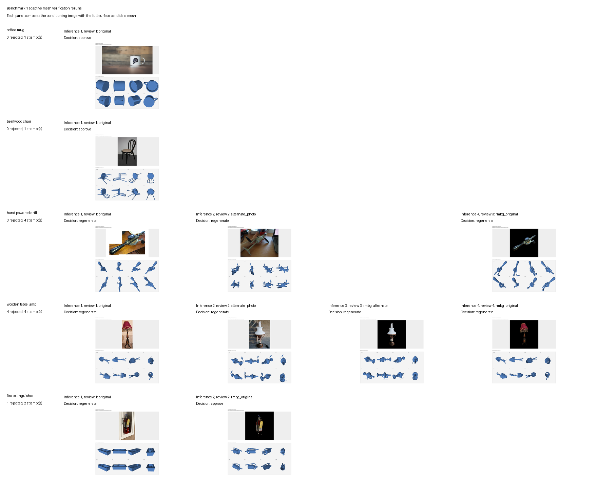

# Benchmark 1: reproducibility

This benchmark measures repeatability of a frozen image-to-3D pipeline and a frozen USD visual-language-model review pipeline. Every source begins as an unverified intake asset. Raw source bytes, the NVIDIA industrial pack archive and all live outputs are stored outside the repository in a runtime benchmark workspace. Supply that workspace with `--source-root` or set `AFB_REPRODUCIBILITY_ROOT` in the shell that runs the benchmark.

The image cohort contains a coffee mug, bentwood chair, hand-powered drill, wooden table lamp and fire extinguisher. The primary images are CC0. Each asset also has a rights-cleared alternate source recorded in `alternate-sources.lock.json`. The USD cohort contains five source stages from NVIDIA's Industrial Assets Pack: `Cardbox_C2`, `WoodenCrate_B2`, `Pallet_C1`, `RackLarge_A5` and `MetalFencing_A2`.

The image pipeline uses `microsoft/TRELLIS.2-4B` on the frozen 512 float32 route. The manifest records seed 17, deterministic Torch controls, preprocessing mode, model identifier, output simplification and texture settings. Every generated mesh then passes through the mandatory mesh-verification agent using `meta/llama-3.2-90b-vision-instruct` on NVIDIA's free endpoint, deterministic full-surface diagnostic renders, a strict JSON review contract and a blind dominant-object identity check. No API key is stored by this benchmark.

Every image repeat writes an `execution-trace.json` beside its run manifest. The trace records inference attempts, reviewer identity, review attempts, mesh rejections, inference failures, inference resubmissions, conditioning strategy and the final decision. A rejection keeps the reconstruction backend frozen but changes the conditioning through background removal, an alternate rights-cleared photo or background removal on that alternate. The declared seed advances with each new inference. Total inference is capped at four attempts, including the initial candidate. Comparison refuses any run whose verifier is not configured.

Use `backfill-traces` only to preserve interrupted or older reviewless executions as preliminary evidence. Backfilled traces are marked as legacy, record that no agent ran and are excluded from valid comparison.

## Image cohort

Prepare immutable locks and governed project copies:

```powershell
uv run python benchmarks/reproducibility/run_benchmark.py prepare
uv run python benchmarks/reproducibility/run_benchmark.py plan-images
```

Run the model in WSL after the TRELLIS installation and model cache are available:

```powershell
wsl -d Ubuntu bash -lc 'uv run python benchmarks/reproducibility/run_benchmark.py run-images'
wsl -d Ubuntu bash -lc 'uv run python benchmarks/reproducibility/run_benchmark.py analyse'
```

Prepare the adaptive source lock and run the bounded mesh-review path in the TRELLIS environment:

```powershell
uv run python benchmarks/reproducibility/run_benchmark.py prepare-adaptive-sources
uv run python benchmarks/reproducibility/run_benchmark.py run-adaptive
uv run python benchmarks/reproducibility/run_benchmark.py run-adaptive --source-id hand_powered_drill
```

The optional `--source-id` resumes one asset and merges its result into the existing five-asset summary. Every reviewed attempt is preserved under `reports/mesh-verification-attempt-<nn>` so later attempts cannot overwrite its renders or review record.

The runner creates 25 serial image runs, five per source asset. Each repeat includes reconstruction, mandatory verification and any bounded inference resubmissions. `comparison.json` treats byte-level GLB agreement as informational. Its reproducibility verdict compares exact topology invariants across the five repeats: connected components, Euler characteristic, genus where defined, watertightness, winding consistency, boundary loops, non-manifold edges and orientation conflicts. It also compares degenerate, duplicate and interior faces, unreferenced and coincident vertices, sliver faces, review-path variation and runtime.

`topology_reproducible` is true only when every required topology invariant is available and matches across all five runs. Genus is not guessed for open geometry. If any repeat is not closed and consistently oriented, genus is marked not comparable and the topology verdict fails closed.

The report also re-evaluates every saved mesh against the current deterministic quality policy. `current_quality_policy` separates this post-run result from the reviewer decisions recorded during execution and lists how many saved candidates would now be rejected for each failed check.

## Adaptive rerun result

The bounded rerun produced two first-attempt approvals and one adaptive approval after a rejected baseline. The other two assets exhausted their four-attempt cap without promotion.

| Asset | Inference attempts | Reviewed meshes | Mesh rejections | Final decision |
| --- | ---: | ---: | ---: | --- |
| Coffee mug | 1 | 1 | 0 | approve |
| Bentwood chair | 1 | 1 | 0 | approve |
| Hand-powered drill | 4 | 3 | 3 | resubmissions exhausted |
| Wooden table lamp | 4 | 4 | 4 | resubmissions exhausted |
| Fire extinguisher | 2 | 2 | 1 | approve |

The drill has three reviewed meshes because its third inference failed before producing geometry. That failure consumed an inference attempt but did not increment the mesh-rejection count. The extinguisher baseline was rejected when the blind check named its dominant object `box`; an asset crop followed by background removal produced the approved second candidate.

`adaptive-comparison.json` records exact per-attempt component count, Euler characteristic, genus where defined, watertightness, winding consistency, boundary structure, non-manifold and orientation-conflict edges, degenerate and duplicate faces and interior faces. Comparisons therefore use mesh invariants rather than byte identity.



## Artefacts

- `<benchmark-root>/sources.lock.json`: immutable raw-source inventory and checksums.
- `<benchmark-root>/alternate-sources.lock.json`: immutable alternate-source rights and checksum inventory.
- `projects\benchmark_1_reproducibility\manifests\source-asset-manifest.json`: governed project copies and rights record.
- `<benchmark-root>/runs/images/plan.json`: frozen run-manifest list.
- `<benchmark-root>/runs/images/execution-summary.json`: per-run execution record.
- `<benchmark-root>/runs/images/comparison.json`: repeatability analysis.
- `<benchmark-root>/runs/adaptive/adaptive-summary.json`: bounded adaptive-run decisions and counts.
- `<benchmark-root>/runs/adaptive/adaptive-comparison.json`: exact topology and integrity metrics for every reviewed adaptive attempt.
- `<benchmark-root>/runs/adaptive/adaptive-rerun-gallery.png`: source-to-mesh evidence for every reviewed attempt.
