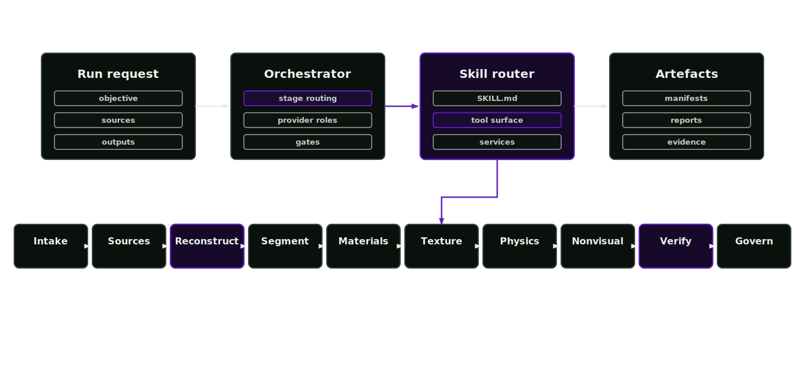

# Agent system

Stage skills run through the public runtime SDK. Registry discovery and the tool router connect them to the runtime.

<p align="center">
  
</p>

## Mutation boundary

Stage-specific logic sits behind one mutation boundary. Skills propose work through a shared `SkillContext`; services own durable writes, validation and policy enforcement.

## Runtime contract

- Skills use the public Skill SDK.
- `SkillContext` is the route to project state, manifests, evidence, reports, cache paths, provider resolution and dry-run state.
- Public tools call service functions.
- Skills cannot patch the core dispatcher.
- Provider output remains proposal material until gates promote it.

## Execution flow

1. The run request enters the orchestrator.
2. The stage router selects the required skill.
3. The skill receives scoped context and returns a `ToolResult`.
4. Services write proposals, reports and manifests.
5. Validators decide pass, blocked or review-required state.
6. Review and governance records decide promotion.

## Stage skills

The registry holds 18 packages: asset-factory-orchestrator, asset-programme-strategist, source-ingestion-lead, reconstruction-lead, segmentation-lead, material-inference-lead, texturing-lead, physics-articulation-lead, nonvisual-materials-lead, simready-verification-lead, rl-environment-design-lead, evaluation-validation-lead, governance-provenance-lead, infrastructure-orchestration-lead, external-model-runner-lead, capability-steward, library-curator and stage-invoker. The stage-invoker package serves [direct partial invocation](platform/direct-partial-invocation.md): running one stage on its own with full review guarantees.

## Files

- `configs/skill-registry.json`
- `configs/agent-workflow.json`
- `src/asset_factory_blueprint/skills/`
- `skills/<stage>/SKILL.md`
- `skills/<stage>/references/`

## Checks

```bash
afb skills list
afb skills validate-config --config configs/runtime-config.example.json
afb skill-audit --root . --output artifacts/skill-audit.json
```
