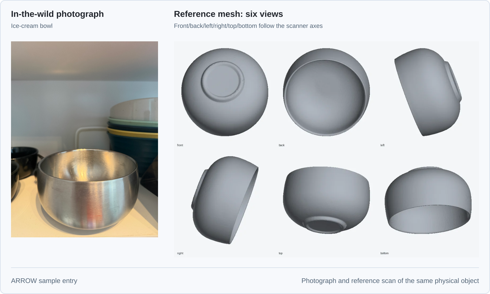
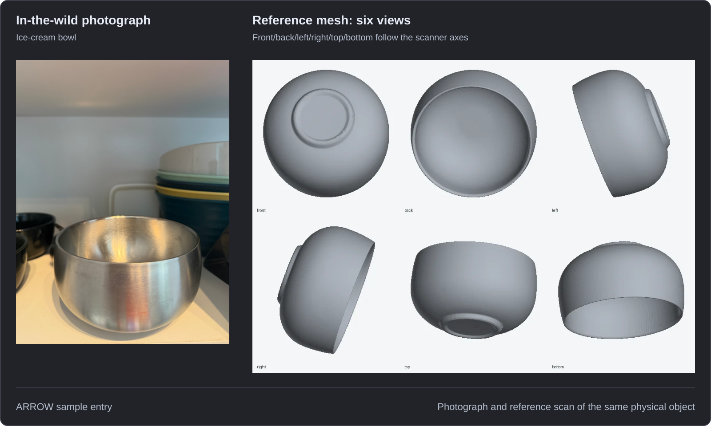

# ARROW

  

ARROW, **Agentic Reconstruction from Real-world Observations in the Wild**, is a standalone project and benchmark built around a dataset of photographed and measured physical objects. It is a companion to Asset Factory Blueprint (AFB), not a component of it. ARROW has its own [repository, validator and benchmark recipes](https://github.com/hcltech-robotics/ARROW) and its [dataset is published on Hugging Face](https://huggingface.co/datasets/chrisvoncsefalvay/ARROW).

We developed ARROW and collected its data to enable the optimisation, verification, attestation, quantification and improvement of pipelines like AFB. The choice of agent driver, model and generation settings affects both the assets a pipeline produces and the resources it consumes. We believe we should be able to reason quantitatively about which choices work best. ARROW provides a common set of objects and independent references against which to measure the results.

## Why we collected ARROW

A reconstruction can look convincing and still get the object wrong. A generated mug might have a handle too narrow to grasp, or a reconstructed bowl might have its interior filled in. Recognisable appearance can conceal errors that matter when the asset is used. The reconstruction should match the particular object that was photographed, including its dimensions and geometry.

ARROW pairs photographs taken in ordinary surroundings with reference scans and measured mass from the same physical specimen. These references let us measure how closely a generated asset matches its source object. They also give repeated comparisons a fixed target: changing a model or an agent's instructions does not change the object against which its output is evaluated.

ARROW gives the questions in AFB's discussion of [reconstruction and evidence](theory/reconstruction-and-evidence.md) an experimental basis, with identifiable inputs and measurable outcomes.

## What the dataset contains

The Hugging Face `overview` table provides one row per case, with a photograph, six views of the reference mesh, short, medium and long descriptions, a GLB preview and links to the full-resolution scans. It includes physical values and object status flags. Companion Parquet tables retain the observations, measurements and file checksums, and distinguish the physical specimen from a case's selected inputs. The [data dictionary](https://github.com/hcltech-robotics/ARROW/blob/main/docs/data-dictionary.md) defines these fields and their units.

  
  

*Sample entry: an ice-cream bowl, photographed and scanned for ARROW. The [dataset card](https://huggingface.co/datasets/chrisvoncsefalvay/ARROW#just-some-examples-from-the-dataset) includes its descriptions and downloadable geometry alongside other examples.*

## Comparing drivers, models and settings

A reconstruction recipe is the unit of comparison. It includes the agent driver that selects and invokes tools, the models those tools use and the settings under which they run. An experiment can compare complete recipes or change one part while holding the others fixed.

| Question | Comparison |
|---|---|
| Which agent driver works best? | Give each driver the same observations, available tools and resource budget, then compare its outputs and recorded work. |
| Which model works best in a particular stage? | Keep the driver and surrounding stages fixed, substitute a compatible model and record any required adapter changes. |
| Which settings are worth using? | Vary the selected setting while fixing the case inputs and other parameters, then measure the change in accuracy, completion rate and resource use. |
| Has a pipeline improved? | Evaluate both revisions on the same frozen cases with the same metric definitions, retaining failed attempts as well as successful outputs. |

Record source and model revisions, prompts, input hashes, preprocessing, seeds and budgets alongside the resulting artefacts. Changing several of these at once compares whole configurations. To attribute an improvement to one choice, isolate that choice and repeat the comparison across cases and runs.

These measurements quantify performance and guide optimisation, while verification checks the generated object against its reference. Attestation ties a reported result to its input, output and evaluation records so another reader can inspect the evidence behind an improvement and repeat the comparison.

## Using ARROW with AFB

Follow [How to benchmark with ARROW](arrow/how-to-benchmark.md) for the complete process, including case selection, input preparation, submission and comparison of results.

Select a frozen ARROW release and a set of cases. Feed each case's permitted photographs and description to AFB, or to another reconstruction pipeline, and retain the reference geometry for evaluation. For an experiment using the medium-length description, record that tier and the selected observation IDs so every configuration receives the same evidence.

Save the generated mesh with its case ID, checksum and declared length unit in an ARROW submission. The [mesh validator](https://github.com/hcltech-robotics/ARROW/blob/main/docs/validation.md) resolves the matching reference and reports surface accuracy, completeness, normal agreement and topology. It evaluates shape after similarity alignment and evaluates metric dimensions with scale preserved. Both evaluations have separate results and recorded transforms. Supplied physical predictions can be compared with compatible reference measurements.

The [ARROW usage guide](https://github.com/hcltech-robotics/ARROW#reconstruct-and-measure) covers loading a release and evaluating a submission. Its [identity recipe](https://github.com/hcltech-robotics/ARROW/blob/main/recipes/identity.yaml) checks the evaluator by comparing the reference mesh with an identical copy. AFB's own [mesh verification](pipeline/01a-mesh-verification.md) and [SimReady verification](pipeline/07-simready-verification.md) document the checks used within the asset pipeline.
