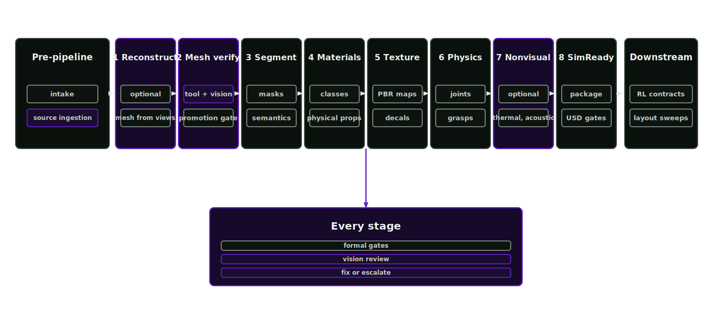

# Blueprint

The Asset Factory is a governed process for creating reproducible, sim-ready OpenUSD assets. Source handling, provider-assisted generation, deterministic validation and operator review share one project workspace.

## Simulation problem

Robotic simulation quality is limited by the world the robot sees and touches. Geometry suitable for a catalogue render may be poor for grasping. A plausible texture may imply the wrong friction or mass. A drawer that opens visually but has no joint limits cannot support reliable policy learning.

The output is an asset package that can be rebuilt from source evidence, explained to a reviewer, varied for domain randomisation and loaded into simulation with known promotion state.

## Run sequence

Start with a CAD file, USD asset, image set, scan, robot description or specification. The factory copies the source into a project workspace and records checksums to detect later changes.

The orchestrator builds a route from the source evidence and requested outputs. Every geometry route includes mandatory mesh verification. An image-only asset may need reconstruction, mesh verification, segmentation, material and physical inference, texturing, physics and articulation authoring and SimReady verification before release. The route is recorded before mutation.

Each stage writes inspectable manifests, reports, evidence, generated artefacts and checksums. Missing evidence blocks the output or marks it review-required; passing gates permits the next stage.

## Factory process

  

Intake and source ingestion register source geometry, scans, images, robot descriptions, logs and specifications as immutable evidence. The asset then moves through eight stages:

1. Reconstruction (optional) produces candidate mesh geometry from images and descriptions through governed external backends. USD and supported mesh sources take conditioning or repair routes. Native CAD remains source evidence and requires an operator-supplied USD or supported mesh export before authoring.
2. Mandatory mesh verification combines exact topology and integrity checks, fixed-camera full-surface renders and vision review. Euler characteristic, genus, boundary structure, manifoldness, watertightness and component structure are measured before review. A deterministic quality failure forces repair or regeneration, while visible source mismatch can trigger bounded adaptive source conditioning before a new inference run. Only an approval bound to both the candidate and policy checksums promotes canonical geometry.
3. Segmentation and semantic inference produce stable appearance segments, semantic labels and material regions.
4. Material and physical inference binds visual evidence to constrained material candidates and proposes mass, density, friction and stiffness with uncertainty.
5. Texturing generates texture prompts, PBR maps, variants, deformation requests and decals bound to material evidence.
6. Physics and articulation author colliders, rigid bodies, mass, joints, limits, drives, grasp affordances and validation scenarios.
7. Nonvisual materials (optional) infer thermal, acoustic and electrical values only from evidence strong enough to support them.
8. SimReady packaging and USD verification assemble the layer stack, check load behaviour and record whether release is allowed, with Isaac Sim as one runtime target.

RL environment stages then build task contracts, observation spaces, action spaces, rewards and curriculum plans around the validated asset as a downstream extension.

## Reviewable output

In a well-formed workspace, files follow documented paths, every generated artefact has a manifest, weak claims carry review state and blockers identify missing evidence. A reviewer can answer four questions without reading the code:

- What source evidence did this asset come from?
- Which stages changed it?
- What validation passed or failed?
- What can be varied safely?

## Promotion model

Every generated item starts as a proposal artefact. Promotion requires the right combination of:

- schema validation
- source evidence
- deterministic checks
- simulator load checks where configured
- review state for weak or task-critical claims
- governance record
- checksum record

Provider output and plausible renders cannot become validated truth without these records.

## Permutation model

Variants must preserve lineage. Texture variants, mesh deformations, material swaps, physics ranges, articulation settings and layout mutations are recorded as variant layers or mutation plans. The base asset remains explainable and every variation has explicit bounds.

Controlled permutation exposes the robot to worn surfaces, lighting changes, small dents, material shifts, friction ranges, object placement changes and articulation tolerances. This broadens the training conditions while preserving traceability.

## Policy-quality link

Robotic policies are sensitive to visual and physical detail. Source handling controls geometry; material and texture records support visual observations; physical-property and physics records determine contact behaviour; articulation and grasp-affordance records determine action consequences. Nonvisual material records support thermal, acoustic and electrical sensing, while environment contracts make evaluation and training repeatable.

## Operating posture

Source assets are immutable. Generated artefacts live under a project workspace. Public tools call service functions. Heavy USD, rendering, Isaac, CUDA or runner imports stay out of schemas and thin tool surfaces. The CLI is the operating surface, and validation remains file-backed and command-backed.
