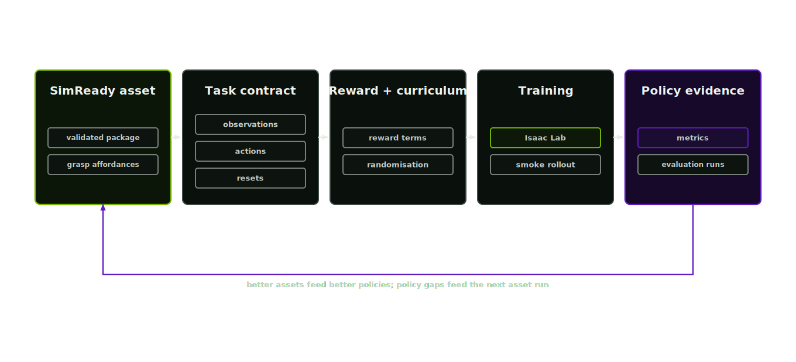

# RL environment

The RL environment extension emits an Isaac Lab task contract around a validated asset package. It is a downstream extension: it starts only after the stage 7 simready-verification gates pass.

  

## Training contract

A robot policy learns from simulated observations and action outcomes. Geometry, texture variation, materials, contact behaviour and articulation determine that training signal.

The RL environment lane carries recorded asset uncertainty into training and evaluation. It consumes validated packages and records the task and permitted variant policies.

## How to use this lane

Agent skill: `rl-environment-design-lead`. The orchestrator invokes it only after the asset package has passed the stage 7 gates, including the `isaac-load` gate where the runtime is configured.

Define the target behaviour, such as picking, placing, pushing, opening, inspection or navigation. Then check that the asset has the visual, physical and articulation evidence required for that behaviour. Grasp tasks should reuse the grasp affordances recorded in the physics-articulation manifest.

The environment manifest records:

- what the robot observes
- which actions it can take
- what earns reward
- what ends an episode
- which variants are allowed during training
- which validation run proves the environment starts cleanly

## Inputs

- validated asset package (`manifests/simready-asset-manifest.json`)
- robot embodiment
- task objective
- sensor policy
- domain-randomisation policy
- safety constraints

## Process

1. Read the simready-asset-manifest and upstream promotion state.
2. Bind asset package, robot embodiment and scene contract.
3. Define observations, actions, rewards, terminations and reset logic.
4. Attach curriculum and domain-randomisation plans.
5. Write training, smoke-test and evaluation command contracts.
6. Emit `manifests/rl-environment-manifest.json`.

## Outputs

- `manifests/rl-environment-manifest.json`
- scene contract
- observation, action, reward and termination specs
- curriculum and randomisation specs
- W&B training plan
- smoke training command contract

## Gate

RL environment generation is blocked until the simready-verification stage has promoted the package with load and physics evidence.
