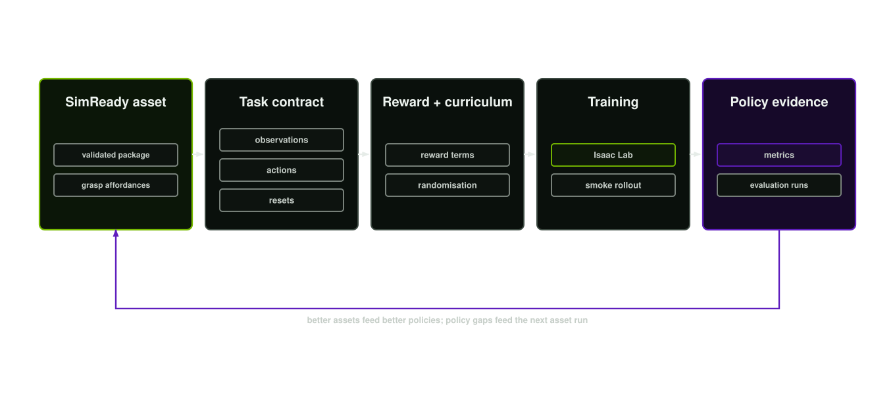

# RL environment

This downstream extension takes a validated asset package and produces an Isaac Lab RL task with complete evidence lineage. It runs only after stage 7 simready-verification and the target runtime's `isaac-load` check.

The [learning-environments theory chapter](../theory/learning-environments.md) defines the distinction among individual-object uncertainty, deployment variation and the deliberately selected training distribution. This page owns the implemented manifest fields, process and promotion gates.

## Variant distributions

Geometry, appearance, materials, contact behaviour and articulation affect observations and transitions. The upstream records constrain which variants are admissible for the requested task and runtime. They do not determine how often an admissible variant appears during training.

The environment manifest therefore records the variant model, physical and task constraints, selected training distribution and the provenance of every bound. A training-distribution decision remains distinct from the evidence record that informed it.

## Training contract

The training contract binds one task to a family of admissible environment contexts. The asset factory records the evidence available for those contexts:

- Every physical property proposal carries a value, unit, range, distribution, method and confidence.
- Every authored mass carries a sealed uncertainty record.
- Every grasp point carries a frame, an approach vector, a gripper width and a confidence.

The lane records the source manifest identifiers and checksums in the environment manifest. It then records the separate policy decision that converts evidence-backed bounds, admissibility constraints and programme requirements into a training distribution.

## Upstream records

| Upstream record | Fields consumed | Use in the environment |
|---|---|---|
| `simready-asset-manifest` | package identity, layer stack, units, axis policy, Profile, promotion status | scene composition root and lineage |
| `physics-articulation-manifest` | `affordances.grasp_points`, `affordances.affordance_labels` | reset distributions, grasp-conditioned rewards, reachability gate |
| `physics-articulation-manifest` | `joints`, `drives`, `limits`, `articulation_roots` | action space for articulated tasks, limit terminations |
| `physics-articulation-manifest` | `mass_properties`, `physics_materials`, sealed uncertainty record | dynamics randomisation ranges with `evidence` provenance |
| `physics-articulation-manifest` | `tuning_scenarios`, `validation_scenarios` | smoke tests and scripted-oracle scenarios |
| `material-inference-manifest` | `physical_property_proposals` (value, unit, range, distribution, confidence) | context prior for vEp, friction &c. |
| `nonvisual-material-manifest` | thermal, acoustic and electrical values with evidence | nonvisual observation channels |
| `isaac-runtime-evidence` | `physics_dt`, `settle_steps`, `repeatability_tolerance_metres`, `runtime_identity.physics_backend` | timestep and backend binding, reset feasibility, rollout repeatability |
| `asset-layout-manifest`, `mutation-plan`, `variants.usda` | placements, parametric patterns, gated operations with rollback notes | layout randomisation and the editing curriculum |
| `task-fitness-protocol` | `scope: articulated_training` tests, metrics and tolerances | emitted by this lane, evaluated by the evaluation stage |

## How to use this lane

Agent skill: `rl-environment-design-lead`. The orchestrator invokes it only after the asset package has passed the stage 7 gates, including the `isaac-load` gate where the runtime is configured.

Declare the target behaviour: picking, placing, pushing, opening, closing, inspection or navigation. The skill checks that behaviour against the available asset evidence. Missing grasp points block a pick task; missing joint limits or drives block an opening task; and a missing friction range blocks a push task. The skill does not approximate missing records. Grasp tasks reuse the grasp affordances recorded in the physics-articulation manifest rather than re-deriving them from geometry.

The environment manifest records:

- the runtime identity the environment is bound to
- what the robot observes, and which of those observations are privileged
- which actions it can take and from which recorded joints and bodies
- what earns reward and which probes the reward passed
- what ends an episode and how episodes reset
- which variants are allowed during training and where each bound came from
- how the environment is evaluated and which validation run proves it starts cleanly

## Environment identity

Isaac Lab is the canonical RL environment framework for this lane. It succeeds Isaac Gym and ORBIT [@makoviychuk_isaacgym_2021; @mittal_orbit_2023] and supports Newton alongside PhysX, Warp and MuJoCo [@mittal_isaaclab_2025; @nvidia_isaaclab_newton_2026]. The same asset can produce different contact behaviour and failure modes under different solvers [@hu_simweaver_2026]. The manifest therefore treats the physics backend as part of environment identity, with a separate pass state for each backend.

The timestep is part of the same identity. A manager-based Isaac Lab environment is defined by `sim.dt`, `decimation` and `episode_length_s` [@nvidia_isaaclab_manager_env_2026]. Isaac runtime evidence records the `physics_dt` used to check the asset's contact behaviour. The training timestep must match it unless fresh runtime evidence is attached. Seeds, environment count and Isaac Lab version complete the identity record.

## Observations and privilege

Observation terms are split into two groups. The `policy` group contains proprioception and the sensor channels available at deployment, each with its noise model. The `critic` group may also contain ground-truth state that the deployed policy never sees. Asymmetric actor-critic training [@pinto_asymmetric_2018], learning by cheating [@chen_cheating_2020] and teacher-student distillation [@lee_terrain_2020; @kumar_rma_2021] use this privileged information, usually through simulator internals.

Every privileged input in this blueprint must come from a validated manifest field with evidence and a checksum. Each `critic` term cites the manifest path from which it is read.

The manifest also declares an `adaptation_mode`; the theoretical distinction between robust and adaptive policies is defined in [From assets to learning environments](../theory/learning-environments.md#the-complete-environment):

- `robust`: the policy averages over the context prior and carries no explicit estimate of it.
- `adaptive`: the policy infers the context online from its own observations, in the manner of rapid motor adaptation [@kumar_rma_2021].

Adaptive mode requires an identifiability audit. For each randomised parameter, the manifest records which `policy` actions and observations can distinguish its values within one episode and which confounders remain. A randomised parameter that the policy cannot identify from its declared interface is handled robustly regardless of the requested mode, and the audit records that decision.

## Sensor contract

For every channel, the sensor contract records the sensor model, noise model and parameters, update rate relative to `decimation`, and supporting upstream evidence. Isaac Lab's observation corruption and noise configuration is the rendering target for visual and proprioceptive channels [@nvidia_isaaclab_manager_env_2026].

Stage 6 grounds thermal, acoustic and electrical observations in the nonvisual materials manifest. A thermal channel, for example, cites the emissivity and temperature records from which it renders. Channels without supporting records are excluded from the `policy` group.

## Actions, resets and terminations

Action terms are derived from the physics articulation manifest, never from geometry alone. Joint-space actions name the recorded joints, drive mode and limits. Task-space actions name the body they affect and the workspace bounds from the safety record. Manifest validation rejects commands beyond a recorded joint limit.

Reset distributions sample initial poses, joint positions and object placements within recorded bounds. Grasp tasks may seed resets from recorded grasp points. Every reset distribution carries feasibility evidence: sampled resets must settle without interpenetration within the runtime evidence's `settle_steps`, using its settled-speed threshold as the criterion.

Terminations include time-out, success, recorded joint-limit violation, illegal contact and workspace exit. The task-fitness definition is the sole success criterion.

## Rewards

Every reward remains a proposal until it passes the deterministic probes and review, whether it came from an engineer or a language model. Each iteration writes a proposal record, an evidence record and a report.

Before review, every reward proposal passes the following deterministic probes, and the manifest records the result of each:

- **Random-policy baseline.** Mean return and per-component magnitudes under uniformly random actions over the recorded seeds.
- **Scripted-oracle bound.** A scripted policy built from the recorded affordances: move to the grasp frame along the approach vector, close to the recorded width, lift; or drive the joint through its recorded range. The oracle's return bounds what the task is worth, and its success proves the task is feasible for the embodiment.
- **Component audit.** No component dominates the total by construction; every component has units or is dimensionless by construction; shaping terms are potential-based where the task admits it, so that they cannot change the optimal policy [@ng_shaping_1999].
- **Specification-gaming probes.** Known patterns of reward hacking [@amodei_concrete_2016; @skalse_hacking_2022; @pan_misspecification_2022] checked against the proposal: proximity rewarded without contact, velocity rewarded without displacement, termination that pays, progress that can be earned by oscillation.
- **Evidence rule.** No reward term depends on a quantity whose upstream record is `proposal` or `review_required`.

A proposal that fails a probe returns to the proposer with the probe output. A proposal that passes them all becomes `review_required` and goes to the reviewer with the probe evidence attached.

## Randomisation with provenance

The [learning-environments theory chapter](../theory/learning-environments.md#correlated-and-constrained-randomisation) defines the relationship among evidence, admissibility, correlated sampling and deliberate training design. Operationally, every randomisation axis records its provenance.

| Provenance | Meaning | Where it comes from |
|---|---|---|
| `evidence` | interval taken from an upstream record | material and physics manifests, the sealed uncertainty record |
| `feasibility` | interval a trained policy tolerates | a parameter sweep around the smoke-trained policy |
| `posterior` | interval inferred from real rollouts | BayesSim or DROPO style inference, when real data exists |
| `policy_default` | declared fallback | the randomisation policy in the run request |

The manifest records how these sources inform each training range. If the evidence and feasibility intervals do not overlap, the axis becomes `review_required`; the lane records the mismatch without choosing whether the policy tolerance or asset evidence must change.

Variants must preserve recorded affordances for the declared embodiment and task. A texture change that makes a handle unrecognisable or a deformation that moves a grasp point beyond the gripper's reach changes the task and is rejected.

## Curriculum tiers

The theory chapter defines curriculum as a sequence of deliberately selected training distributions and keeps it separate from deployment variation. The blueprint's mutation plan declares the target layer, prim, operation, inputs, expected outputs, gates, rollback note and dry-run support. Layout plans add parametric placement patterns with unit policy and bounds. The lane supports three curriculum tiers:

1. **Static.** A declared schedule over randomisation bounds and reset difficulty.
2. **Replay.** Prioritised replay over pre-validated variants, where the replay buffer is a set of variant identifiers with checksums and the priority is an estimated regret.
3. **Editing.** ACCEL-style proposals emitted as mutation plans in `validate_only` mode and promoted only through the existing gates, with rollback notes. The curriculum generator is one more provider whose output is proposal material.

Editing curricula retain lineage, bounds, gates and rollback for every proposed change.

## Affordance-weighted collision fidelity

The [physical-interaction theory chapter](../theory/physical-interaction.md#contact-geometry-and-collision-approximation) explains why visual and collision geometry require separate task-bound evaluation. The blueprint records grasp points with frames and approach vectors, together with the moving parts for articulation affordances. The lane measures visual-to-collision shell distance around each recorded affordance region and checks it against the task-fitness tolerance. A value outside tolerance emits a stage 5 request for finer decomposition in the failing region and blocks the lane until that request is resolved.

## Safety constraints

Safety constraints are recorded as costs in a constrained MDP [@altman_cmdp_1999; @achiam_cpo_2017; @ray_safetygym_2019] and as hard terminations. They are never represented by reward penalties alone. The safety record contains workspace bounds, joint-velocity and torque ceilings from the embodiment description, contact-force ceilings for the asset and robot, and deployment rate limits. DrEureka found that giving the reward proposer a safety instruction made the resulting rewards deployable, so every reward proposal request carries this record [@ma_dreureka_2024].

## Evaluation protocol

Deep reinforcement learning results are sensitive to seeds, and small run counts can mislead [@henderson_matters_2018]. The evaluation record declares the seeds, run count and aggregation method. Unless the protocol authority states otherwise, it uses the interquartile mean with stratified bootstrap confidence intervals [@agarwal_precipice_2021; @patterson_empirical_2024]. Reports break success rates down by held-out variant and randomisation axis.

A policy can learn a proxy that matches the intended goal within the training distribution but diverges outside it [@langosco_misgeneralization_2022; @shah_misgeneralization_2022]. The evaluation record therefore includes a **proxy audit**. Its held-out variants use the mutation machinery to separate candidate proxies from the objective, for example by matching a distractor to the goal colour or placing a handle on the wrong side. Reviewer approval depends on the proxy-audit evidence; the headline metric alone is insufficient.

Isaac Lab Arena is the evaluation harness of record for the Isaac runtime, and its zero-action runner is the reference noop rollout [@nvidia_isaaclab_arena_2026].

## Updating asset evidence

Evaluation runs and real-world rollouts provide new evidence about the asset. BayesSim or DROPO-style methods can infer a posterior over the context from those rollouts [@ramos_bayessim_2019; @tiboni_dropo_2023; @aljalbout_realitygap_2025]. The lane writes that posterior as a new physical-property evidence record with lineage to the source rollouts, then proposes a revised asset manifest through the ordinary review gates. This return path lets recorded uncertainty shrink as evidence accumulates.

## Environment card

The manifest renders an environment card containing intended tasks and embodiments, out-of-scope uses, provenance-backed randomisation coverage, known sim-to-real gaps, evaluation results and a reward report [@gilbert_rewardreports_2023]. The environment card is the RL-environment counterpart to a model card or dataset datasheet [@mitchell_modelcards_2019; @gebru_datasheets_2021]. A client's safety function can review it without opening a USD file.

## Inputs

- validated asset package (`manifests/simready-asset-manifest.json`)
- physics-articulation, material-inference and, where present, nonvisual-material manifests
- Isaac runtime evidence for the target backend
- robot embodiment description with joint limits and actuator ceilings
- task objective and success definition
- sensor contract
- randomisation policy and any real-rollout posterior evidence
- safety record

## Process

1. Read the simready-asset-manifest, the upstream manifests and the runtime evidence; verify promotion state and checksums.
2. Reconcile the requested behaviour against the evidence the asset carries; block on missing affordances, limits or ranges.
3. Bind runtime identity: backend, timestep, episode length, seeds, embodiment.
4. Assemble the context prior from the recorded ranges, distributions and uncertainty records.
5. Define observation groups, the sensor contract, actions, resets and terminations from the recorded joints, limits and affordances.
6. Propose rewards, run the deterministic probes and record their results.
7. Derive randomisation ranges with provenance; check affordance invariance per variant; run the identifiability audit when the mode is adaptive.
8. Attach the curriculum tier and, for editing curricula, the mutation-plan contract.
9. Compute affordance-weighted collision fidelity; emit a stage 5 request on failure.
10. Write the evaluation protocol, the `articulated_training` task-fitness protocol and the smoke, train and evaluate command contracts.
11. Emit `manifests/rl-environment-manifest.json`, the environment card and the W&B plan.

## Outputs

- `manifests/rl-environment-manifest.json`
- runtime identity and context prior records
- observation, sensor, action, reset, reward and termination specs with probe evidence
- randomisation spec with per-axis provenance and affordance-invariance results
- curriculum spec and, where applicable, mutation-plan contracts
- `articulated_training` task-fitness protocol
- evaluation protocol with proxy-audit variants
- environment card
- W&B training plan
- smoke, train and evaluate command contracts with digests

## Promotion gates

RL environment generation is blocked until the simready-verification stage has promoted the package with load and physics evidence for the declared backend. Within the lane, promotion requires:

- lineage: every consumed manifest is `validated` or `released` and checksums match
- backend and timestep binding against the runtime evidence
- affordance reachability under the scripted oracle
- affordance-weighted collision fidelity within tolerance
- reset feasibility within the recorded settle criteria
- zero-action smoke rollout, random-policy baseline and oracle bound recorded
- reward component audit and specification-gaming probes passed
- evidence rule satisfied for every reward and observation term
- randomisation provenance complete and affordance invariance checked per variant
- identifiability audit passed when the mode is adaptive
- evaluation protocol with seeds, held-out variants, aggregation and proxy audit
- environment card rendered and checksummed
- W&B plan status, review requirement and promotion decision

## Commands

The manifest stores exact command lines and argument digests for smoke, train and evaluation contracts. The smoke contract steps the composed environment with zero actions and then random actions for a fixed number of frames. Isaac runtimes use the Isaac Lab Arena runner. The train contract names the Isaac Lab entry point, environment identifier, seeds and W&B project. The evaluation contract runs the approved protocol over held-out variants and writes the task-fitness evidence report. The evaluation stage recomputes every result from that protocol.

## References

\bibliography
