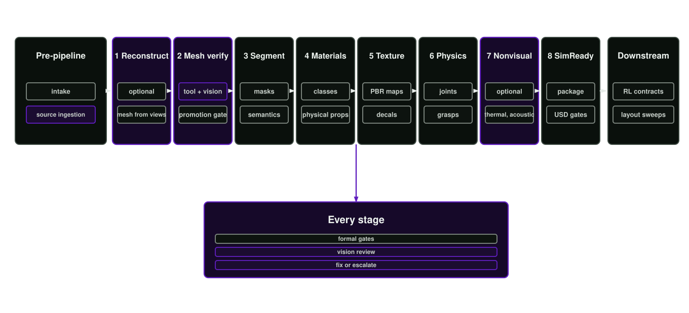

# Asset Factory Blueprint

[](https://doi.org/10.5281/zenodo.22201829)

## What does Asset Factory Blueprint do?

Asset Factory Blueprint (AFB) is an MIT-licensed reference implementation from the HCLTech Robotics Intelligence CoE that turns photos, scans, CAD and USD sources into governed, reproducible OpenUSD assets [@aousd_openusd_2026] and Isaac Lab reinforcement learning environments for robotics simulation, with every geometry, physics and variant decision verified against SimReady requirements [@nvidia_simready_faq_2026] and tied to recorded evidence. It routes each source through explicit stages, records evidence and checksums, and keeps generated variants traceable to the source, policy and review decisions that produced them.

Robotic policies learn from what the simulator shows them. Clean-looking but physically wrong scenes teach brittle cues. Traceable geometry, scale, mass, friction, joints and material state make failures easier to find before they reach training. **The Asset Factory Blueprint creates the repeatable, governed USD pipelines that automatically build assets from your photos, meshes, USD files and other source evidence that will be _useful_, not just good-looking.**



The key idea is _repeatability_. A simulation asset should be rebuildable from its sources, with its geometry, materials, textures, physical properties, articulation and variants tied to evidence.

The Asset Factory Blueprint is a coordinator that works with your tools, patches into your workflow where you want it to pick up, and integrates with your governance and Profiles. Asset Factories power high-performance, high-throughput environment generation for reinforcement learning, simulation and verification.

## Read first

- [Quickstart](quickstart.md)
- [Walkthrough: one photo to a governed workspace](walkthrough.md)
- [Observed runthrough](runthrough.md)
- [Blueprint](blueprint.md)
- [Theory](theory/index.md)
- [ARROW: companion benchmark and dataset](arrow.md)
- [Reference architecture](reference-architecture.md)
- [Source map](source-map.md)

## Pipeline stages

- [Intake and source ingestion](pipeline/00-intake-and-sources.md)
- [Reconstruction](pipeline/01-reconstruction.md)
- [Mandatory mesh verification](pipeline/01a-mesh-verification.md)
- [Segmentation and semantic inference](pipeline/02-segmentation.md)
- [Material and physical inference](pipeline/03-material-inference.md)
- [Texturing](pipeline/04-texturing.md)
- [Physics and articulation](pipeline/05-physics-articulation.md)
- [Nonvisual materials](pipeline/06-nonvisual-materials.md)
- [SimReady verification](pipeline/07-simready-verification.md)
- [Texture defaults](pipeline/texture-defaults.md)

## Implementation guidance

- [Orchestrator](platform/orchestrator.md)
- [Agentic operation](platform/agentic-operation.md)
- [Libraries](platform/libraries.md)
- [Infrastructure](platform/infrastructure.md)
- [Deployment](platform/deployment.md)
- [External model runners](platform/external-model-runners.md)
- [Layer ownership and variants](platform/layer-ownership-and-variants.md)
- [Layout and mutation plans](platform/layout-and-mutation-plans.md)
- [RL environment](extensions/rl-environment.md)
- [Runtime architecture](runtime-architecture.md)
- [Agent system](agent-system.md)
- [Toolchain](toolchain.md)
- [Manifest contracts](manifest-contracts.md)
- [Skill SDK](skill-sdk.md)
- [Project workspaces](project-workspaces.md)
- [Provider abstraction](provider-abstraction.md)
- [Repository structure](repository-structure.md)
- [Support matrix](support-matrix.md)
- [Citation and reproducibility](citation-and-reproducibility.md)
- [Reference-run capsule](reference-run-capsule.md)

## About the Asset Factory Blueprint

The Asset Factory Blueprint was developed by HCLTech Robotics Intelligence CoE in early 2026. We are a team of engineers, developers and roboticists who have to navigate a world of increasing complexity and provide training environments that reflect reality so that our robots can learn the right policies, faster. Asset factories make this possible at scale and in an economically efficient manner.

### Principal investigators

* [Chris von Csefalvay](https://orcid.org/0000-0003-3131-0864), HCLTech Robotics Intelligence CoE
* [Tamas Foldi](https://orcid.org/0000-0001-9283-6865), HCLTech Robotics Intelligence CoE, Head of Lab

### Citation

The [concept DOI](https://doi.org/10.5281/zenodo.22201829) follows the latest archived release. Cite the immutable version DOI when reporting a reproducible result. The current v1.1.0 archive and its verified creator order are registered by Zenodo [@von_csefalvay_asset_factory_2026].

```bibtex
@software{von_csefalvay_2026_22201830,
  author    = {von Csefalvay, Chris and Foldi, Tamas},
  title     = {Asset Factory Blueprint},
  month     = aug,
  year      = {2026},
  publisher = {Zenodo},
  version   = {v1.1.0},
  doi       = {10.5281/zenodo.22201830},
  url       = {https://doi.org/10.5281/zenodo.22201830}
}
```

### License

The Asset Factory Blueprint and all its code are released under the MIT licence.

## References

\bibliography
