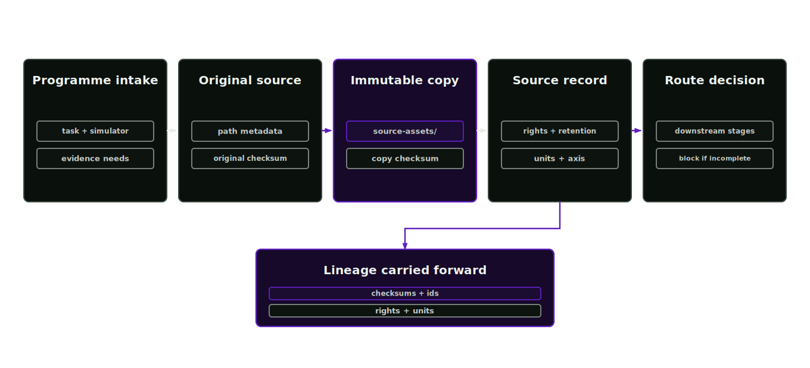

# Intake and source ingestion

Intake records programme requirements. Source ingestion turns raw project material into immutable evidence. These records feed reconstruction or source conditioning, followed by mandatory mesh verification.

<p align="center">
  
</p>

## Programme intake

Before file ingestion, `asset-programme-strategist` records the programme objective, simulator use, evidence needs and delivery shape in `asset-programme-intake-manifest.json`. Later reviews measure readiness against that declared task.

## Source ingestion

Source ingestion accepts CAD, USD, robot descriptions, scans, images, logs, specifications and operator notes. It copies them into the project workspace before normalisation or authoring.

### Source integrity

Reproducibility depends on stable original inputs. Generated assets may be repaired, retextured, articulated or varied many times. The source record traces each change to the exact input file, checksum, rights state and unit policy that justified it.

Small source errors can become large robotic-policy training errors. A wrong scale, missing axis convention or unrecorded image crop can change grasp geometry, visual observations or contact behaviour downstream.

### Run source ingestion

Agent skill: `source-ingestion-lead`. In normal runs, `asset-factory-orchestrator` routes and drives the stage.

For a new asset, create the project and run the workflow in dry-run mode. This copies the source files and writes the missing-evidence report.

```bash
afb project new "Warehouse Pick Cell" --project-root projects
afb workflow run --request examples/run-requests/warehouse_pick_cell.json --project-root projects --dry-run
```

After the run, inspect:

- `projects/<slug>/source-assets/` for copied source files
- `projects/<slug>/manifests/` for source records
- `projects/<slug>/missing-evidence.json` for blocked or review-required inputs
- `projects/<slug>/evidence/checksums.json` for source and generated file hashes

### Process

1. Register the source file, capture original path metadata and compute a checksum.
2. Copy the file into `projects/<slug>/source-assets/`.
3. Record the project-copy checksum and immutable-source policy.
4. Classify the source type, unit policy, rights state and intended downstream stages.
5. Report missing evidence before reconstruction, material inference or physics authoring starts.

### Records

- `source-asset-manifest.json`
- source checksum and project-copy checksum
- rights and retention state
- unit, axis and scale policy
- evidence IDs used by later manifests

### Gates

- Source files must exist in the workspace before mutation.
- Checksums must be present.
- Rights status must be known before release.
- Unit policy must be declared before geometry, physics or articulation stages depend on it.
- Missing task-critical evidence produces a blocked or review-required state.
