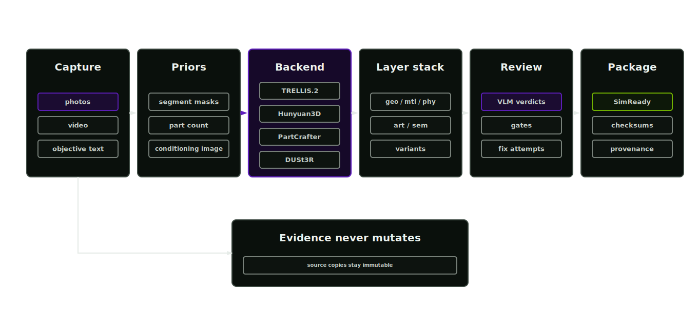

# Reconstruction

The optional reconstruction stage creates mesh geometry from image(s), with or without text descriptions, through governed external backends. Supported mesh and USD sources use the non-generative conditioning, harvesting and repair routes. Native CAD files remain source evidence until the operator supplies a USD or supported mesh export; the runtime does not convert them directly.

<p align="center">
  
</p>

## Geometry quality and provenance

Geometry carries the visual and physical structure used by every later stage. Bad scale, incomplete geometry or unsupported evidence propagate into material, physics and policy work. The reconstruction record identifies the proposal method and selected route.

Reconstruction accelerates geometry authoring while preserving provenance. Original sources stay immutable. Generated geometry enters the project as a proposal until validation and review admit it to later stages.

## Choose a reconstruction route

Agent skill: `reconstruction-lead`. The orchestrator normally selects and runs the route from the run request. Invoke the skill directly to inspect or refine the reconstruction playbook.

Condition a supported mesh or USD source when its geometry, hierarchy and units are trustworthy. Harvest an approved library asset when its provenance and geometry fit the task. Choose image-to-3D reconstruction when images are the only usable source; the result remains a proposal until geometry, scale and task-critical surfaces pass review.

The governed backends are registered in `configs/reconstruction-backends.json` with adapters, provisioning and install scripts under `scripts/reconstruction/`. Single-image backends are TRELLIS.2, Hunyuan3D, TripoSG and PartCrafter. Multi-view backends consume several photos of the same object: Hunyuan3D multi-view conditions on ordered views and DUSt3R fuses arbitrary view sets into geometry. The video lane samples frames from a capture and delegates to the multi-view chain. Segmentation priors from stage 2 can condition part-aware backends such as PartCrafter. The capability registry (`afb capabilities`) records which backend serves each lane on this machine and what gates block the rest.

Multiple inputs are passed with the `input_assets` list in the run manifest or the `AFB_RECONSTRUCTION_INPUT_ASSETS` environment handle; single-image backends keep using `input_asset`.

For a dry-run backend manifest:

```bash
afb reconstruction create-backend --backend trellisv2
afb external-models run --manifest external-model-run-manifest.json --dry-run
```

Read the run log before using the output path. A successful adapter run produces a proposal. Release requires the downstream gates.

## Routing criteria

Route selection considers:

- source type and quality
- required output format
- expected asset scale
- available reconstruction backend
- mesh repair need
- task-critical surfaces
- runtime cost and GPU requirements
- rights and retention policy

Image-led reconstruction writes enough evidence for a reviewer to compare the source image, generated mesh, proposed USD layer and resulting package. CAD-led routes preserve hierarchy, units and part names where possible.

## Process

1. Read the run plan and source manifest.
2. Select a reconstruction or harvesting route.
3. Write an external model run manifest when a local or remote model is used.
4. Run the backend or dry-run adapter.
5. Store logs, generated artefacts and checksums.
6. Write a reconstruction manifest with proposal status.
7. Block, promote or send the result to review based on validation.

## Outputs

- `reconstruction-manifest.json`
- generated mesh or USD proposal
- external model run manifest when applicable
- backend provision, install or run reports
- checksums and logs
- review state

## Gates

- Source evidence must exist.
- Backend path, runtime and allowed paths must be declared.
- Generated files must match the expected manifest output.
- Geometry scale and axis policy must be known before physics stages.
- Task-critical missing surfaces require review or block release.
