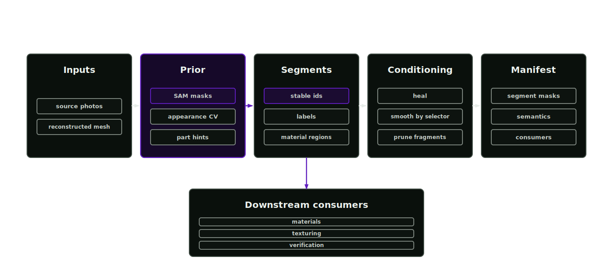

# Segmentation and semantic inference

Segmentation splits an asset into stable, semantically labelled regions. Image priors may condition reconstruction, but the segmentation stage consumes only canonical geometry approved by mandatory mesh verification. Every later material, texture and physics decision can therefore point at a reviewed named part.

<p align="center">
  
</p>

## Stable segment identities

Material inference, texturing, decal placement and grasp reasoning operate on named asset regions. A mug body and handle have different materials, textures and grasp affordances. Segmentation assigns stable ids, semantic classes and masks that survive reconstruction upgrades.

## Invoke segmentation

Agent skill: `segmentation-lead`. Tools: `asset_image_segmentation_prior` and `asset_mesh_condition`. The orchestrator selects this stage whenever material inference is planned.

## Image segmentation priors

Before reconstruction, `asset_image_segmentation_prior` splits a source image into appearance or SAM-derived region masks. Its outputs are semantic masks, an overlay, a conditioning image and a manifest with the suggested part count.

Use the prior before PartCrafter when material or appearance regions should influence the generated part structure. PartCrafter exposes no native mask input. The conditioning image and part count carry the prior; downstream validation scores the generated parts against the masks.

## Appearance and material-region segmentation

1. Read the source asset, reconstruction result and material cues.
2. Propose stable appearance segments with ids, labels, semantic classes, material hints and confidence.
3. Write segment masks under `assets/<asset>/textures/segments/`.
4. Author `SemanticsLabelsAPI:class` and `SemanticsLabelsAPI:label` token arrays on the asset root and segment prims in `sem.usda`.
5. Hand the segment records to material inference, texturing and SimReady verification.

Segment ids remain stable across later reconstruction upgrades. If geometry supports separate prims or mesh subsets, those prim paths replace the mask-only material-region proposal while the same segment ids, material regions and semantic labels remain valid.

Legacy assets that authored string-valued `SemanticsAPI:<instance>` properties must be migrated on a project copy:

```bash
afb semantics migrate \
  --source <legacy-root.usd> \
  --output <migrated-root.usda> \
  --report <semantic-migration-report.json>
```

The command flattens the source composition into a distinct output, replaces legacy applied schemas with `SemanticsLabelsAPI:<taxonomy>` token arrays and records every migrated prim. The source file remains immutable. Unreadable composition or unsupported semantic values leave migration blocked.

## Semantic mesh conditioning

`asset_mesh_condition` heals reconstructed mesh files and applies deterministic shape operations only to meshes selected by material, segment or prim metadata. Healing can run across all listed meshes; dents, bumps and smoothing must carry an explicit selector such as `material_family`, `material_name`, `segment_id` or `prim_path` so geometry edits stay material-aware. The tool writes a report, manifest, checksums and conditioned mesh outputs, all as proposal geometry until visual and USD validation passes.

The supporting script lives at `scripts/segmentation/condition_usd_mesh_segments.py`.

## Manifest

`manifests/segmentation-manifest.json` records:

- `appearance_segments` with ids, labels, semantic classes, material hints and confidence
- `segment_masks` with mask paths and checksums
- `material_regions` binding segments to prim paths and material names
- downstream consumers: material-inference, texturing and simready-verification

## Gates

- segments carry masks, semantic labels and material targets (`segmentation-segments` gate)
- segment ids are stable
- mesh conditioning operations carry explicit selectors
- source lineage is recorded
