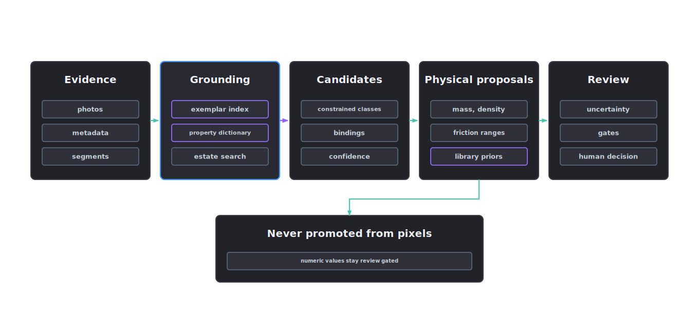

# Material and physical inference

Material inference selects constrained material-library candidates for each segmented component and proposes the physical properties that follow from them. Both are evidence-bound proposals until review promotes them.

  

## Visual and physical consistency

Visual detail affects robotic-policy observations. Policies often learn from colour, edge wear, gloss, seams, dirt, shadows and material contrast. Those cues must agree with the claimed physical properties: an object that looks like rubber but weighs like steel produces bad training signal.

Every selected material and physical property proposal carries evidence. Pixels can support a proposal; numeric physical values require evidence beyond pixels for promotion.

## Invoke material inference

Agent skill: `material-inference-lead`. Tools: `material_propose` and `material_physical_properties_propose`. The orchestrator runs this stage once source, geometry and segmentation records exist.

Review the following:

- the material name is constrained to the approved library
- every selected material has evidence and a confidence record
- physical property proposals carry units, uncertainty and review state

## Material process

1. Read source metadata, CAD material names, BOM entries, specifications, renders, reference images and operator notes.
2. Read the segmentation manifest for component regions and material hints.
3. Propose candidate materials from the approved material library.
4. Record evidence IDs, confidence and uncertainty for each component.
5. Select a material or mark the component review-required.

Each component records prim path, label, segment id, candidate materials, selected material, evidence IDs, confidence, uncertainty reason and review status.

## Physical property proposals

Material classes imply physical behaviour: mass, density, friction and stiffness. This stage records those implications as `physical_property_proposals` in the material-inference manifest, each with:

- property name and group
- value, unit, range and distribution
- method and confidence
- evidence IDs
- validation status and notes

Values enter as `review_required` or `needs_measurement` and stay there until measured, specified or reviewer-approved. Stage 5 physics-articulation consumes only validated or review-approved proposals.

## Manifest

`manifests/material-inference-manifest.json` records the material library id, `component_materials`, `physical_property_proposals` and the binding target layer (`mtl.usda`).

## Material representations

The generated package separates a renderer-neutral sidecar from the operative USD material:

- `materials.mtlx` is a MaterialX 1.39 sidecar using Standard Surface, explicit texture colour spaces and package-relative filenames
- `mtl.usda` is the canonical operative `UsdPreviewSurface` material and USD binding layer for the universal render context
- `material-adapters.json` binds both files by digest and explicitly marks the MaterialX sidecar as unbound until an `outputs:mtlx:surface` network or equivalent source-asset adapter has been authored and validated
- MDL remains blocked until its adapter is configured
- Storm and RTX remain pending until runtime render evidence is attached; authoring the files does not imply renderer parity

The USD `mtlx` adapter gate records an explicitly unbound MaterialX sidecar as not applicable. This status is distinct from a pass. Claiming an authored MaterialX render-context adapter makes the gate applicable; the bound artefact and digest must then validate. The universal Preview Surface gate remains independent.

The package-closure validator traverses USD dependencies and MaterialX filename inputs. Missing, external or escaping texture paths block promotion.

## Gates

- material library exists
- material names are constrained
- every selected material has evidence
- physical property proposals carry units, uncertainty and evidence
- numeric values are never promoted from visual evidence alone
