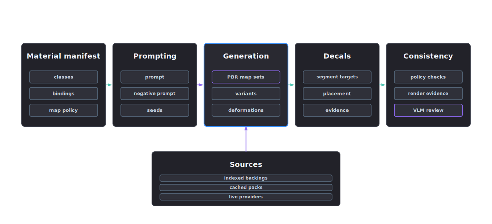
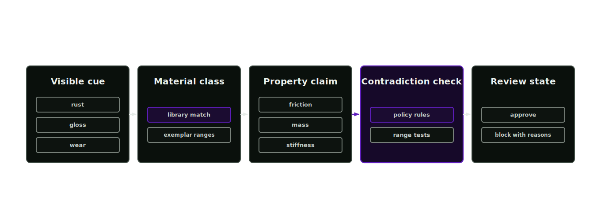

# Texturing

Texturing generates PBR map sets, texture variants and decals for the materials selected in stage 3. Texture work starts only after material bindings, UV readiness and physical consistency requirements are known.

<p align="center">
  
</p>

## Texture evidence

Textures determine the visual observations available to a policy. Domain randomisation needs variants that remain consistent with recorded material and physical claims. A texture may make an object look like rubber, steel, foam or worn plastic; the repository records the evidence behind the underlying physical claim.

<p align="center">
  
</p>

## Build a texture request

Agent skill: `texturing-lead`. Tools: `material_texture_prompt`, `material_texture_variation_workflow` and `material_texture_defaults_validate`.

Start with material evidence. Generate the texture prompt after prim paths, material candidates, selected materials and physical property claims exist.

```bash
afb texture prompt --material-manifest material-inference-manifest.json --property-manifest material-inference-manifest.json --output texture-prompt.json
afb texture defaults validate --texture-manifest texturing-manifest.json --property-manifest material-inference-manifest.json
```

## Texture process

1. Confirm material bindings and UV readiness.
2. Build a prompt from the material manifest and its physical property proposals.
3. Generate or declare PBR map sets within allowed bounds. Required maps are base colour, roughness, normal and ao; metallic only for metals. See [texture defaults](texture-defaults.md).
4. Store map paths, USD layer references, seeds, checksums and review state.
5. Validate texture and property consistency before promotion.

Live generation and calibration scripts live under `scripts/texturing/`: `run_live_texture_generation.py`, `probe_live_texture_provider.py`, `create_rollout_pbr_textures.py`, `calibrate_pbr_material_semantics.py`, `import_ambientcg_pbr_textures.py` and `compose_visual_set_passes.py`.

## Image texture and deformation workflow

`material_texture_variation_workflow` reads a source image review record and writes named material variants and mesh deformation requests into the project workspace. The dry-run workflow records:

- `source_image_review` with display surface, source image path, checksum and immutable-source policy
- `appearance_segments` with semantic labels, material hints, prim paths and mask paths
- `texture_variants` for default, clean satin, worn-edge and rough speckled PBR map sets
- `mesh_deformation_requests` for dent and bump variants with amplitude, radius and height or displacement map paths
- `variant_usd_path` for the selector layer
- `deformation_usd_path` for authored deformation request opinions

Generated maps live under `assets/<asset>/textures/variants/` and `assets/<asset>/deformations/`. Segment masks live under `assets/<asset>/textures/segments/`. The source image remains unchanged under `source-assets/`.

## Decals

The texturing manifest carries a `decals` array for labels, logos, markings and localised surface details. Each decal records:

- `decal_id`
- `target` prim or segment and `semantic_label`
- `placement` (UV region or mask)
- `source` and `source_evidence_ids`
- `status`

Decals are placed against segmentation regions so they survive texture variant swaps. They are proposals until render evidence and review confirm them.

## Manifest

`manifests/texturing-manifest.json` records UV readiness, texture requests, texture outputs, texture variants, mesh deformation requests, decals, render evidence and the physical-consistency record binding this stage to the material manifest.

## Gates

- UV readiness is declared
- texture paths exist
- deformation requests have USD layer and height or displacement evidence when requested
- decals carry placement, source evidence and status
- physical-consistency record exists
