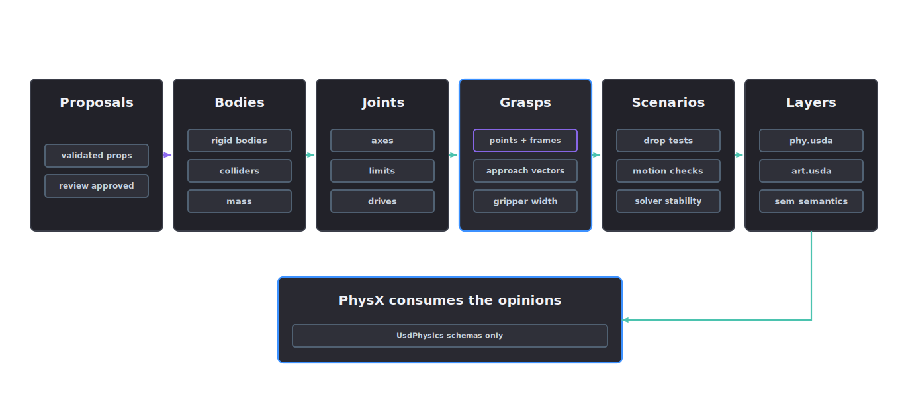

# Physics and articulation

The physics-articulation stage converts physical property proposals into USD physics plans, builds the kinematic plan for moving parts and records grasp affordances.

<p align="center">
  
</p>

## Contact behaviour

Contact behaviour depends on collider quality, mass distribution, friction, restitution, damping and solver-friendly topology. A visually correct handle, latch, drawer, hinge or slider can still move incorrectly and produce bad policy data. The physics-articulation record captures the relevant choices before they become simulator behaviour.

## Plan physics from the task

Agent skill: `physics-articulation-lead`. Tools: `physics_plan` and `articulation_plan`. The orchestrator runs this stage after material inference and consumes the physical property proposals in the stage 3 material-inference manifest.

Start with the task, then select colliders. Grasping, pushing, placing, rolling, opening and contact-rich navigation each demand evidence for different surfaces, physical values and joints.

## Physics authoring

Use the manifest to answer:

- which bodies are dynamic
- which colliders approximate which geometry
- where mass and centre of mass came from
- which contact properties are validated
- which scenarios prove the asset behaves well enough

1. Read the material-inference manifest, its physical property proposals and the geometry proposal.
2. Select collider strategy for each task-relevant component.
3. Author or plan rigid bodies, mass properties and physics materials.
4. Record approximation choices and known risks.
5. Define tuning scenarios for contact, stability and performance.

The physics layer is `phy.usda`. Its rigid body starts disabled and carries no mass or inertia opinions. Authoring activates it only after a project-local evidence file, SHA-256, SI unit policy, uncertainty record, accepted reviewer decision and valid HMAC attestation all resolve. Visual estimates, unmaterialised evidence IDs and unsigned approval records leave physics disabled.

Build the unsigned evidence object first. The evidence path is relative to the project workspace and its digest is verified before any USD opinion is authored:

```json
{
  "status": "accepted",
  "prim_path": "/asset_id",
  "mass": 2.75,
  "center_of_mass": [0.0, 0.0, 0.04],
  "diagonal_inertia": [0.08, 0.09, 0.05],
  "principal_axes": [1.0, 0.0, 0.0, 0.0],
  "method": "measured",
  "unit_policy": {"mass": "kg", "length": "m", "inertia": "kg*m^2"},
  "uncertainty": {"mass": 0.02, "diagonal_inertia": [0.005, 0.005, 0.005]},
  "source_evidence_ids": ["scale-reading"],
  "evidence": [
    {
      "evidence_id": "scale-reading",
      "path": "evidence/scale-reading.json",
      "sha256": "<lowercase-sha256-of-the-project-local-file>"
    }
  ],
  "approval": {
    "status": "accepted",
    "decision_id": "physics-review-001",
    "reviewer": "operator@example.org",
    "decided_at": "2026-07-09T12:00:00Z"
  }
}
```

Seal that object with an independent managed secret containing at least 32 UTF-8 bytes:

```powershell
$env:AFB_PHYSICS_EVIDENCE_SECRET = '<managed-physics-evidence-secret>'
afb physics-evidence seal --input .\physics-evidence.unsigned.json --output .\physics-evidence.sealed.json
```

Place the complete sealed object under `constraints.physics_evidence`. The command adds `evidence_fingerprint` and a five-field `attestation` containing the schema version, algorithm, non-secret key ID, canonical payload digest and HMAC signature. The canonical payload covers every supplied mass property, SI declaration, uncertainty value, evidence ID and digest and approval identity and time. Only the attestation and derived evidence fingerprint are excluded from the signed bytes. Authoring verifies the signature with `AFB_PHYSICS_EVIDENCE_SECRET`, then binds the exact attested object and the separately materialised evidence inventory into the package.

The accepted methods are `measured`, `manufacturer_specification` and `computed_from_measured_density`. Principal moments must be finite and positive and satisfy the rigid-body triangle inequalities; principal axes must be a unit quaternion. An initial run can remain blocked while the measurement record is added under `projects/<slug>/evidence/`; rerunning against the same request identity then verifies and authors the bound values.

## Articulation

Specify user-visible behaviour before tuning drives or damping. A drawer should slide within limits, a door should hinge around the correct axis and a latch should stop where the real latch stops.

For each joint, record:

- what part moves
- what is fixed
- which axis is allowed
- what the limits are
- which collisions should be ignored
- which validation scenario proves the motion

1. Build the part graph from source hierarchy and segmentation.
2. Propose joints, axes, limits, mimic relationships and drive settings.
3. Record collision exclusions and contact expectations.
4. Attach evidence and review state to each non-fixed joint.
5. Define validation scenarios for reachable motion, limits, collisions and solver stability.

The articulation layer is `art.usda`.

Joint authoring is driven by `constraints.articulation.joints` in the run request. Each joint requires two distinct body paths, metre-denominated local positions, non-zero finite local rotation quaternions and at least one source evidence ID. Each non-fixed joint also requires an axis and finite ordered limits. Drive type must be `force` or `acceleration`. Stiffness, damping and maximum force must all be finite and non-negative. A target position must remain inside the joint limits. For example:

```json
{
  "constraints": {
    "release_scope": "articulated_training",
    "articulation": {
      "joints": [
        {
          "name": "lid_hinge",
          "type": "revolute",
          "body0": "Geometry/Base",
          "body1": "Geometry/Lid",
          "axis": "Y",
          "frame_unit": "m",
          "local_pos0": [0.0, 0.31, 0.18],
          "local_rot0": [1.0, 0.0, 0.0, 0.0],
          "local_pos1": [0.0, -0.04, 0.0],
          "local_rot1": [1.0, 0.0, 0.0, 0.0],
          "lower_limit": 0,
          "upper_limit": 105,
          "drive": {
            "type": "force",
            "stiffness": 4.0,
            "damping": 0.5,
            "max_force": 12.0
          },
          "source_evidence_ids": ["manual_hinge_spec_page_12"]
        }
      ]
    }
  }
}
```

The author writes `UsdPhysics.ArticulationRootAPI` and typed Fixed, Revolute or Prismatic joint prims. Body targets must already be defined; authoring neither creates over-only body prims nor silently enables rigid bodies to satisfy a joint relationship. Verification reopens the composed stage, requires distinct defined targets with enabled rigid-body schemas and inspects axes, limits and typed drives. An articulated or RL request without joint evidence remains blocked; descriptive stand-in metadata is insufficient.

## Grasp affordances

The manifest carries `affordances.grasp_points`: candidate grasps for manipulation tasks. Each grasp point records:

- `grasp_id`
- frame
- approach vector
- gripper width
- confidence
- evidence IDs
- validation status

Affordance labels tie grasp points to task semantics. Grasp points are proposals until a validation scenario or reviewer confirms them.

## Inputs

- material-inference manifest with physical property proposals
- geometry proposal and segmentation
- source hierarchy and part labels
- robot description files
- manuals or operating videos

## Gates

- no unintended orphan bodies
- every non-fixed joint has axis and limit policy
- limit units are correct
- collision exclusions are explicit
- drive strength and damping are evidence-backed or review-required
- grasp points carry frame, approach vector, gripper width, confidence and evidence

## Outputs

- `manifests/physics-articulation-manifest.json`
- physics layer `phy.usda` or authoring plan
- articulation layer `art.usda` or authoring plan
- collision approximation report
- tuning and kinematic validation scenarios
- reviewer checklist

## Stop conditions

- missing unit policy
- missing source geometry
- task-critical mass, friction or stiffness unknown
- impossible collider topology
- high-risk property not validated or review-approved
