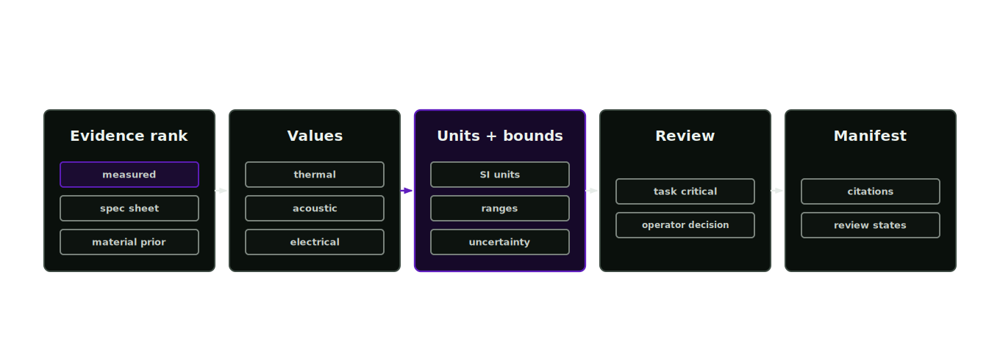

# Nonvisual materials

The optional nonvisual-materials stage infers hidden thermal, acoustic and electrical behaviour. Pixels may support a proposal; hidden physics requires independent evidence.

  

## Scope

Covered nonvisual material properties:

- thermal: conductivity, heat capacity
- acoustic: absorption
- electrical: conductivity, permittivity
- similar hidden material behaviour

Mechanical properties needed for physics, such as mass, density, friction and stiffness, are proposed in stage 3 material inference and authored in stage 5 physics-articulation. Their ownership remains with stages 3 and 5.

## Hidden-property evidence

Thermal cameras, contact microphones and electrical sensing models depend on behaviour that renders cannot show. The nonvisual-material record captures those assumptions with units, uncertainty and evidence.

## Evidence order

1. measured values
2. manufacturer specs
3. BOM or catalogue
4. material prior
5. simulation tuning
6. provider proposal
7. manual review

Higher-quality evidence can promote a property. Lower-quality evidence can create a proposal, but task-critical values remain review-required until a reviewer accepts the risk or stronger evidence arrives.

## Review hidden properties

Agent skill: `nonvisual-materials-lead`. Tool: `physics_nonvisual_materials_propose`. Provider role: `nonvisual_material_reasoner`. The orchestrator invokes this stage only when the task needs nonvisual material behaviour.

Ask whether the property affects the task. A rough thermal estimate for a decorative background object may be acceptable. An absorption value for an acoustic sensing task is task-critical and needs stronger evidence or review.

Check each value for:

- unit and range
- source method
- evidence ID
- confidence and uncertainty
- validation or review state

## Process

1. Collect candidate values from source evidence, material records and trusted priors.
2. Record units, ranges, distributions and method.
3. Attach evidence IDs and confidence.
4. Mark weak, contradictory or task-critical values as review-required.
5. Emit `manifests/nonvisual-material-manifest.json`.

## Property records

Each property records prim path, property name, group, value, unit, range, distribution, method, confidence, evidence IDs, validation status and notes.

## Required outcomes

- units present
- uncertainty present
- source method present
- weak proposals stay review-required
- task-critical unknowns block release or require review
