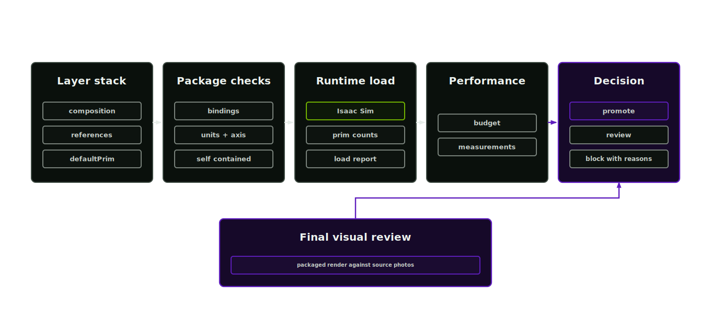
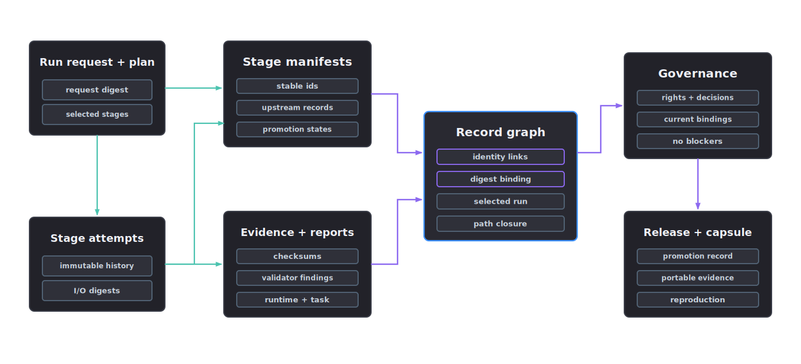

# SimReady verification

The final stage assembles a SimReady candidate, verifies the USD and records the evidence required before any scoped promotion claim.

<p align="center">
  
</p>

## Promotion boundary

SimReady status is a promotion state. A candidate must carry an exact Profile, pass the applicable Requirements, load in the named runtime, close every package dependency and prove fitness for its declared task before it can support a release claim. A filename or local-validator result cannot confer that status. Repository checks provide evidence without constituting NVIDIA certification.

## Run the gate

Agent skill: `simready-verification-lead`. The orchestrator reaches this gate after segmentation, material, texturing and physics-articulation records are present.

Run readiness after upstream stages have written their manifests. The report expresses the release decision and its blockers.

```bash
afb readiness --project projects/<slug> --output projects/<slug>/reports/readiness.md
```

If the report is blocked, fix the named missing record before rerunning. Visual correctness cannot replace missing load, layer, physics or governance checks.

## Verification checks

- units and up axis
- default prim
- layer stack completeness and reference resolution
- current OpenUSD `UsdValidation` registry results, including the registered validator inventory, bound to the root digest
- canonical Preview Surface material, unbound MaterialX sidecar status and texture colour-space records
- clean package replacement plus exact declared-file, USD, MaterialX and non-layer dependency closure
- current `SemanticsLabelsAPI:<taxonomy>` labels
- applied physics schemas
- articulation roots, defined and enabled rigid-body targets, collider coverage, evidence-backed local frames, axes, limits and bounded typed drives
- texture paths
- render evidence
- performance budget
- an exact NVIDIA Profile result with versioned Feature and Requirement findings
- task-fitness evidence for the declared release scope
- cross-record graph integrity before release

## Official Profile validation

Configure the trusted [NVIDIA Omni Asset Validator CLI](https://docs.omniverse.nvidia.com/kit/docs/asset-validator/latest/source/python/docs/cli.html), then validate the composed root against the exact Profile recorded in the asset manifest. The current NVIDIA validator distribution exposes `nvidia_usd_validate`; pin and record the installed package version and executable digest.

```bash
export AFB_ASSET_VALIDATOR_EXECUTABLE="$(command -v nvidia_usd_validate)"
export AFB_ASSET_VALIDATOR_EXECUTABLE_SHA256="$(sha256sum "$AFB_ASSET_VALIDATOR_EXECUTABLE" | cut -d' ' -f1)"
export AFB_VALIDATION_ATTESTATION_SECRET="$(openssl rand -base64 32)"
afb simready validate-profile \
  --usd projects/<slug>/packaged/<asset-id>/<asset-id>.usda \
  --profile-id <profile-id> \
  --profile-version <profile-version> \
  --raw-output projects/<slug>/reports/simready-profile-validation.raw.json \
  --output projects/<slug>/reports/simready-profile-validation.json
```

Use the executable digest from an administrator-approved installation. The report producer cannot select it. Keep one stable attestation secret in the deployment secret manager and make it available to both production and later evidence verification. Keep it out of the project and report. The bridge removes this secret from the validator child-process environment.

The bridge runs a bounded process with the shell and fix operation disabled; source files remain immutable. Raw and normalised reports must sit outside the immutable package directory. The normalised report binds the result to the root USD SHA-256, complete composition fingerprint, exact package-inventory fingerprint, administrator-pinned executable digest and exact Profile identity. Passing reports also carry a deterministic HMAC-SHA256 attestation over their canonical content. The inventory includes textures, MaterialX and other non-layer package files. A pass requires the requested Profile to appear exactly once and the vendor report to supply passing, versioned evidence for every Feature and Requirement beneath it. The unmodified vendor JSON remains the separate audit source. A missing pin, missing attestation secret, malformed report, unknown Profile or incomplete requirement tree remains blocked.

The script wrapper `scripts/simready/run_official_profile_validator.py` exposes the same bridge for environments that do not install the `afb` entry point.

## Fitness for use

Task adequacy requires evidence beyond Profile conformance and runtime loading. Generate a schema-valid, blocked template carrying the exact current bindings:

```bash
afb fitness template \
  --project projects/<slug> \
  --output projects/<slug>/reports/task-fitness-template.json
```

First materialise an approved `task-fitness-protocol` record under the project. The protocol names its authority, approval ID, approval time, scope, scenarios, metric units, ranges and tolerances. Its digest is bound into the fitness report, so the report submitter cannot choose different thresholds around an observed value. Run the required scenario outside the factory, replace the unmeasured template fields with measured metrics and content-addressed evidence records, then apply the result:

```bash
afb fitness apply \
  --project projects/<slug> \
  --report <completed-task-fitness-report.json>
```

The evaluator resolves the protocol and every evidence file inside the project, verifies their SHA-256 digests and content-derived IDs, requires exact test and metric coverage and recomputes every result from the approved protocol. A report for another run, request digest, package fingerprint, Profile or release scope cannot pass. The named protocol authority owns the acceptance thresholds; the blueprint supplies none.

## Record graph

<p align="center">
  
</p>

Run `afb project validate --project projects/<slug>` after applying external evidence. The validator walks the run request, run plan, immutable attempts, manifests, evidence references, checksums, provenance and release records. `record-graph` remains blocked when an identifier, digest, path or selected-run reference is inconsistent even if each individual JSON file is schema-valid.

## Runtime targets

Isaac Sim is one concrete runtime target. Its load check (`scripts/simready/isaac_load_check.py`) feeds the `isaac-load` gate:

Inject the same independent `AFB_ISAAC_ATTESTATION_SECRET` from the managed secret store into the producer and consumer environments. It must contain at least 32 UTF-8 bytes and must not reuse the official-validator attestation secret. Set `AFB_ISAAC_PRODUCER_SHA256` in every producer and consumer environment to the administrator-approved lowercase 64-hex SHA-256 of `scripts/simready/isaac_load_check.py`. A producer whose own script bytes do not match that pin cannot pass.

```bash
<isaac-sim>/python.bat scripts/simready/isaac_load_check.py \
  --usd projects/<slug>/packaged/<asset-id>/<asset-id>.usda \
  --profile-id <profile-id> \
  --profile-version <profile-version> \
  --output projects/<slug>/reports/isaac-load-check.json
afb isaac-load apply --project projects/<slug> --report projects/<slug>/reports/isaac-load-check.json
```

Use the exact `simready_profile.profile_id` and `simready_profile.profile_version` values from the asset manifest. The runtime report carries fixed report and protocol identities, a portable `project:///` USD label, producer and Isaac runtime identities and a versioned HMAC-SHA-256 attestation over canonical JSON. The signature input is the protocol-specific context `asset-factory-isaac-runtime-validation-attestation-v1`, a NUL byte and the canonical report bytes. The importer verifies the exact attestation shape, schema, producer pin, HMAC, Profile, USD digest and package inventory before it writes project state. The canonical SimReady consumer independently repeats the schema, producer-pin, identity and HMAC checks whenever it reads the report. A report for another Profile, package, protocol, producer or key does not satisfy this gate.

The result is recorded in the manifest as `isaac_sim_load_check`.

## Manifest

`manifests/simready-asset-manifest.json` records package ID, USD root, layer stack, units, axis policy, upstream manifest IDs, exact Profile, Feature and Requirement results, OpenUSD compliance, articulation schema evidence, official-validator evidence, runtime evidence, performance budget and promotion status. `reports/package-dependency-closure.json` records the transitive USD and MaterialX package closure.

## Promotion states

- `validated`: required checks passed and governance allows release.
- `review_required`: the package loads, but a reviewer must accept a weak or task-critical claim.
- `blocked`: a required record, artefact or gate is missing or failed.
