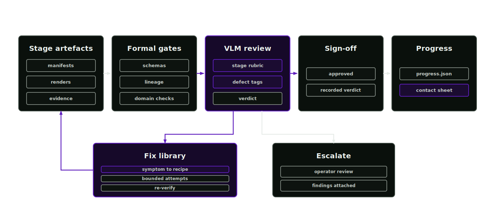

# Agentic operation

The agent loop materialises the workspace and runs each stage's deterministic gates. A vision-language reviewer checks the artefacts, the fix library applies bounded remediations and unresolved findings go to an operator.

<p align="center">
  
</p>

## Perceptual review

Formal gates check schemas, files and checksums. They cannot detect a melted handle or baked shadows in a texture. The VLM sign-off checks those perceptual faults against stage-specific instructions before the artefacts reach simulation.

## Start from a brief

The [asset programme strategist](https://github.com/hcltech-robotics/asset-factory-blueprint/blob/main/skills/asset-programme-strategist/SKILL.md) is the conversational entry point. It converts the user's source and outcome into a partial run request, calls the approval-free `asset_programme_intake` tool and asks every returned start-blocking question. It does not infer source rights, physical measurements or a SimReady Profile.

When intake returns `ready: true`, the host presents the canonical request and execution settings for operator approval. The reviewed `asset_factory_start` tool creates the project, persists `run-request.json` and enters the loop. A missing or denied approval stops the transition without mutating the workspace.

A coding agent with shell access can use the equivalent CLI path:

```bash
afb agent intake --draft artifacts/run-requests/<asset-id>.json
afb agent start --request artifacts/run-requests/<asset-id>.json --project-root projects
```

`agent intake` is diagnostic and writes nothing. Exit code 2 means the draft still has start-blocking questions. `agent start` requires `ready: true` and repeats intake validation before it creates the project. The CLI is the operator-controlled local path. External agent hosts use the reviewed tool boundary below.

External agent hosts can expose this path over stdio:

```bash
scripts/afb-agent-launchable
```

The host should allow `asset_programme_intake` and `asset_factory_start`. The latter uses the existing parameter-bound, single-use [mutation approval](deployment.md#http-tool-service).

## Run an existing request

```bash
afb agent run --request examples/run-requests/warehouse_pick_cell.json --project-root projects
afb agent run --request ... --live --max-fix-attempts 2
```

Dry runs materialise the workspace, record every planned review and fix without provider calls and leave each stage as review required. Live runs call the configured vision provider and apply fix recipes.

After every stage the loop refreshes two artefacts:

- `progress.json` at the project root: the machine-consumable state of every stage, gate, review verdict, fix attempt and next action.
- `reports/contact-sheet.md` and `reports/contact-sheet.png`: the operator-consumable contact sheet with per-stage status badges, reviewer verdicts, defect tags and image thumbnails.

Regenerate both at any time with `afb progress --project projects/<slug>`.

## VLM sign-off

Every content stage carries the `vlm-signoff` gate. The reviewer receives a rubric from `prompts/vlm_review_<stage>.md`, evidence images declared in `configs/vlm-review-policy.json` and a strict response contract. It returns `approve`, `revise` or `blocked`, a confidence and findings from a controlled defect vocabulary. Mesh findings include `mesh_holes`, `fragmented_parts`, `lumpy_surface`, `wrong_proportions` and `missing_parts`.

Verdicts are recorded as `vlm-review-record` manifests under `reports/<stage>-vlm-review.json`. Each record contains the rubric checksum, reviewer identity and evidence checksums. An unavailable reviewer or an invalid response produces a `skipped` verdict and leaves the stage review required; the loop never fabricates approvals.

Mesh verification is stricter than the generic content-stage sign-off. The mandatory verifier combines exact topology and integrity measurements with fixed-camera diagnostic renders and the vision judgement. The reviewer is expected to reject poor geometry and choose local repair or regeneration. It cannot override a failed deterministic quality check. Missing tools, evidence or reviewer availability blocks the stage rather than producing `skipped`. Reconstruction emits only candidate geometry and downstream work cannot begin until `mesh-verification-record` approves the exact candidate and quality-policy checksums.

A regeneration changes the reconstruction conditions. The controller can remove the background, select another rights-cleared view of the intended asset or apply another registered source remediation before running the pinned backend with the next declared seed. Every inference attempt and review has preserved evidence. Inference failures, review-provider failures and mesh rejections are counted separately. A configured hard cap prevents unbounded send-backs and leaves unresolved candidates blocked.

## Fix library

`configs/fix-library.json` maps defect tags to remediation recipes. Each recipe records the symptom, likely cause, action, attempt budget, verification step and escalation target. `heal_mesh_holes` runs `asset_mesh_condition`; `rerun_segmentation_prior_stronger_method` uses a stronger segmentation model; `regenerate_textures_reinforced_negative_prompt` re-prompts the texture generator. Numeric physical values are never auto-fixed and always escalate.

The `asset_fix_apply` tool resolves tags to recipes and logs every attempt in `reports/fix-attempts.json`. When attempts are exhausted or no recipe covers a defect, the stage escalates to operator review with the findings attached.

## Capability stewardship

The capability-steward skill and `scripts/discover_capabilities.py` probe installed reconstruction backends, segmentation models, texture generators, vision reviewers, mandatory mesh verification, the USD runtime, mesh processing and the Isaac lane. `configs/capability-registry.json` declares the primary option and ordered fallbacks for each capability, including licence or token gates.

```bash
afb capabilities
afb capabilities --install reconstruction.multiview_to_3d
afb capabilities --install mesh.processing --live
```

The probe reports which option serves each capability, flags capabilities running on fallbacks and plans installs on demand. Fix recipes of kind `capability_fallback` use the same registry to pick the next ready backend and execute the reconstruction resubmission before re-review.

## Escalation contract

Numeric physics, rights and release decisions require human review. Each escalation names the stage and defect tag, then includes the reviewer's reasoning and previous fix attempts.
