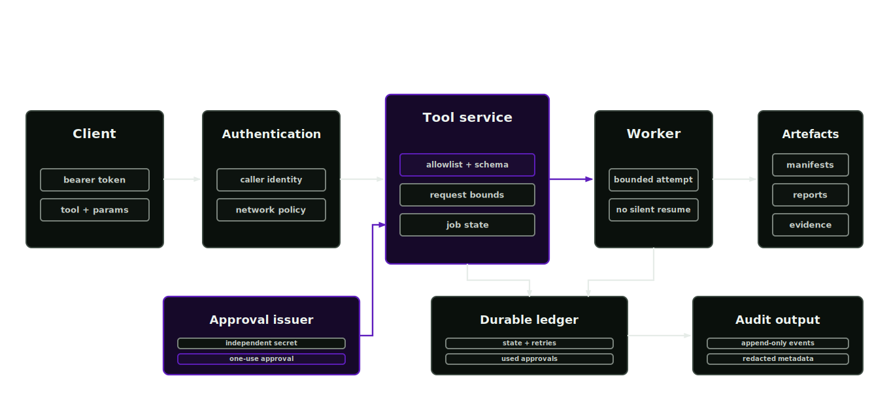

# Deployment

Deployment covers operator hosting, secret handles and bounded request execution outside a one-off local command.

## Operating model

Deployment lets operators review evidence, rerun gates and inspect project state across terminal sessions. Local and hosted runs use the same file-backed validation model. The HTTP process is an execution gateway with durable job records, not a workflow scheduler.

## Deployment units

- CLI package installed from the repository
- bounded tool service bound to loopback or an authenticated approved host
- project workspace root
- provider policy file
- external model config
- durable job and approval ledger
- append-only audit destination
- separate bearer and reviewed-mutation approval secrets

## Secret policy

Secrets are supplied through environment variables or deployment secret stores. Reports can record env var names, provider IDs, model IDs and redacted endpoint metadata. Reports must not record raw keys, bearer tokens, approval secrets or signed URLs. Job parameters and approval reasons are durable operational records and must contain only handles.

## HTTP tool service

The service binds to loopback by default. It limits request and result size, HTTP threads, workers, retained jobs and retries. `--job-store` persists every job transition and consumed approval capability. On restart, recorded terminal jobs remain queryable and interrupted jobs become failed. The service never silently resumes an interrupted mutation.

<p align="center">
  
</p>

```bash
afb tool-server --transport http --host 127.0.0.1 --port 8181 \
  --max-request-bytes 1048576 --max-result-bytes 4194304 \
  --max-http-threads 32 --max-workers 4 --max-retained-jobs 256 --max-retries 1 \
  --job-store artifacts/tool-server-state \
  --allowed-tools environment_capability_probe,asset_stage_run \
  --audit-log artifacts/tool-server-audit.jsonl
```

Set `AFB_TOOL_SERVER_APPROVAL_SECRET` to a random value of at least 32 bytes. The approval issuer runs separately from the server and binds a capability to the exact tool and canonical request parameters:

```bash
afb tool-approval issue \
  --tool asset_stage_run \
  --params-file reviewed-stage-request.json \
  --expires-at 2026-07-09T19:30:00Z \
  --approved-by operator@example.org \
  --reason "Reviewed stage mutation for run run-20260709-01"
```

The returned token expires within 24 hours and can be consumed once. Any parameter change invalidates it. A retry requires a new token. Approval is derived from the registered service effect, so setting `dry_run` never weakens the boundary.

Endpoints are:

| Method | Path | Purpose |
| --- | --- | --- |
| `GET` | `/healthz` | unauthenticated process health, durability mode and job counts |
| `GET` | `/tools` or `/v1/tools` | governed tool catalogue |
| `POST` | `/v1/jobs` | validate and submit `{"tool": "...", "params": {...}, "approval_token": "..."}` |
| `GET` | `/v1/jobs/<id>` | read state and result |
| `POST` | `/v1/jobs/<id>/cancel` | cancel queued work or record a request against running work |
| `POST` | `/v1/jobs/<id>/retry` | create a bounded child attempt from a failed or cancelled job |
| `GET` | `/v1/audit` | read the most recent in-memory audit events |

Running tools cannot yet be interrupted cooperatively. A cancellation request is recorded and the response says whether execution was cancelled before it started.

Set `AFB_TOOL_SERVER_TOKEN` to require bearer authentication. Non-loopback binding requires the bearer token, the independent approval secret and `AFB_TRUSTED_TOOL_SERVER_NETWORK=1`. Use a reverse proxy or service mesh for TLS, rate limiting and caller identity. The bearer authenticates the caller; the single-use capability authorises one reviewed mutation. They are deliberately different credentials.

The stdio transport accepts one JSON request per line. Operations are `health`, `catalogue` and synchronous `invoke`. It applies the same tool allowlist, exact schema validation, result bound and approval ledger as HTTP. It is intended for a local agent subprocess whose process lifetime is controlled by the caller.

## Deployment templates

The Docker Compose and Kubernetes templates run one bounded HTTP replica and require bearer and approval secrets. Compose persists the job ledger in the mounted artefact directory. Kubernetes keeps it across container restart inside the pod, but the checked-in `emptyDir` does not survive pod replacement. Replace the artefact volume with a persistent volume claim for a durable deployment. Multiple replicas require an external scheduler and shared concurrency control.

Slurm, OSMO and Brev templates launch bounded batch commands. They do not provide a durable HTTP control plane. Provider credentials remain external to every template.

## Release checks

```bash
afb provider check --policy configs/provider-policy.json
afb skill-audit --root . --output artifacts/skill-audit.json
```

Repository contract validation and benchmark tooling live in the asset-factory-verification repository and run against a checkout of this blueprint.

Deployment should expose the same artefacts that local runs produce: manifests, reports, evidence, checksums and governance records.

See the [support matrix](../support-matrix.md) before describing any deployment or simulator combination as release-verified.
