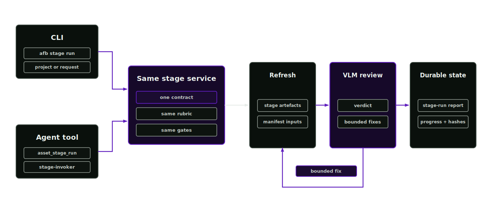

# Direct partial invocation

Direct partial invocation runs one pipeline stage with the same review, fix and progress contracts as the orchestrated loop. An agent calls the `asset_stage_run` tool; a person runs `afb stage run`. Both paths call the same service function and produce identical records.

<p align="center">
  
</p>

## Scope

Use the full loop for a fresh asset and direct invocation for a targeted change. Typical cases include re-texturing changed maps, reviewing a repaired mesh, rerunning segmentation with better masks or assigning stages to specialist agents. The same review, fix and progress rules still apply.

## The CLI path

```bash
afb stage list
afb stage run texturing --project projects/metal_jerrycan --live
afb stage run segmentation --project projects/metal_jerrycan --live --max-fix-attempts 2
afb stage run material-inference --request examples/run-requests/jerrycan_from_photo.json --live
```

`afb stage list` shows every routed stage and whether it is directly invocable. `afb stage run` refreshes the workspace artefacts, runs the stage's VLM sign-off against its rubric, applies bounded fixes when the reviewer bounces the work and updates `progress.json`, the contact sheet and checksums. Without `--live` it is a dry run. `--no-refresh` reviews exactly what is on disk without rebuilding first. When the project does not exist yet, `--request` bootstraps the workspace and then reviews the one stage.

## The agent path

The `stage-invoker` skill package teaches an agent the same operation through the `asset_stage_run` tool:

```json
{
  "tool": "asset_stage_run",
  "params": {
    "stage_id": "texturing",
    "project": "projects/metal_jerrycan",
    "dry_run": false,
    "max_fix_attempts": 2
  }
}
```

The per-stage lead skills, such as texturing-lead and segmentation-lead, own the domain reasoning. Stage-invoker owns the invocation contract. A specialist agent can use the lead skill's tools before running the stage review through `asset_stage_run`.

## What each stage exposes

| Stage | Invoke as | Domain tools an agent can also use directly |
| --- | --- | --- |
| reconstruction | `afb stage run reconstruction` | `governance_external_model_run`, backend runs via `afb external-models run` |
| segmentation | `afb stage run segmentation` | `asset_image_segmentation_prior`, `asset_mesh_condition` |
| material-inference | `afb stage run material-inference` | `material_propose`, `material_physical_properties_propose` |
| texturing | `afb stage run texturing` | `material_texture_prompt`, `material_texture_variation_workflow`, `material_texture_defaults_validate` |
| physics-articulation | `afb stage run physics-articulation` | `physics_plan`, `articulation_plan` |
| nonvisual-materials | `afb stage run nonvisual-materials` | `physics_nonvisual_materials_propose` |
| simready-verification | `afb stage run simready-verification` | `afb isaac-load apply`, `afb readiness` |

Pre-pipeline and cross-cutting stages (orchestrate, intake, source-ingestion, evaluation, infrastructure, governance) have no review rubric and are not directly invocable; the tool refuses them and lists what is.

## Results and state

The stage run writes `reports/stage-run-<stage>.json` with the full iteration record and returns `final_state`:

- `approved`: the reviewer signed off with no blocking findings.
- `review_required`: held by the reviewer, skipped for a recorded reason or a dry run.
- `blocked`: rejected outright.
- `escalated_to_review`: fixes ran but none changed the artefacts.
- `fix_attempts_exhausted`: the remediation budget ran out.

## Preserved invariants

- Rubrics, review record schemas and severity gates match the full loop; approvals have the same meaning on either path.
- Stage manifests are regenerated, never hand-edited; durable decisions stay in governance records and the operator release decision.
- Numeric physical values from visual evidence stay `review_required` whatever invoked the stage.
- Every run refreshes the progress record and contact sheet, including partial runs.
