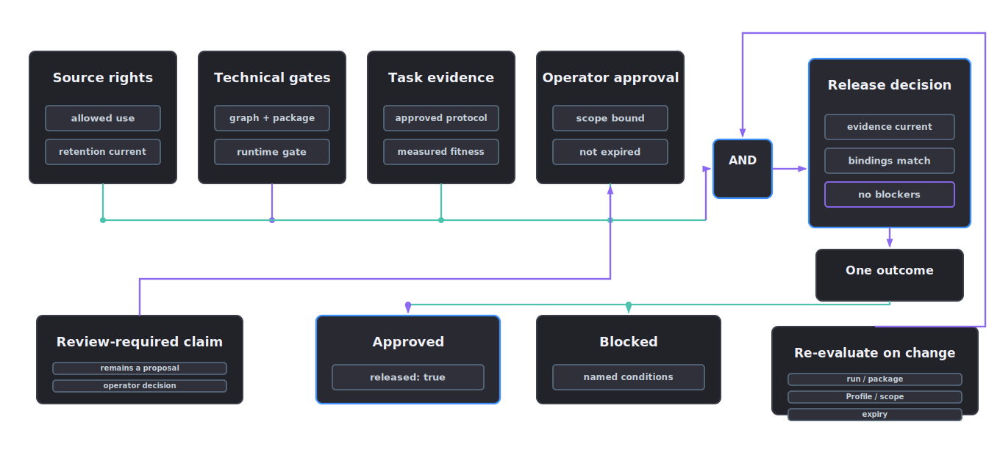

# Governance

Governance records rights, privacy, retention, reviewer decisions and provenance.

## Release basis

Loading in simulation does not make an asset releasable. Source rights may be unclear, a physical value may apply only to a narrow task and provider output may need redaction. Governance records those conditions for later release decisions.

## How to make a release decision

Agent skill: `governance-provenance-lead`. Tools: `governance_record`, `governance_project_create`, `governance_external_model_run` and `governance_mutation_validate`. The orchestrator generally leaves governance until the end, then gathers source, provider, validation and review records for the release decision.

Technical claims originate in source, provider, validation and review records. Governance cites those records when deciding release state.

Before release, confirm:

- source rights allow the intended use
- provider traces are redacted
- validation reports match the claimed promotion state
- review-required claims have reviewer decisions
- the record graph and task-fitness gate pass for the declared release scope
- blocked reasons are empty

## Required records

- run request
- project manifest
- source rights record
- provider trace with secrets redacted
- validation report
- reviewer decision
- exact run, request, asset fingerprint and Profile binding
- decision expiry and immutable decision history
- task-fitness evidence for the declared release scope
- checksum record
- promotion state

## Process

1. Read the source, provider and validation records for the project.
2. Confirm release rights, retention policy and redaction state.
3. Record reviewer decisions for weak or task-critical claims.
4. Attach blocked reasons when promotion is not allowed.
5. Generate the decision from current project state with `afb governance decide`.
6. Inspect the preview, then repeat with `--write` to create the current pointer and immutable history record.

The decision records a timezone-aware `evaluated_at` value and a fixed evaluation order. Rights, fixed-period retention and the operator decision must all remain current at that instant. An expired rights grant, reached retention deadline, reviewer timestamp after the evaluation time or expired operator decision blocks release.

<p align="center">
  
</p>

## Promotion decisions

- `validated`: required evidence exists and gates passed.
- `review_required`: a reviewer must accept uncertainty or missing strength of evidence.
- `blocked`: release is not allowed until the named condition changes.

## Worked example: releasing the walkthrough project

The walkthrough project proposes a mass value for the jerrycan from visual evidence alone, so material inference marks it `review_required`, and the workflow keeps the governance release status blocked. A release decision cannot waive that technical blocker. The decision does not live in a stage manifest because the workflow regenerates those files. The command derives a decision from current project state and writes a content-addressed history record plus a current pointer after the missing evidence has been supplied.

Preview the exact decision before writing it:

```bash
afb governance decide \
  --project projects/metal_jerrycan \
  --reviewer operator@example.org \
  --decision approve \
  --scope rigid_body_manipulation \
  --expires-at 2026-08-01T00:00:00Z \
  --note "Source rights and current evidence graph reviewed" \
  --note "Materialised mass evidence and physics validation reviewed"
```

The preview contains a content-derived `decision_id`, current `run_id`, request digest, asset fingerprint, exact Profile ID and version, scope and expiry. If any binding is blank or wrong, do not author the file. Repeat the command with `--write` only after the preview has been reviewed. The write creates:

- `operator-release-decision.json`, the current decision pointer
- `governance-decisions/<decision-id>.json`, the immutable history record

On the next rebuild or agent run, the governance stage recomputes the release state:

- the isaac-load gate result is read from `reports/isaac-load-check.json`
- `reports/project-graph-validation.json` and `reports/pre-release-graph-validation.json` must have no graph errors
- `reports/task-fitness-evidence.json` must match the current run, fingerprint, Profile and release scope
- the operator decision is read from `operator-release-decision.json`
- its content ID, expiry and all bindings are recomputed
- any remaining stage or validation blockers are collected

The governance record changes to `release_status: approved` with `released: true` only after every required gate passes, generated artefact validation is `validated` and the bound decision says `approve`. A new run, package change, Profile change, scope change or expiry invalidates the current decision automatically.

Persistence rules:

- The stage manifests are never edited retroactively; a proposal from visual inference stays labelled as such, and the decision file records who accepted it and under what conditions.
- Notes carry concise, non-secret conditions of acceptance for comparison with the evidence available at decision time.
- Gate results survive rebuilds through their reports; `afb isaac-load apply` records the load check once and every later rebuild rehydrates it.
