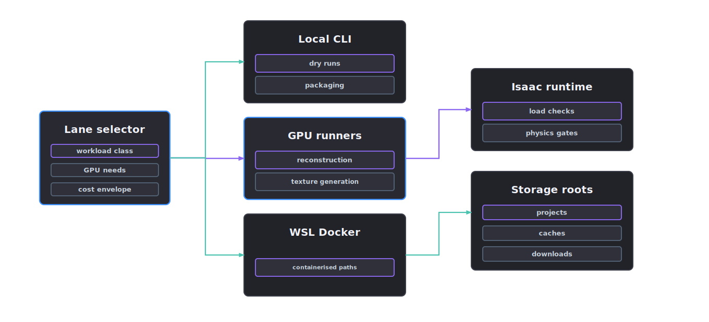

# Infrastructure

Infrastructure lanes describe where work can run and how the resulting artefacts return to the project workspace.

<p align="center">
  
</p>

## Record consistency

Asset generation can use local CPUs, GPU reconstruction, external runners or simulator load checks. Each execution lane writes the same classes of manifests, logs, reports and checksums.

## Lanes

- local CLI for schema checks, dry runs and packaging
- local or remote GPU runners for reconstruction and generation
- WSL Docker for containerised execution paths
- Isaac or compatible simulator runtimes for load and physics checks
- storage roots for downloads, caches and project workspaces

## Rules

- Runtime paths must be declared in configs or manifests.
- Secrets are passed through environment handles, not stored in reports.
- External commands are argument lists, not shell strings.
- Large downloads go to the approved download root.
- Runner outputs are proposals until downstream validators promote them.

## Docker access

Docker on the local machine is reached through WSL:

```bash
wsl -d Ubuntu docker ps
```

## Output contract

Infrastructure work is complete only when the project has the relevant run log, manifest, report and checksum sidecar.
