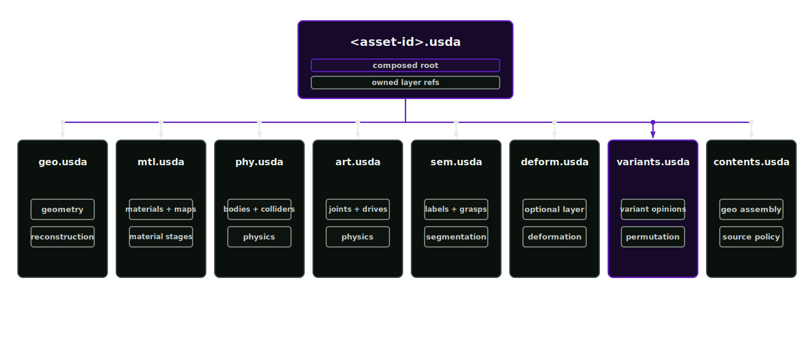

# Layer ownership and variants

Layer authority is explicit. Tools write only to their owned layer family.

  

## Review boundaries

Arbitrary writes across geometry, material, physics, articulation, semantic and variant opinions obscure which stage owns a change. Layer ownership assigns each opinion to a stage, while variant definitions bound the permitted permutations.

## Asset layers

- `geo.usda`: source or reconstructed geometry, owned by reconstruction
- `mtl.usda`: material definitions, bindings and texture outputs, owned by material inference and texturing
- `phy.usda`: rigid bodies, colliders, mass and physics materials, owned by physics-articulation
- `art.usda`: joints, drives, limits and articulation roots, owned by physics-articulation
- `sem.usda`: labels, affordances, task metadata and provenance hooks, fed by segmentation
- `deform.usda`: dent, bump and displacement request opinions for generated geometry variants
- `variants.usda`: material, geometry, physics, articulation and domain-randomisation variants
- `contents.usda`: assembly references

Grasp affordances are recorded in the physics-articulation manifest and surfaced as semantics in `sem.usda`.

## Mutation rules

- Ambiguous write targets return `blocked_needs_target`.
- Deletes scan active and inactive variant bodies.
- Renames update owned variant bodies and relationship targets.
- Asset or path attributes validate target files before authoring.
- Variant deletion requires explicit approval when only one effective choice remains.

## Variant role

Variants let the same asset support policy training across visual, physical and layout differences. Each variant must keep the base asset lineage and define its bounds so randomisation stays reviewable.

## Validation

`configs/tool-surface.json` encodes layer authority. Prefix and service ownership checks live in the asset-factory-verification repository and run against a checkout of this blueprint.
