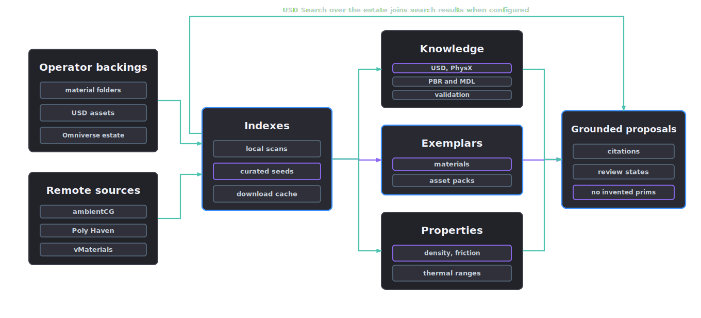

# Libraries

Libraries index operator backings such as material folders, texture sets, USD assets, an Omniverse content estate, a USD Search endpoint and remote free sources. Agents use those indexes to ground asset, material, texture and property choices.

<p align="center">
  
</p>

## The grounding rule

Every authored prim path, schema name, material, texture channel and physical value traces to a knowledge document, exemplar entry, indexed local asset, configured estate search hit or measured record. Items without grounding are flagged ungrounded and require review. The `library_grounding` record on material proposals and the `library:` evidence IDs on property proposals carry this trace.

The pipeline can run without library backings, but ungrounded items require review.

## Backings

`configs/library-registry.json` declares the backings; operators add their own in `library/local/backings.json` without touching tracked config. Kinds:

- `local_folder`: operator folders resolved through environment handles (`AFB_MATERIALS_ROOT`, `AFB_TEXTURES_ROOT`, `AFB_USD_ASSETS_ROOT`, `AFB_OMNIVERSE_CONTENT_ROOT`). `afb library index` scans them for MDL modules, USD files and PBR texture sets (channel naming is recognised and grouped into sets) into indexes under `library/local/`.
- `usd_search`: a USD Search API endpoint indexing the operator's estate, configured through `AFB_USD_SEARCH_URL` and `AFB_USD_SEARCH_API_KEY`. Search results join library hits for USD assets.
- `remote_pack_source`: API-backed free sources (ambientCG and Poly Haven, both public domain) that can be queried and downloaded from.
- `manual_pack`: catalogues obtained through their own channels, such as vMaterials; once installed locally, the same folder indexing applies.

## What ships in the seeds

The repository ships four curated indexes under `library/`, all in the same item-record shape (`item_id`, `name`, `domain`, `source`, `tags`, licence and domain-specific fields), so search treats seeds, operator indexes and remote hits uniformly.

| Seed file | Entries | What each entry carries |
| --- | --- | --- |
| `material-exemplars.json` | 20 exemplar materials | material class, tags and format for common industrial surfaces: brushed and galvanised steels, painted and rusted metals, aluminium, plastics, rubbers, woods, concrete, glass and fabrics, patterned on the Omniverse reference catalogues |
| `physical-properties.json` | 21 material classes | per-class ranges with units for density, friction, restitution and related properties (`props_steel`, `props_aluminium`, `props_rubber` and so on); material inference draws review-gated `library_prior` evidence from these ranges, never point values |
| `asset-packs.json` | 10 pack links | curated pointers to existing asset, material and texture collections (NVIDIA SimReady warehouse assets, ambientCG, Poly Haven and peers) with licence and pack domains, so a reconstruction target such as an industrial ladder can be compared against pack exemplars |
| `knowledge/` | 5 documents plus `index.json` | the agent knowledge corpus: `usd-fundamentals.md`, `asset-creation.md`, `validation.md`, `physx-binding.md` and `pbr-mdl-materials.md`, indexed for search so agents cite how USD, validation, physics binding and PBR and MDL authoring work here |

The seeds cover the bundled examples and define the extension format. Production materials databases require additional entries.

## Adding library content

### Index existing content

Declare backings in `library/local/backings.json`, which is untracked and operator-owned, or through the environment handles. Then index them:

```json
{
  "backings": [
    {"backing_id": "studio_materials", "kind": "local_folder", "domain": "materials", "path": "D:/content/materials"},
    {"backing_id": "studio_usd", "kind": "local_folder", "domain": "usd_assets", "path": "//nas/usd-library"}
  ]
}
```

```bash
afb library index
afb library search --query "brushed steel"
```

Indexing scans for MDL modules, USD files and PBR texture sets. Recognised channel names are grouped into sets. The resulting `*-index.json` files under `library/local/` join the seed indexes in search.

### Download from free sources

`afb library fetch --source ambientcg --query "rusty metal" --limit 3 --live` pulls query-responsive items. `afb library shop` opens the terminal selector across sources and packs. Downloads land under `library/downloads/` with checksums and licence records, then join the cache index.

### Search the estate

With `AFB_USD_SEARCH_URL` configured, estate hits join local results on every search and remain available as remote grounding references.

### Extend the curated seeds

Seed files are tracked contracts. Add entries in the same item-record shape and commit them like any other config change. A new property class must carry ranges with explicit units, never single values, so downstream proposals stay review-gated. Add knowledge as a Markdown document under `library/knowledge/` and register it in `knowledge/index.json`.

## Searching and fetching

```bash
afb library search --query "rusty metal"
afb library search --query "industrial ladder" --domain usd_assets --remote
afb library backings
afb library index
afb library fetch --source ambientcg --query "rusty metal" --limit 3 --live
afb library shop --query "rusty metal"
afb library shop
```

`afb library shop` lists query-responsive items from API-backed sources or registered packs. Numbered selections accept `all` or ranges such as `1,3-5`, then require confirmation before planning or downloading. Downloads land under `library/downloads/` with checksums, join a cache index and stay out of version control. Fetches are plan-first; `--live` performs them. Licences travel with every item, and mixed-licence sources require rights checks before use beyond visual reference.

The agent-facing tools mirror the commands: `asset_library_search`, `asset_library_index` and `asset_library_fetch`.

## How stages use the library

- Reconstruction compares targets against asset pack exemplars and estate search hits for part structure and proportions.
- Material inference grounds candidates in the exemplar index and records `library_grounding` per component; ungrounded materials require review.
- Physical property proposals cite dictionary entries as `library_prior` evidence with ranges and stay review gated.
- Texturing resolves texture sets from indexed backings and cached pack downloads before generating new maps.
- VLM reviewers receive exemplar references in stage context for review decisions.
