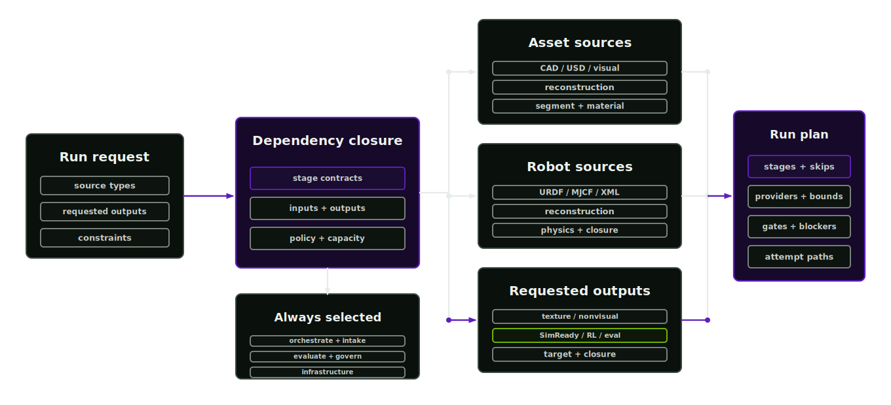

# Orchestrator

The orchestrator converts a run request into a dependency-closed DAG. The plan records versioned stage contracts, provider assignments, validation gates, W&B settings and stop conditions.

<p align="center">
  
</p>

## Route selection

CAD, image-only, articulated robot and texture-variation requests take different routes. The orchestrator records the selected route, skipped stages, missing evidence and provider choices before mutation starts.

## How to read a plan

Agent skill: `asset-factory-orchestrator`. This is the primary route through the factory; it usually selects the stage skills, provider assignments and validation gates for the whole run.

`run-plan.json` records:

- which stages will run
- which stages are skipped and why
- which providers or local runners are assigned
- which validation gates apply
- which typed deliverables each stage consumes and produces
- which executor, resource bounds and retry policy apply
- what evidence is missing before release

Resolve missing evidence in a blocked plan before running downstream stages.

## Routing

Stages are selected by source suffix and requested outputs:

- CAD and USD sources route through the reconstruction contract, which records that conversion is unnecessary when the source is already canonical USD and otherwise conditions owned geometry.
- URDF and robot description XML route through source-ingestion, physics-articulation, simready-verification and rl-environment.
- Images, video, point clouds and raw meshes route through source-ingestion, reconstruction, material-inference and evaluation.
- Selecting material-inference always selects segmentation as well.
- Texture, variant, deformation and decal terms in the requested outputs select texturing.
- Thermal, acoustic, electrical and nonvisual terms select nonvisual-materials.
- SimReady, OpenUSD and USD package terms select simready-verification.
- RL terms select rl-environment together with simready-verification.

Orchestrate, intake, governance, evaluation and infrastructure are always selected.

## Inputs

- `run-request.schema.json`
- `configs/agent-workflow.json`
- `configs/provider-policy.json`
- `configs/skill-registry.json`
- `configs/validation-gates.json`
- `configs/stage-contracts.json`

## Output files

- `run-plan.json`
- `provider-assignment.json`
- `validation-plan.json`
- `missing-evidence.json`
- `wandb-run-plan.json`
- `runs/<run-id>/request.json`, `plan.json`, `provenance.json` and `events.jsonl`
- `runs/<run-id>/attempts/<stage-id>/<attempt-id>/`

## Telemetry plan

`wandb-run-plan.json` names the run, reporting stages and artefact lineage for Weights and Biases. Nothing is sent unless `AFB_WANDB_ENABLED` is set and `WANDB_API_KEY` is exported; `AFB_WANDB_PROJECT` and `AFB_WANDB_ENTITY` select the destination. When telemetry is off, the file records what a later connected run would log. Regenerate it with `afb wandb-plan --run-plan ... --output ...`.

## Ordering

Ordering comes from `depends_on`, `consumes` and `produces` in the stage contract registry. A stage cannot publish a successful attempt while a required deliverable is unavailable. Every terminal attempt records resolved inputs, environment and resource checks, output snapshots, validation gates and error codes. Segmentation carries the segmentation-segments gate, simready-verification carries static and runtime conformance gates and every content stage carries the VLM sign-off gate served by the [agentic loop](agentic-operation.md).

## Stop conditions

The orchestrator blocks or flags a stage when required source evidence, provider policy, unit policy, schema support or upstream promotion state is missing. A blocked plan records why the run cannot proceed.

## Commands

```bash
afb run-plan --request examples/run-requests/warehouse_pick_cell.json --output artifacts/run-plan.json
afb workflow run --request examples/run-requests/warehouse_pick_cell.json --dry-run
afb workflow summarize --run-plan projects/<slug>/run-plan.json --reports projects/<slug>/reports
```
