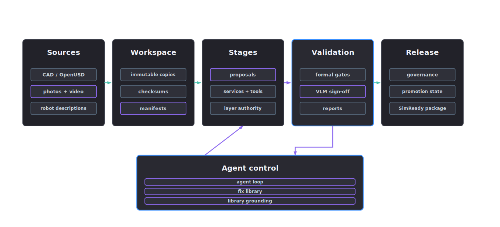

# Reference architecture

The architecture assigns separate layers to source evidence, proposal generation, project mutation, validation and release. Recorded hand-offs keep promoted assets replayable.

  

## Runtime layers

- `schemas/` defines JSON Schema contracts for files that must survive outside Python.
- `src/asset_factory_blueprint/schemas/` defines Pydantic models used by runtime services.
- `tools/` exposes public commands and tool calls. Each public tool calls one service function.
- `services/` owns stateful work: project creation, manifest writes, provider calls, validation plans and reports.
- `utils/` contains pure helpers used by services.
- `prompts/` contains editable tool help and provider-facing instructions.
- `skills/` contains public Skill SDK packages and stage playbooks.

## Artefact flow

The factory writes a chain of durable records:

1. A run request describes the asset programme.
2. The dependency resolver closes requested deliverables over versioned stage contracts and writes the run plan.
3. The executor records an immutable attempt under `runs/<run-id>/attempts/<stage-id>/<attempt-id>/` and appends state transitions to the run journal.
4. Stage services write manifests, reports and proposal artefacts; the attempt snapshots their exact outputs by digest.
5. Validators record JSON and graph validity, OpenUSD validity, exact Profile conformance, runtime behaviour and task fitness as distinct levels.
6. Governance derives release state from rights, the current asset fingerprint, exact Profile, task scope and an expiring operator decision.
7. Native provenance and its W3C PROV-O JSON-LD projection bind runs, attempts, sources, software, models, manifests and the dependency lock.

Stages rely on durable records rather than process memory or console output. Reruns create new attempts and cannot replace the evidence of an earlier attempt. The project workspace is the audit surface.

## Provider boundary

Providers are selected by role and capability. Their outputs are stored as redacted proposal artefacts with enough metadata to reproduce the request context without exposing secrets. Providers may supply material inference, reconstruction notes, image reasoning or prompt generation; repository gates control promotion.

## Review records

Review happens through the CLI and the project files themselves. Reviewers read manifests, reports and evidence, then record decisions as governance records. The validator of record is the manifest, report, checksum and gate state written to disk.

## Release evidence

A released package carries source lineage, layer stack records, material and physics evidence, requirement-level validator output, runtime and task evidence, graph validation and governance status. A blocked package carries the same structure plus the exact missing evidence or failed gate. Publication adds the locked SBOM and positive or negative reference capsule without changing the original run records.
