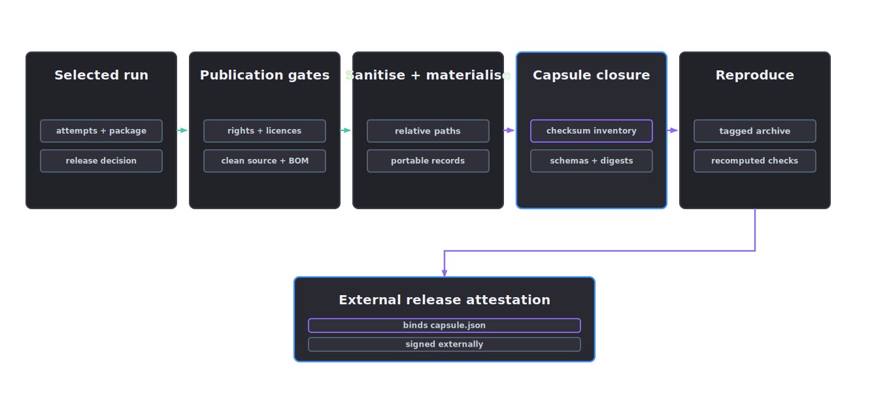

# Reference-run capsule

A reference-run capsule is the minimal redistributable record for inspecting and reproducing a release claim. It excludes developer workspace state and includes screenshots only as supporting evidence.

Create and validate a capsule through the `afb` command. Creation is fail-closed and never overwrites an existing destination.

```powershell
afb capsule create `
  --project projects/example_asset `
  --output artifacts/reference-runs/example-negative `
  --outcome negative `
  --scope rigid_body_manipulation

afb capsule validate --capsule artifacts/reference-runs/example-negative
```

Both commands emit JSON. Validation exits with status `0` only for a valid capsule and status `1` for an invalid capsule. Use `--include-source-media` only after an explicit publication decision. Positive capsules include allowlisted packaged outputs by default; compact negative capsules do not. Use `--include-outputs` to retain eligible outputs in a negative capsule or `--no-outputs` to omit eligible outputs where the outcome permits it.

Library callers may use `create_reference_capsule()` and `validate_reference_capsule()` from `asset_factory_blueprint.capsule` directly.

## Required layout

```text
reference-run/
  README.md
  capsule.json
  checksums.sha256
  request/run-request.json
  source/source-asset-manifest.json
  source/rights-evidence.json
  source/redistributable-inputs/
  environment/runtime.json
  environment/software-bom.json
  environment/models.json
  schemas/
  attempts/<stage>/<attempt-id>/
  outputs/
  validation/schema-results.json
  validation/profile-results.json
  validation/runtime-results.json
  validation/task-fitness-evidence.json
  validation/task-fitness-protocol.json
  validation/fitness-evidence-files/
  validation/official-validator-results.json
  validation/official-validator-raw.json
  validation/openusd-compliance.json
  validation/package-dependency-closure.json
  governance/release-decision.json
```

`capsule.json` records the capsule format version, run identity, origin and capsule-local provenance and decision identities, schema identities and digests, requested Profile, stage attempt identifiers and the digest and licence of every included file. Paths inside the capsule are relative.

The current capsule format records the exact run provenance and release-decision identities. Release tags and verification commits remain release-publication metadata and must be recorded by the release process before publication.

## Evidence rules

<p align="center">
  
</p>

- Include only source material whose redistribution terms are recorded and permit publication.
- Require cleared, unexpired source rights with explicit redistribution permission for both positive and negative capsules.
- Materialise every cited licence or consent record inside the project and verify its recorded digest before export.
- Record code revisions separately from model or weight revisions.
- Preserve failed, blocked and superseded attempts when they affected the release decision.
- Store validator findings per Requirement rather than only a top-level pass label.
- For a positive reference, materialise the task-fitness report, its approved protocol and measurement files, normalised and raw official-validator reports, OpenUSD report and package-closure report bound by the selected-run evidence digests.
- Recompute task-fitness metrics, official raw-to-normalised results and package file digests during capsule validation rather than accepting their aggregate pass labels.
- Require every used model to have a resolved provider, kind, model ID, revision, weights checksum, licence, runtime and resolution status in the model BOM.
- Include runtime behaviour and performance thresholds used by the release gate.
- Record environment-variable names, never their secret values.
- Remove workstation paths, usernames, signed URLs, tokens and private service addresses.
- The release publication process rejects a capsule whose source commit is dirty, missing or unreachable from the release tag. Capsule creation preserves the run's repository evidence but does not invent or resolve release tags.

Source media is excluded by default. An explicit `--include-source-media` request may include only manifest-listed, checksum-matched files with allowlisted media types after the same rights gate passes. Packaged outputs are also checked against source digests so copied source material does not enter `outputs/` accidentally. A source-identical file is retained in `outputs/` only when the passed package-closure report declares it as a required package dependency.

JSON records are exported as portable, sanitised representations. The capsule recomputes local request, provenance and release-decision identities after redaction, while retaining the origin identities and source digests as lineage. Stage attempts retain their derived identity because redaction does not alter the run, stage, attempt number or origin request digest.

## Positive and negative references

Each release should publish one positive capsule that reaches its named release scope and one compact negative capsule that demonstrates a meaningful fail-closed decision.

A positive capsule must bind an approved decision with no blockers. A negative capsule must bind a blocked decision with at least one explicit blocker. Restricted source material is not publishable merely because the decision is negative; use a redistribution-cleared or synthetic source when constructing a public negative example.

Positive capsules additionally require a clean, concrete Git source revision, fully resolved model provenance, trusted schema validation, independently revalidated task-fitness, official validator, OpenUSD and package-closure evidence, runtime evidence, an exact operator-decision binding and at least one selected-run packaged output.

Creating or validating a positive capsule requires the managed verification configuration used by the original gates: `AFB_ASSET_VALIDATOR_EXECUTABLE_SHA256`, `AFB_VALIDATION_ATTESTATION_SECRET`, `AFB_ISAAC_PRODUCER_SHA256`, `AFB_ISAAC_ATTESTATION_SECRET` and, when rigid-body evidence is present or claimed, `AFB_PHYSICS_EVIDENCE_SECRET`. The capsule carries signed evidence but never these secrets. Validation rechecks the official and Isaac envelopes, raw report binding, complete package inventories and any packaged physics binding against the released USD opinions.

## Reproduction record

The capsule README gives exact commands, expected exit codes and expected digests. A reproducer records any differing environment values and produces a new comparison report without rewriting the original capsule.

The capsule is ready to publish only when it passes licence review, secret scanning, absolute-path scanning, checksum verification and reproduction from an extracted tagged source archive.

Validation returns a JSON-compatible report with per-check status and stable error codes. It verifies exact checksum and inventory coverage, schema identities, outcome semantics, redistribution rights, path allowlists, symlink rejection and disclosure scanning without modifying the capsule.

Checksum validation proves internal consistency, not publisher identity. Capsule creation reports the exact `capsule.json` digest that a published release binds in its signed release attestation. That signature remains outside the immutable capsule so reproductions do not rewrite it.
