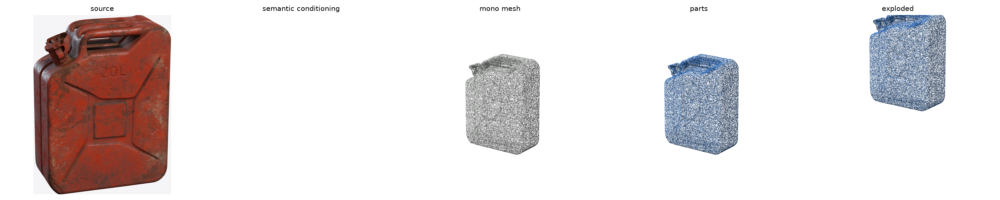
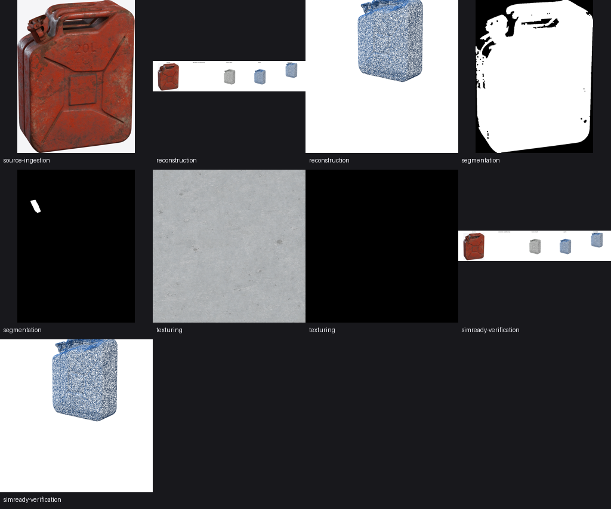

# Observed runthrough

The [walkthrough](walkthrough.md) gives the commands. The measurements below record order, timing and outputs from replays on one workstation. They are operating observations, not a release-verification record; a citable release uses the exact Profile, runtime, fitness, graph and capsule evidence described later in the documentation.

## Captured machine

The workstation used:

- Windows 11 with an RTX 3090 (24 GB)
- a dedicated Python 3.11 backend venv with CUDA torch, separate from the blueprint venv
- the Hunyuan3D-2 shape backend installed through `afb reconstruction install` at a pinned commit
- two credentials exported in the shell: `NVIDIA_API_KEY` for the VLM reviewer lane (`nvidia/llama-3.1-nemotron-nano-vl-8b-v1` via `AFB_VISION_MODEL`) and `OPENAI_API_KEY` for the image generation lane

## GPU-backed run

Planning is local and deterministic. `afb run-plan` on the bundled jerrycan request returns the same dependency-closed stage sequence and gate set on every machine, because routing is derived from the request and the versioned stage contract, not from what happens to be installed.

Reconstruction used most of the compute. The backend's first run downloaded roughly 9 GB of shape-model weights, then generated a 925000-face mesh from the single photo in one diffusion pass on the 3090, with peak GPU use just under 8 GB. Preview renders entered the workspace as review evidence in the same attitude as the source photo. GLB assets are Y-up; the renderer converts to the plot's Z-up so previews are comparable:

<p align="center">
  
</p>

Segmentation used the transformers SAM path on the GPU. Segment count follows the detected object rather than a fixed value: this jerrycan is one moulded shell plus a closure, so the workspace carries exactly two photo-accurate masks, the body silhouette with its handle slots carved out and the cap. The composed asset uses those masks, and SAM confidence propagates into the material proposals. The cap's small evidence area therefore produces a lower-confidence metal proposal.

With generated evidence present, every content stage received live sign-off and appeared in `approved_stages`:

```json
{
  "approved_stages": [
    "reconstruction", "segmentation", "material-inference",
    "texturing", "simready-verification"
  ],
  "pending_stages": [],
  "status": "proposal"
}
```

The review records still contain minor findings: `baked_lighting` in the base colour, segmentation masks running slightly beyond the borders and a package render whose colour differs from the source photo. Note and minor findings do not block; they remain in the operator record.

<p align="center">
  
</p>

The Isaac Sim report recorded 62 prims, a ray-traced render, 911 frames and no load errors against the packaged USD. The runtime check also records drop-and-settle, impulse, reset and applicable joint behaviour. `afb isaac-load apply` binds that report to the exact USD composition and Profile. This report cannot release the package by itself. The official Profile result, task-fitness report, record graph, rights state and content-bound operator decision must all pass for the declared scope. The [governance page](platform/governance.md) shows that decision path.

## Observed operational issues

Provisioning exposed the following issues, now covered by environment handles and troubleshooting entries:

- The backend runner originally required `AFB_RECONSTRUCTION_INPUT_ASSET`; it now resolves inputs from the project's source manifest, with the handle kept as an override.
- On Windows a bare `python` in a native command resolves to the spawning interpreter's base install, bypassing any venv. The installer now records which interpreter provisioned each backend and the runner uses it automatically; `AFB_RECONSTRUCTION_PYTHON` remains as an override.
- A machine-level `HF_HUB_CACHE` aimed at a network share stalled the weight download at zero throughput; overriding it to a local path for the run restored full speed. Hunyuan3D additionally keeps its weights under `~/.cache/hy3dgen`, not the Hugging Face cache.
- The hosted vision endpoint rejects reviews whose image sets exceed its input budget with a bare HTTP 500. The reviewer downscales oversized evidence into capped JPEG derivatives and, when a server error still occurs, sheds images from the end of the set (source photos first) and retries until the review fits.

## Bare-checkout replay

Before provisioning, the same request ran from a fresh checkout with a CPU-only path, no backend, no image lane and only the reviewer credential. The run recorded named blockers for missing capabilities.

Five stage reviews completed in 47 seconds:

| Stage | What happened | Approximate time |
| --- | --- | --- |
| reconstruction | skipped because no stage outputs exist yet | instant |
| segmentation | live VLM review of the generated masks, approved | about 13 seconds |
| material-inference | live VLM review of material candidates, approved | about 13 seconds |
| texturing | live VLM review of the neutral maps, held | about 20 seconds |
| simready-verification | skipped because nothing is packaged yet | instant |

The run made three VLM calls. Two stages declined review because required outputs were absent, and each pending stage recorded what it needed:

| Pending stage | Recorded reason | What unblocks it |
| --- | --- | --- |
| reconstruction | `no stage-output images exist yet; reviewing source photos alone would judge nothing this stage produced` | install a backend (`afb capabilities` plans it), run it, produce `asset.glb` plus render evidence |
| texturing | approve verdict carrying a `wrong_material_appearance` blocker against the neutral smoke maps; `next_actions` also records `live texture synthesis failed: openai is missing environment variable OPENAI_API_KEY` | configure an image generation lane, rerun the loop, get re-reviewed against generated PBR maps |
| simready-verification | nothing packaged to review; the isaac-load gate additionally needs `AFB_ISAAC_SIM_ROOT` | upstream stages first, then the load check on a machine with Isaac Sim |

Two fail-closed behaviours are visible in the table:

- The texturing stage did not pass despite an approve verdict. A blocker-severity finding overrides the verdict; sign-off is never granted against the review record's own evidence.
- The reconstruction review recorded itself as skipped because it could not see stage outputs. It did not treat the source photo as mesh-review evidence.

On a bare CPU-only checkout, `afb capabilities` reports every reconstruction option as blocked and supplies an install plan for each. Install a backend, export the image-lane credential and rerun the loop after each addition; the existing records incorporate each result.

## Run variability

The VLM reviewer is a live model, so its prose changes between runs. The following behaviour was stable across the captured replays:

- the verdicts, severities and review statuses were stable for every stage
- the reconstruction skip reason on the bare checkout reproduced word for word across replays
- the segmentation reviewer read the embossed lettering on the can in independent runs and raised the same note-severity `wrong_semantic_label` finding, down to the wording
- the texturing blocker was raised in every run that reviewed the neutral maps, and cleared once generated evidence replaced them

Routing and deterministic gate logic are repeatable for the same pinned inputs and configuration. Manifests and checksums also contain run identities, timestamps, provider outputs and other declared run-instance values, so reproducibility is assessed through content bindings and the capsule disclosure rather than byte-for-byte equality of an entire live run.

## Run records

After a run, `projects/metal_jerrycan/` holds the run record: the run request and plan, one manifest and one report per stage, a schema-valid VLM review record per reviewed stage with provider, model and prompt checksum in its trace, the mesh and its render evidence, the segmentation prior with its masks, `progress.json` for machines, the contact sheet for operators and a checksum record over all of it.

Nothing about the run depends on process memory. Stopping the terminal after the loop leaves the records intact; `afb progress --project projects/metal_jerrycan` regenerates the operator views at any time, and rerunning `afb agent run` resumes against the same workspace.
