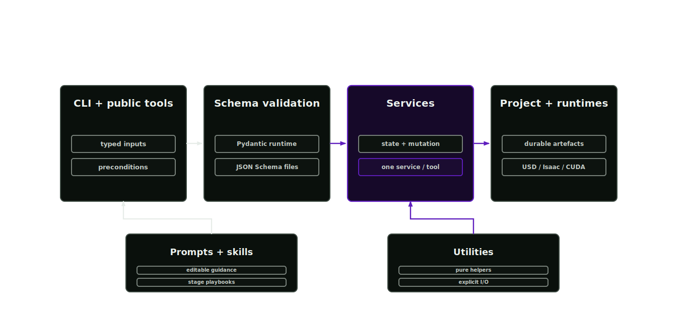

# Runtime architecture

The runtime uses fixed layers so public capabilities stay testable.

<p align="center">
  
</p>

## Layer boundary

Asset factory work spans schemas, commands, provider calls, file mutation and heavy runtime integrations. Fixed layers keep those concerns out of unrelated surfaces. Schemas remain validatable without simulator imports, public tools can be tested independently of file-writing details and services retain mutation authority through explicit contracts.

## Layers

- `schemas/`: Pydantic data contracts and enums only.
- `tools/`: public tool definitions, preconditions and one service call.
- `services/`: state-aware orchestration and project mutation. Stage services are `segmentation.py`, `material_inference.py`, `texturing.py`, `live_textures.py`, `physics_articulation.py`, `nonvisual_materials.py`, `simready.py` and `asset_authoring.py`, with `source.py`, `project.py`, `layout.py`, `external_models.py` and `governance.py` covering the pre-pipeline and cross-cutting concerns.
- `utils/`: pure functions with explicit inputs and outputs.
- `prompts/`: editable markdown help for tool domains.
- `skills/`: public skill SDK and registry.

The runtime package contains no UI code. The CLI is the only operating surface.

## Invariants

- Each public tool has a same-named service function.
- Each public tool has a prompt mention.
- Public tool names encode layer authority.
- Heavy USD, Isaac or CUDA imports stay in services or utilities.
- Schemas and prompts do not import runtime SDKs.

## Checks

```bash
afb tools list --format json
afb skills list
```

Test suites and repository contract checks live in the asset-factory-verification repository and run against a checkout of this blueprint.
