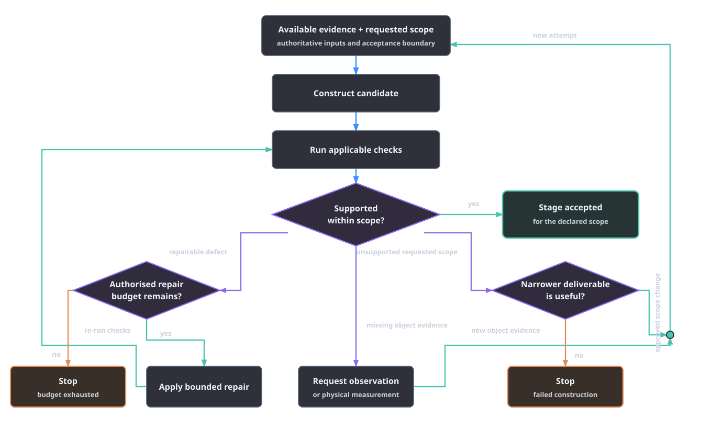
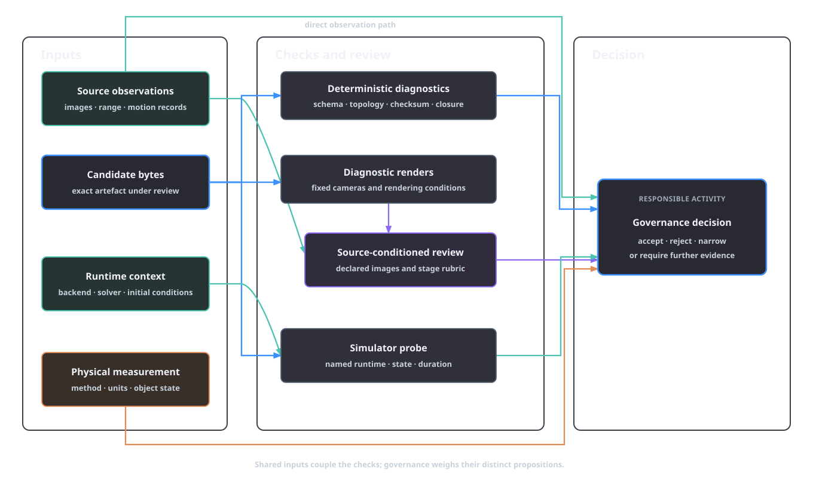

# Agentic asset construction

Automated asset authoring is a sequential decision process under incomplete information. At each step, a system can construct a candidate, inspect it, repair a bounded defect, obtain another observation or measurement, narrow the supported scope, or stop. An agentic loop chooses among those actions while preserving source evidence and the requested use. Each checker has authority over its tested proposition. Acceptance names the declared scope; exhaustion, missing evidence and failed construction are terminal outcomes.

## Authoring as sequential decision-making

Let an authoring state at step $t$ be

\[
\chi_t = (e_t,A_t,D_t,H_t,B_t;\tau,c),
\]

where $e_t$ is the available source evidence, $A_t$ the current candidate asset, $D_t$ the outstanding defect and uncertainty record, $H_t$ the immutable attempt history and $B_t$ the remaining budget. The requested task $\tau$ and experimental context $c$ delimit acceptance and remain fixed across repair actions.

The orchestrator resolves a dependency-closed stage plan, and the agent loop follows configured gates, review rubrics and fix recipes. The state description exposes the decision variables and transition boundary used to assess that process.

The action set is broader than generation:

| Action | State change | Required record |
| --- | --- | --- |
| Construct | create a candidate $A_{t+1}$ from declared evidence and tool conditions | inputs, provider or backend identity, revision, seed and output checksum |
| Inspect | add findings to $D_t$ without changing the candidate | checker, proposition, rubric or protocol, evidence identity and result |
| Repair | change a bounded part of $A_t$ while preserving authoritative inputs | defect tag, mutation, changed artefacts and required rechecks |
| Acquire evidence | extend $e_t$ with an observation, measurement or interaction record | source identity, rights, method, units and checksum |
| Narrow scope | reduce the claims attached to the candidate | explicit accepted scope and excluded requirements |
| Stop | retain the candidate and full history without promotion beyond current evidence | terminal reason and unresolved findings |

Two uncertainties must remain separate. **Object uncertainty** concerns the unknown parameters $\phi$: hidden geometry, scale, material state, mass distribution or articulation. Another photograph may reduce uncertainty about an occluded edge; a weighing may reduce uncertainty about mass. **Tool uncertainty** concerns the result of an authoring action: whether a reconstruction backend will preserve a thin handle, whether a mesh repair will alter a clearance, or whether a reviewer will return a contract-valid response. Running a different backend probes tool uncertainty. Object-property measurements come from the corresponding source evidence.

Budget also has several components. Compute, elapsed time, provider calls, permitted source acquisition and operator attention can each be bounded. Separate counters preserve the different cost and evidential effect of a reconstruction resubmission and a local topology repair. AFB combines a per-stage fix ceiling configured for the run with per-recipe attempt limits in the fix library. The attempt history records which budget was consumed and marks exhausted recipes.

*Figure 5.1. Bounded authoring decisions from available evidence and requested scope through construction, checks, repair, evidence acquisition, scope change, acceptance or stop.*

The terminal states carry information. “Required new evidence” identifies an underdetermined object claim. “Failed construction” records that the available methods produced no acceptable candidate. “Budget exhausted” records the end of the permitted search. “Accepted for scope” names the checks passed. Release then follows the release governance gate.

## Feedback and the authority of checks

An inspection result is meaningful only with the proposition it tests and the candidate identity it covers. AFB binds reviews and mesh-verification results to checksums for this reason. The principal check classes have different authority:

| Check | Proposition supported | Authority scope |
| --- | --- | --- |
| JSON Schema validation | the record has the declared structure, types and required fields | record structure |
| Checksum and path closure | named bytes are identical and dependencies are present under the allowed root | byte and dependency identity |
| Geometry diagnostics | selected topology, orientation, component or integrity properties of the exact candidate | measured candidate geometry |
| Fixed-view renders | observable appearance and silhouette from the declared cameras | declared camera views |
| Source-conditioned VLM review | rubric-scoped perceptual findings against the supplied images | supplied images and rubric |
| Simulator probe | behaviour under its initial conditions, runtime, solver and duration | recorded probe context |
| Operator decision | responsibility for accepting a defined claim from the assembled evidence | declared governance claim |

Schema validation follows a formal record contract such as JSON Schema Draft 2020-12 [@json_schema_2022]. Its result is deterministic and exhaustive for that record. Perceptual review covers source-conditioned defects under its image choice, rendering and rubric. Combining the two adds coverage because their tested propositions differ.

AFB orders deterministic gates before model review. Generic content stages then present configured evidence to a vision-language reviewer under a stage-specific rubric. Mandatory mesh verification combines topology and integrity measurements, fixed-camera renders and visual judgement; a failed deterministic requirement blocks promotion. The exact operating states and records are defined in [Agentic operation](../platform/agentic-operation.md) and [Mandatory mesh verification](../pipeline/01a-mesh-verification.md).

*Figure 5.2. Sources of feedback. Shared arrows expose the candidate and source-image dependencies of rendered review.*

Independence follows the evidence dependency graph. Two reviewers can use the same source image, related models, the same renderer and the same rubric. Their agreement can reduce the chance of one malformed response. A new observation of the hidden side requires a source that exposes it; passage through a handle opening requires the corresponding geometric test.

Each feedback record must identify what information changed. A new calibrated side view can constrain hidden geometry. A deterministic manifold check can settle whether the candidate has non-manifold edges. A drop probe can add evidence about one runtime behaviour. A second language explanation of the first review clarifies the same record.

Research on intrinsic language-model self-correction makes the same external-feedback distinction in a narrower setting. Huang et al. evaluated reasoning tasks in which models attempted correction without external feedback and found that correction was often ineffective or harmful under those study conditions [@huang_selfcorrect_2024]. AFB therefore retains tool outputs, source observations and deterministic counterevidence for every revision.

## Repair, evidence acquisition and stopping

A repair is the smallest authorised state transition that addresses a diagnosed defect while preserving authoritative evidence. Let $r$ be a repair applied to $A_t$, and let $(e^+,\tau^+,c^+)$ denote the evidence, task and context after the action. Its admissibility requires the next checker to pass and the protected quantities to satisfy

\[
r(A_t) = A_{t+1},
\qquad
(e^+,\tau^+,c^+)=(e_t,\tau,c)
\]

unless the activity is explicitly an evidence-acquisition step or an approved scope change. The new asset checksum and every invalidated downstream record then identify $A_{t+1}$.

AFB's fix library encodes this distinction by defect class. Mesh holes and selected local surface defects can route to mesh conditioning followed by mesh verification. Wrong proportions, missing parts and source mismatch route to a new reconstruction attempt using a registered capability. A joint-axis finding can request a new articulation proposal. Numeric physical values, collider mismatch and implausible mass distribution escalate for evidence and review. A packaged render missing upstream material bindings can be recomposed, while a source silhouette mismatch escalates across stage boundaries. Each recipe names its attempt limit and rechecks.

A registered capability resubmission changes the construction tool and creates a new attempt with a new provider or backend identity, conditions and output checksum. The rejected candidate remains in history. The stage stays blocked until a registered route is ready.

Threshold edits change the test or requested claim. Lowering a minimum clearance after observing failure, deleting the camera that exposes a defect, excluding a difficult contact case or changing an authoritative measurement therefore requires a separately reviewed protocol or scope decision. Defect remediation records remain tied to asset changes.

Fresh evidence is appropriate when the candidate is underdetermined rather than defective. A handle's unseen interior can require another view. Mass can require weighing. Joint limits can require a specification or observed motion. New evidence extends $e_t$, retains the previous source records and starts a new derivation path. Evidence acquisition targets properties outside the support of the original photograph.

Stopping is mandatory when an applicable hard requirement remains failed, a required reviewer or tool is unavailable, no repair recipe covers the defect, a recipe is exhausted, a repair makes no artefact change, or the object evidence is missing. The direct-stage loop exposes `blocked`, `escalated_to_review` and `fix_attempts_exhausted` alongside approval and review-required states. In particular, it refuses to re-review identical evidence when a fix changed no artefact. The durable `reports/stage-run-<stage>.json`, review record, fix log and `progress.json` retain the path to that decision; [Direct partial invocation](../platform/direct-partial-invocation.md) defines their operational form.

## Relation to generative systems and synthesis

Agentic asset construction intersects several established problem settings. RoboGen, Articulate-Anything and combinatorial sketching each contain propose-and-check structure, with different inputs, outputs and verifier authority.

| Dimension | AFB authoring loop | RoboGen | Articulate-Anything | SKETCH comparison |
| --- | --- | --- | --- | --- |
| Primary problem | construct and promote evidence-bound OpenUSD asset stages | generate tasks, scenes, supervision and learned robot skills | infer articulated objects from text, images or video | complete bounded finite programs from partial programs |
| Output representation | owned USD layers, manifests, reports and package | simulation environments, training supervision and policies | high-level Python compiled to URDF | finite program implementation |
| Articulation | a separate evidence-gated physics and articulation stage | part of generated simulation tasks where required | central output: links and joints | outside the problem domain |
| Feedback | schema and geometry checks, renders, simulator probes and operator decisions | propose–generate–learn cycle and task execution | vision-language actor–critic comparison of rendered predictions with grounded input | formal verifier returns counterexamples to candidate implementations |
| Physical evidence | measurements and specifications remain distinct from model proposals | determined by the generated task and system evaluation | grounded visual inputs and retrieved meshes support articulation inference | complete bounded input semantics under the specification |
| Source lineage | checksums, attempts, provider traces and derivations are explicit release inputs | not the principal claim evaluated in the cited paper | mesh retrieval and input modalities are part of the method | sketch and specification define the synthesis instance |
| Evaluation scope | each check and promotion claim names its candidate, task and runtime | generated skills and environments in the paper's experimental setting | articulation evaluation, including PartNet-Mobility and robot demonstrations | functional equivalence for the finite program class addressed by the paper |

RoboGen operates at the task-and-learning-system level. Its self-guided cycle proposes skills, constructs scenes, selects learning methods, generates supervision and learns policies [@wang_robogen_2024]. AFB's loop addresses whether an asset-stage proposal has the records and evidence required to proceed. AFB's source and promotion contracts supply the asset-stage governance boundary.

Articulate-Anything is closer to an authoring loop. A vision-language actor generates high-level Python that compiles to URDF, while a visual critic compares rendered predictions with available grounded input and drives iterative refinement. The system accepts text, images and video and uses mesh retrieval for static geometry [@le_articulate_2025]. Its evaluation covers that articulation method under the paper's datasets and demonstrations. In AFB, grounded visual feedback improves articulation proposals while physical evidence supplies joint strength, mass and friction.

Combinatorial sketching gives a precise contrast. SKETCH searches completions of bounded finite programs against a separate functional specification; a formal verifier supplies counterexamples, and the completeness result is stated for that finite-program setting [@solarlezama_sketching_2006]. AFB renderers, VLM reviews and finite simulator probes provide external feedback over their recorded observations and states. SKETCH supplies the formal finite-program guarantee; AFB supplies evidence-bound proposal, inspection and repair.

## Loops preserve evidence authority

AFB represents provider responses as proposals, assigns mutation authority to services and assigns validation authority to gates. The [provider abstraction](../provider-abstraction.md) records role, model and prompt identity; promotion remains a governance action. The [agentic operation](../platform/agentic-operation.md) loop preserves review, repair and escalation state; the fix library permits named, bounded remediations; stage reports and immutable attempts bind decisions to exact candidates.

Every loop transition must state what changed, which proposition is tested next and which evidence remains authoritative. New observations address object uncertainty. Alternative tools address construction uncertainty. Repairs preserve task and measurement invariants. Failed, blocked, exhausted and narrower-scope outcomes remain first-class. Acceptance identifies the checks passed for the declared scope and leaves composition, runtime, task-fitness and release decisions to their own evidence.

## References

\bibliography
