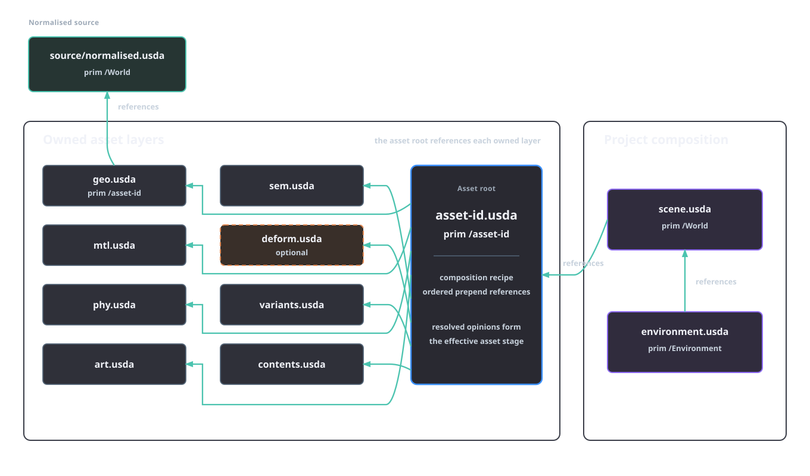
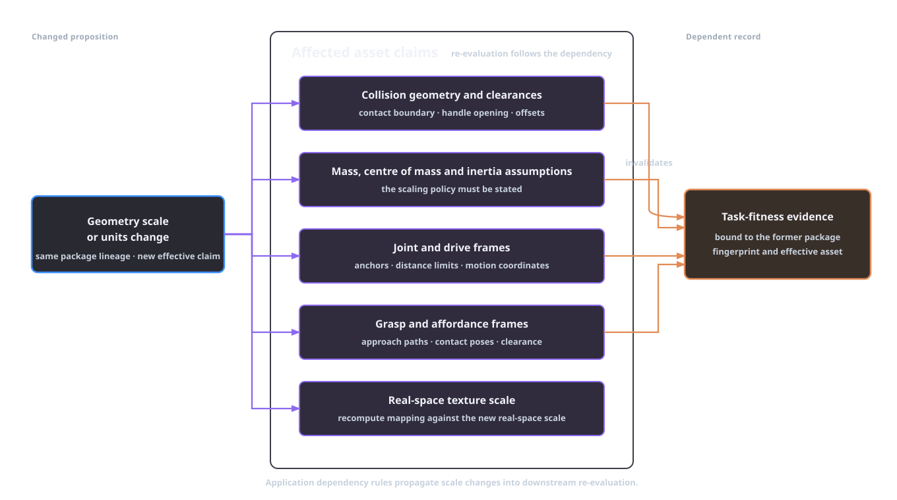
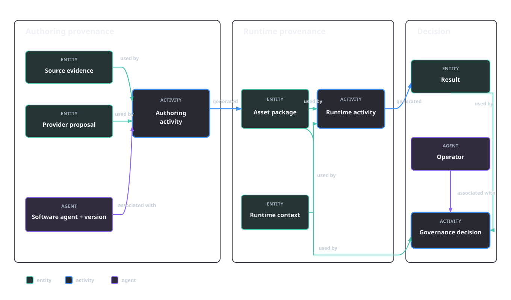

# Composition and reproducibility in OpenUSD

A simulation consumes a composed stage. Geometry, materials, collision shapes, mass properties, articulation, semantics and selected variants become one effective model through OpenUSD composition. The result also depends on asset resolution and stage state. Reproducing an asset experiment requires the root file, resolved dependency closure, composition choices and runtime context. AFB defines the layer names and ownership rules; OpenUSD supplies the composition semantics. Physical accuracy comes from the associated evidence and task-fitness protocols.

## The composed stage is the experimental model

An OpenUSD layer is a persistent container of scene description. A `UsdStage` presents the composed scene determined recursively from a root layer and the composition arcs encountered from it. Queries against a prim return the strongest effective opinion for the queried value, not a concatenation of every statement found in every file. Namespace mapping, list editing and strength ordering are therefore part of the model received by a renderer or simulator [@aousd_openusd_2026].

Let $R$ identify a root layer, $D$ the bytes of every resolved dependency, $v$ the effective variant selections, $\xi_{\mathrm{res}}$ the asset-resolution context and $\ell$ the stage's load and session state. The executable scene description can be written as

\[
S = \mathcal{C}(R,D,v,\xi_{\mathrm{res}},\ell),
\]

where $\mathcal{C}$ denotes OpenUSD composition under a named implementation version. The notation records the inputs needed to identify “the same USD asset”. A package $A$ can contain the same root-layer bytes while producing a different $S$ because a relative asset path resolves elsewhere, a stronger session-layer opinion selects another variant or a payload load set changes.

The OpenUSD 26.08 documentation describes strength through **LIVERPS**: local layer-stack opinions, inherits, variant sets, relocates, references, payloads and `specializes` arcs, ordered from stronger to weaker with recursive application. Direct and ancestral arcs, list operations and the participating layer stacks further determine the prim index. References are list-editable; they can add, remove, reorder or replace weaker reference items. Variant sets introduce selected alternative scene description and can themselves contain composition arcs. Reordering references, moving an opinion between a local layer and a referenced asset, or changing a variant selection is consequently a semantic edit even when all contributing property values still occur somewhere in the package [@aousd_openusd_2026].

Composition is ordered. If two contributing prim specifications author different values for the same attribute, exchanging their strength can exchange the effective value. If their namespaces differ, a reference can remap a selected prim beneath another prim, whereas sublayering overlays the namespaces already authored in the layers. Flattening records the currently composed result, including the current variant choices, while the authored dependency graph retains alternatives, responsibility and derivation. The two records serve execution and inspection respectively.

## Separately authored claims in AFB

AFB assigns one family of claims to each asset layer. The separation prevents a texturing operation from silently changing collision geometry and gives a reviewer a bounded place to inspect an opinion. Application dependencies connect the claim families.

| Layer | AFB-owned claims |
| --- | --- |
| `geo.usda` | canonical geometry and its reference to the normalised source |
| `mtl.usda` | material definitions, bindings and texture inputs |
| `phy.usda` | rigid bodies, colliders, mass properties and physics materials |
| `art.usda` | joints, drives, limits and articulation roots |
| `sem.usda` | semantic labels, affordances and provenance hooks |
| `deform.usda` | optional deformation request opinions |
| `variants.usda` | controlled material, geometry, physics, articulation and randomisation alternatives |
| `contents.usda` | assembly relationship and source-geometry policy metadata |

The authoring service creates an asset root named `<asset-id>.usda`. That root uses an ordered `prepend references` list targeting the asset root prim in each owned layer. `geo.usda` in turn references `/World` in `source/normalised.usda`. A project `scene.usda` references the composed asset root, and `environment.usda` references the scene. `deform.usda` is included only when deformation was requested. `contents.usda` records the relationship to the geometry prim and the assembly policy. The asset root assembles the owned layers.

*Figure 4.1. AFB's composition graph. Every arrow is an authored OpenUSD reference arc from the consumer to the referenced target.*

The root's reference list is fixed by the implementation, but USD still resolves overlapping opinions through its composition rules. The [layer ownership and variants](../platform/layer-ownership-and-variants.md) page defines allowed mutation targets; the [runtime architecture](../runtime-architecture.md) keeps those writes inside services. The ownership rule applies to authored mutation targets and to the strongest effective opinions in the composed stage.

Variant sets make alternatives part of the composed asset rather than a collection of unrelated files. AFB defines `materialProfile`, `geometryDeformation`, `physicsProfile`, `articulationProfile` and `domainRandomization` selections in `variants.usda`. A selection changes $v$ and therefore $S$. The base asset lineage remains shared, but each selected combination is a distinct effective scene for experimental purposes. Effective selections form part of reproducible run identity.

## Dependency changes and invalidation

USD composition dependencies answer which scene description contributes to $S$. Engineering dependencies answer which claims cease to be supported after one of those contributions changes. Together, those engineering dependencies form the application-level invalidation relation. OpenUSD documentation uses topology-dependent shading updates to illustrate this division of responsibility [@aousd_openusd_2026]. The same dependency structure applies to collision, inertia and affordance evidence.

Uniformly rescaling canonical geometry by $s$ can leave composition, reference resolution and schema validation intact while several downstream opinions still describe the former dimensions:

- Collision shapes may no longer preserve the handle clearance or the intended contact offset.
- Explicit centres of mass and inertia tensors remain numeric opinions until the authoring process recomputes them. Under fixed density, uniform scaling gives $m'=s^3m$ and $I'=s^5I$; under fixed total mass, the corresponding inertia scales as $I'=s^2I$. The evidence policy selects the applicable rule.
- Joint anchor positions, limits expressed in distance and grasp frames may refer to old locations.
- A texture mapping can remain topologically valid while its real-world texel scale changes.
- Task-fitness evidence tied to the former package fingerprint no longer supports the new effective asset.

The physical derivation is developed in [Geometry, materials and physical interaction](physical-interaction.md). A changed checksum detects byte-level change; the proposition-level dependency relation determines which claims require renewed evidence.

*Figure 4.2. Application invalidation caused by a scale change. The arrows encode modelling dependencies.*

Invalidation follows the changed proposition. A topology edit invalidates evidence bound to vertex or face identity even when object dimensions remain constant. A unit correction changes the interpretation of spatial values while preserving topology. Replacing a texture invalidates a vision task's observation evidence while preserving a mass measurement. Changing a collider invalidates contact probes and grasp results bound to the former collision representation while preserving rendered pixels. The task $\tau$ and experimental context $c$ decide the relevant boundary.

AFB's manifests provide the identifiers and checksums needed to enforce this dependency graph. The [manifest contracts](../manifest-contracts.md) keep stage inputs, outputs, evidence and promotion state distinct. An immutable stage attempt names what it consumed and produced. Downstream validation can then reject an evidence record whose input digest no longer matches instead of relying on a file modification time or a successful stage open.

## Four levels of reproducibility

“Reproducible” names four separate questions. Each level assumes the preceding evidence but adds a different equality criterion.

| Level | Question | Required identity or comparison |
| --- | --- | --- |
| File | Are the recorded inputs the same bytes? | digests for the root, every resolved dependency, policies, schemas, prompts and model weights |
| Composed scene | Do those inputs resolve to the same effective stage? | root identity, dependency closure, resolver context, variant selections, load/session state and OpenUSD version |
| Runtime | Was that stage executed under the same experimental context $c$? | simulator and solver identity, timestep, plugins, renderer, seeds, driver, hardware-relevant settings and task configuration |
| Result | Did repeated execution agree under the declared criterion? | exact output where promised, otherwise a property-specific tolerance or a predeclared statistical comparison |

### File identity

A digest of the root asset identifies that file. The complete file identity covers the dependency closure discovered from the root under $\xi_{\mathrm{res}}$, including external references, textures, MaterialX documents and source layers. AFB's package-closure report localises dependencies, rejects missing or escaping paths and records each included file's SHA-256 digest. Its package inventory fingerprint covers ancillary files as well as the USD layer closure.

The source archive also matters. Re-executing an authoring stage depends on code, schemas, configuration, prompts and model artefacts, which can reside outside the released USD package. The [citation and reproducibility](../citation-and-reproducibility.md) contract records a source commit, dependency lock, schema catalogue, backend revisions, model or weight revisions and seeds. Byte identity supplies traceability.

### Composed-scene identity

OpenUSD's `GetUsedLayers()` reports the layers consumed by the current stage composition. The returned set is a snapshot: load state and variant selection can change it. AFB's official-validator bridge opens the root, hashes every persistent used layer and rejects anonymous or otherwise unfingerprintable contributors. The report also binds the package inventory. This is stronger than hashing the root, because a referenced layer cannot change unnoticed.

A composition fingerprint includes its declared method, resolver plugin, resolver context and OpenUSD composition implementation. A durable experiment record keeps the authored graph, unselected alternatives and effective selections, then uses a composed snapshot or resolved-property comparison where exact stage equivalence must be demonstrated.

### Runtime identity

The same $S$ can behave differently under different $c$. Physics backend and version, solver parameters, timestep, substeps, contact settings and enabled extensions can alter transitions. Renderer, colour management and sensor plugins can alter observations. Seeds determine declared stochastic choices, while driver and accelerator details delimit the environment in which deterministic execution was assessed. An Isaac Lab runtime record therefore names all of those settings [@mittal_isaaclab_2025].

AFB's provenance record separates repository identity, dependency lock, environment bill of materials, model bill of materials, prompt and configuration checksums, manifest identities and random seeds. Runtime evidence then binds a particular package fingerprint, Profile and producer identity to an observed load or probe. The [reference-run capsule](../reference-run-capsule.md) carries those records into a redistributable unit.

### Result agreement

Exact file and runtime records make a repeat interpretable. The protocol defines success: a deterministic exporter can require exact output bytes after excluding declared run-instance fields; a geometric computation can compare a named quantity in fixed units within a justified numerical tolerance; a stochastic policy evaluation requires a predeclared sampling and statistical criterion. Each form retains its own comparison result.

For an outcome function $g$, let $(S',c',\omega')$ denote the repeated execution. Composed-scene and runtime identity require $S'=S$ and $c'=c$. A deterministic repeat uses $\omega'=\omega$; a stochastic protocol declares independent sampling or common-random-number coupling. The outcome criterion is

\[
d\!\left(g(S,c,\omega),g(S',c',\omega')\right) \leq \varepsilon,
\]

where $d$, $\varepsilon$ and the coupling of $\omega$ and $\omega'$ are fixed by the protocol before observing the repeat. Package-digest equality and outcome agreement remain separate criteria.

## Provenance reconstructs the experiment

PROV-O distinguishes entities, activities and agents. An authoring activity can use source entities and generate an asset entity; the activity can be associated with a software or human agent; a generated entity can be derived from earlier entities. Qualified relations can add roles, plans and generation details [@w3c_provo_2013]. This vocabulary maps cleanly onto a run while preserving responsibility. A provider response is an entity used by an authoring activity; the release approval names its responsible agent separately.

*Figure 4.3. Provenance reconstruction of an experiment using PROV-O roles. It identifies use, generation and responsibility.*

Provenance completeness is claim-relative. Reproducing the composed visual appearance needs material, texture, renderer and colour-management identity. Reproducing a contact result also needs collision and dynamics configuration. Re-running construction needs the authoring tools and prompts. Inspecting a release decision needs the evidence and the responsible decision record. The record includes the inputs required by the named claim.

## Conformance, loading and task fitness

Composition produces a stage. Four further states remain distinct:

1. **Declared requirements** name the contract the asset is intended to meet.
2. **Profile conformance** records passing findings for every applicable Requirement in the exact Profile version.
3. **Successful loading** records that the composed package opened and executed the specified probe in a named runtime.
4. **Task fitness** records performance against a protocol for $\tau$, the embodiment and $c$.

The [SimReady Foundation 2026.06.0 asset profiles](https://nvidia.github.io/simready-foundation/2026.06.0/profiles/profiles.html) list `Prop-Robotics-Neutral` 2.0.0 as a particular bundle of versioned Features and Requirements. Passing that profile establishes conformance to the bundle. Task-specific collision clearance and policy success are separate runtime propositions. SimReady likewise separates static asset validation from runtime testing [@nvidia_simready_faq_2026].

AFB keeps these decisions separate in [SimReady verification](../pipeline/07-simready-verification.md). A composed-stage check, official Profile result, runtime report and task-fitness record have different evidence identities. Governance evaluates each required record under its own authority.

## Reproducibility binds the effective stage

AFB treats `<asset-id>.usda` as the composition recipe and the resolved stage as the model under test. Owned layers retain responsibility for individual claim families. Package closure, effective variant selections and composition fingerprints bind the stage; provenance and the reference-run capsule bind its construction and execution. Application-level invalidation follows geometry, physics, articulation, semantics and task dependencies rather than USD arcs alone. Release evaluation then keeps Profile conformance, runtime loading and demonstrated task fitness as separate propositions.

## References

\bibliography
