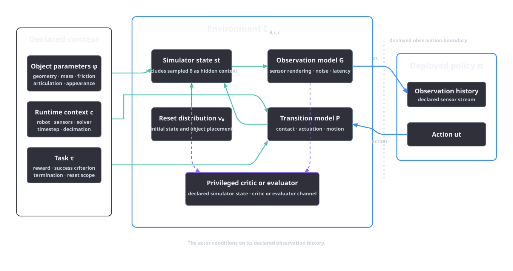
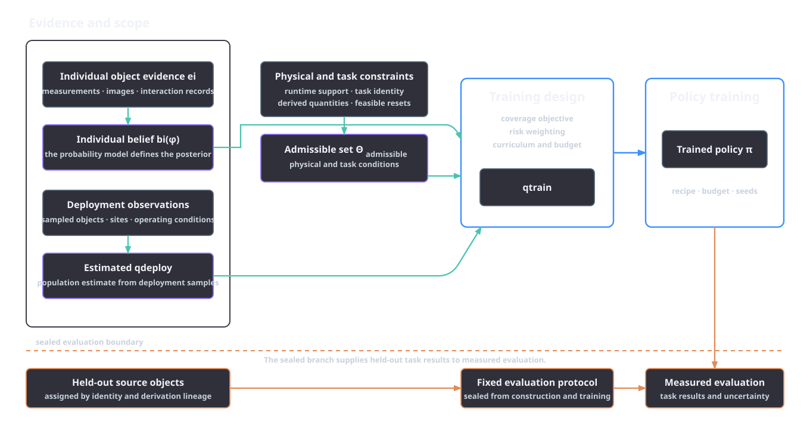
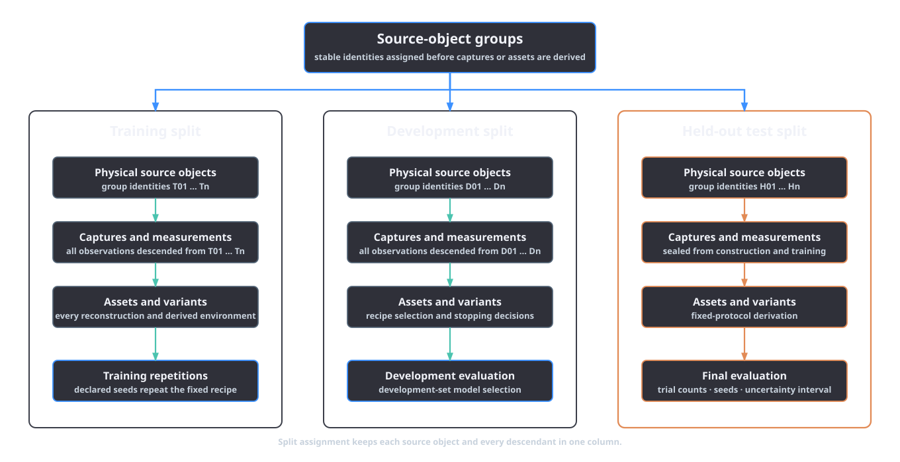

# From assets to learning environments

An asset is one input to a learning environment. It represents selected claims about an object, while the environment defines the robot, sensors, actions, dynamics, resets, objective, termination rules and timing. Moving from an asset to a family of training environments requires two judgements: which combinations of object, scene and sensor parameters are admissible, and which admissible conditions a policy should encounter during training. Asset evidence constrains object parameters; environment design supplies the complete experiment.

Object uncertainty, deployment variation and the deliberately chosen training distribution, \(q_{\mathrm{train}}(\theta)\), are different quantities. The same distinction governs evaluation. Held-out objects are separated by source and derivation lineage, while reconstruction agreement, physical behaviour and task performance remain separate results. The operational contracts are defined in the [RL environment extension](../extensions/rl-environment.md).

## The complete environment

Let \(\phi\) contain object parameters, \(\kappa\) contain varying scene and sensor conditions, \(\theta=(\phi,\kappa)\), \(c\) identify the fixed experimental context and \(\tau\) identify the task. A learning environment is

\[
\mathcal E_{\theta,c,\tau}=
(\mathcal S,\mathcal O,\mathcal U,P_{\theta,c},G_{\theta,c},
\nu_0,R_\tau,\Gamma_\tau,\Delta t).
\]

Here \(\mathcal S\) is the simulator state space, \(\mathcal O\) the observation space and \(\mathcal U\) the action space. The transition model \(P_{\theta,c}\) includes contact, actuation and other state changes. The observation model \(G_{\theta,c}\) maps state to sensor observations, including latency and noise. The reset distribution \(\nu_0\), reward \(R_\tau\), termination rule \(\Gamma_\tau\) and time discretisation \(\Delta t\) complete the episode definition. In a concrete runtime, the control decimation, episode duration, solver and software version are also part of \(c\). Isaac Lab's manager-based workflow exposes observations, actions, events, rewards, terminations and curricula as separate environment components, while its timestep and decimation settings determine how control and simulation time relate [@nvidia_isaaclab_manager_env_2026; @mittal_isaaclab_2025].

The authored package \(A\) contributes a representation of \(\phi\): geometry, collision geometry, appearance, mass properties, articulation, semantics and their variants. Scene layout, illumination and sampled sensor conditions belong to \(\kappa\). The environment supplies the robot's controller interface, deployed sensors, reset process and success criterion. Two experiments can therefore use the same asset and instantiate different environments. A camera-based detector and a contact-rich manipulation policy may receive different observations and exercise different parts of the same package. Likewise, changing the solver or timestep changes the fixed experimental context even when every USD byte is unchanged.

The deployed policy receives its declared observation history. A training critic or evaluator can receive separately declared privileged state such as object pose, contact force or the sampled value of \(\theta\). Passing hidden context directly to a deployed actor defines a different observation interface and policy. A robust policy acts across hidden contexts; an adaptive policy uses its available history to infer context during an episode. Identifiability follows from the permitted actions, observation history and parameter-dependent response.

*Figure 6.1. Schematic environment boundary. Object parameters and runtime context affect both observations and transitions. Privileged simulator state is available only to a declared training critic or evaluator.*

## Individual belief, deployment variation and training design

Evidence for one object can include calibrated dimensions, unresolved contents and a bounded mass error. Those records describe the individual object. Deployment observations describe population variation, and the training recipe specifies exposure frequency.

The relevant objects are:

| Object | Meaning | Basis |
|---|---|---|
| \(b_i(\phi_i)\), or \(p(\phi_i\mid e_i)\) | belief about the parameters of individual object \(i\) | evidence \(e_i\), an explicit likelihood and a prior where those exist |
| \(q_{\mathrm{deploy}}(\theta)\) | variation across deployment conditions | a target population and operating process, usually observed only in part |
| \(q_{\mathrm{train}}(\theta)\) | conditions deliberately presented during training | the experimental recipe, subject to admissibility and budget |

The notation \(p(\phi_i\mid e_i)\) applies when an evidence model defines probabilistic inference. Intervals, candidate lists and rubric confidence fields retain their original form. Any conversion into sampling weights is an experimental choice recorded as part of \(q_{\mathrm{train}}(\theta)\).

Population variation concerns differences among objects or scenes generated by the deployment process. Repeated measurements of one object reduce uncertainty about that object; population sampling characterises variation across objects. A product catalogue describes a product family, while instance evidence describes one captured configuration. Through \(\kappa\), \(q_{\mathrm{deploy}}(\theta)\) can also include temporal and contextual variation such as surface contamination or lighting at different sites. Deployment observations produce its estimate.

The training distribution is an intervention. It may oversample rare but consequential conditions, balance object families, widen selected ranges to encourage robustness or change over a curriculum. It can therefore differ intentionally from both an individual posterior and an estimated deployment distribution. Coverage choices should be justified against the task and deployment claim. Matching an estimated \(q_{\mathrm{deploy}}(\theta)\) is one possible objective; minimax robustness, risk-sensitive training and targeted stress exposure lead to different recipes.

Interaction can refine an individual or system-specific belief. BayesSim takes trajectories from a black-box simulator under sampled parameters and trajectories from a physical system, then performs likelihood-free inference over simulator parameters. Its reported studies cover classical control and robotics problems, and the inferred posterior is used for adaptive domain randomisation [@ramos_bayessim_2019]. For Asset Factory, this supplies a model for updating \(b_i(\phi_i)\) or a context-specific calibration belief when the required trajectories and inference assumptions exist. Deployment-population estimates and \(q_{\mathrm{train}}(\theta)\) remain separate design objects.

Hidden context also changes the learning problem. Ghosh et al. show that generalisation from limited training contexts to unseen test contexts induces implicit partial observability, even when each underlying environment is a fully observed Markov decision process. Their approximate method is evaluated on Procgen [@ghosh_epistemic_2021]. When sampled object or scene context is hidden, the policy acts in a partially observed family of environments. Online adaptation requires discriminating information in the deployed observation history. Texture variation enters through visual observations. Mass adaptation requires actions that excite the object and responses that separate mass from friction, actuator error and sensor noise.

## Admissibility before sampling

Randomisation starts with a set of valid environment parameters. For a declared task and context, define

\[
\Theta_{\mathrm{admissible}}(\tau,c)
=\{\theta: g_k(\theta,\tau,c)\leq 0,\ h_j(\theta,\tau,c)=0\},
\]

where the inequalities and equalities encode physical assumptions, representation limits and task scope. They may require positive wall thickness, a supported joint type, a reachable handle clearance, collision-free resets, consistent units or a mass and inertia derived from the same geometry and density model. An admissibility constraint can also exclude conditions the selected sensor or simulator cannot represent. The applicable rules must name their evidence or modelling basis.

An admissible configuration is a valid instance of the stated environment family. It can lie near an operational limit and remain difficult. Embodiment and reset constraints define the family boundary.

Let \(\mathcal J(\pi;\mathcal E_{\theta,c,\tau})\) denote expected task performance for policy \(\pi\) in the complete environment. A training objective can then be written as

\[
\max_{\pi}\;\mathbb E_{\theta\sim q_{\mathrm{train}}}
\left[\mathcal J(\pi;\mathcal E_{\theta,c,\tau})\right],
\qquad
\operatorname{supp}(q_{\mathrm{train}})
\subseteq \Theta_{\mathrm{admissible}}(\tau,c).
\]

The support condition restricts the sampler to valid combinations. Coverage compares \(q_{\mathrm{train}}\) with deployment conditions; performance evaluates the learned policy. Deployment conditions outside \(\Theta_{\mathrm{admissible}}\) require an extended model or runtime scope, or a narrower deployment claim.

Asset evidence contributes constraints and candidate bounds. The [physics and articulation stage](../pipeline/05-physics-articulation.md) records approved mass properties and uncertainty, while [layer ownership](../platform/layer-ownership-and-variants.md) keeps geometry, physics, articulation and variant opinions attributable. Physical consistency and preserved task relations admit a variant to an environment family. Policy performance is then evaluated over the admitted variants.

## Correlated and constrained randomisation

Sampling follows the dependencies in the model. Object parameters usually contain deterministic and statistical relationships. Geometry, density, total mass and inertia follow one mass model. Joint frames preserve task-critical contact paths. Camera noise is conditioned on the relevant illumination and range variables.

A hierarchical construction makes the dependencies explicit:

\[
z\sim q(z),\quad
d\sim q(d\mid z),\quad
V=\mathcal V(z,d),\quad
\rho\sim q(\rho\mid z,d),\quad
m=\rho V,\quad
\mathbf I=\mathcal I(z,d,\rho;F_B),\quad
\mu\sim q(\mu\mid z,z_{\mathrm{counter}},s,\mathcal M_{\mathrm{contact}}),
\]

where \(z\) identifies a uniform-density construction family, \(d\) contains dimensions, \(\mathcal V\) returns its solid volume, \(\rho\) is density, \(m\) is mass and \(\mathcal I\) returns the inertia tensor in body frame \(F_B\). The friction coefficient \(\mu\) is conditioned on the asset material family \(z\), counter-surface family \(z_{\mathrm{counter}}\), surface state \(s\) and contact model \(\mathcal M_{\mathrm{contact}}\). Joint samples, covariance models, copulas and finite sets of validated variants can all preserve these relationships. The environment record distinguishes evidence-supported relationships from correlations introduced for training design.

Randomisation can act on observation and transition models. Tobin et al. randomised rendering factors to train a detector from simulated RGB images, evaluating geometric-object localisation and a grasping demonstration [@tobin_domain_2017]. Peng et al. randomised simulator dynamics and trained a recurrent policy for a robotic puck-pushing task, including transfer to a physical Fetch arm [@peng_dynamics_2018]. These studies establish task-specific examples of visual and dynamics randomisation. Each asset family and task protocol supplies its own ranges and dependencies.

Digital cousins provide another structured source of variation. Dai et al. define cousins as virtual assets or scenes that retain similar geometric and semantic affordances across distinct counterparts. Their system constructs scenes from one RGB image and trains behaviour-cloning policies from programmatic demonstrations. The reported policy studies cover door opening, drawer opening and putting away a bowl; the real-world comparison is a cabinet door-opening task [@dai_cousins_2024]. Affordance-conditioned variation is combined with collision, articulation and physical-property checks.

For Asset Factory, a cousin, USD variant, layout change or physical randomisation remains a derived asset with lineage. The [layout and mutation contracts](../platform/layout-and-mutation-plans.md) define controlled placements and changes, and the operational [RL environment page](../extensions/rl-environment.md#randomisation-with-provenance) defines the per-axis provenance records. Every sampled parameter combination must satisfy the applicable joint constraints.

*Figure 6.2. Evidence informs an individual belief, deployment estimate and admissibility rules. Training design produces \(q_{\mathrm{train}}\), followed by held-out evaluation under the frozen protocol.*

## Curriculum and environment design

A curriculum replaces a fixed distribution with a sequence \(q_{\mathrm{train}}^{(1)},q_{\mathrm{train}}^{(2)},\ldots\). The sequence may widen a static range, replay selected valid variants or propose new environments in response to the current policy. It changes the allocation of training data. Deployment observations define population frequency, while admissibility continues to bound every curriculum stage.

Unsupervised environment design formalises the adaptive choice of training environments. Dennis et al. introduce PAIRED, in which an environment-generating adversary maximises the regret between protagonist and antagonist policies to seek structured, solvable challenges. Their experiments use grid-world navigation and a modified MuJoCo hopper setting [@dennis_paired_2020]. PAIRED supplies a regret-based construction; the environment specification supplies asset constraints, runtime semantics and task identity.

Curricula can operate through fixed schedules, replay or environment editing. A static schedule changes declared bounds or reset difficulty according to a fixed rule. Replay changes the frequency of pre-validated environment identifiers according to a score such as learning progress or regret. Editing proposes new layouts or variants and validates each derived environment before use. In the editing case, the curriculum generator is an authoring provider: its output requires the same lineage, layer authority and rollback information as any other mutation. Curriculum signals come from training and development data; held-out test data remains reserved for final evaluation.

Curriculum state is part of the training recipe. Reports retain the schedule or selection algorithm, its version, update interval, scores, candidate pool and random seeds, thereby identifying the data exposure behind \(q_{\mathrm{train}}\). Isaac Lab supplies curriculum and event mechanisms within its environment framework [@mittal_isaaclab_2025; @nvidia_isaaclab_manager_env_2026]. The experiment specification supplies the curriculum objective and deployment criterion.

## Evaluation and evidence of transfer

Evaluation begins with the unit of independence. Images, captures, reconstructed meshes, source objects and random seeds occupy different lineage levels. Several photographs of one object share object identity. Several meshes generated from those photographs share both object and capture lineage. Texture, collision and mass variants derived from one base package remain descendants of that source. Random seeds repeat an algorithm under stochastic variation within a source split.

Split assignment therefore starts at the highest lineage unit relevant to the claim. For object-level generalisation, assign physical source objects to training, development and test groups before deriving captures or assets. Keep every capture, reconstruction, variant and environment descended from an object in the same group. For scene-level generalisation, group source scenes that share the same underlying objects or captured layout. Stable identities keep library assets, generated cousins, duplicates and near-duplicates within one split.

Training sources construct assets, fit the policy and estimate training-time normalisation. Development sources select admissibility rules, randomisation recipes, curriculum settings and stopping criteria. The test group serves the protocol fixed before final evaluation. A test outcome used to change the asset, training distribution, reward, stopping rule or model selection moves that group into development and triggers a fresh test group.

*Figure 6.3. Evaluation lineage design. Descendants of a source object remain in one split. Seeds repeat a recipe within that split.*

Three evaluation axes answer different questions:

1. **Reconstruction agreement** compares authored quantities with held-out source observations or measurements under a stated observation model.
2. **Physical behaviour** tests contact, motion, settling, articulation or sensing under a named runtime and initial-condition protocol.
3. **Task performance** measures the policy against the task criterion over declared objects and conditions.

Each axis retains its own pass state: pixel agreement measures reconstruction, a drop test measures its declared physical behaviour, task execution measures policy performance and physical deployment measures transfer. Results preserve the gate at which they were obtained: source validation, simulator behaviour, held-out simulation, alternate-runtime testing and physical deployment.

Comparative studies hold \(\tau\), embodiment, deployed observations, action interface, solver, timestep, applicable compute and data budgets, and evaluation groups fixed. A complete-recipe comparison changes a declared bundle of components. An ablation changes one component while retaining the rest. Separate reporting preserves attribution to asset evidence, randomisation or curriculum. An external benchmark defines its answers, splits and score; Asset Factory supplies the evaluated recipe.

Finite-run uncertainty is part of the result. Agarwal et al. show, using Atari 100k and analyses of ALE, Procgen and DeepMind Control Suite results, that point estimates from a small number of deep-RL runs can support unstable comparisons. They recommend interval estimates, performance profiles and robust aggregate summaries such as the interquartile mean [@agarwal_precipice_2021]. For a suite of tasks, stratified bootstrap intervals and performance profiles can follow that design. For one binary manipulation task, reports retain trial counts, per-seed results and an interval appropriate to the nested seed and episode structure. Repeated episodes remain nested under their trained seed.

Every transfer result states the source and target distributions, object identities, number of training seeds, evaluation trials, estimator and uncertainty interval. Paired comparisons preserve the pairing in their analysis. Per-condition breakdowns expose material, geometry-family and randomisation-edge behaviour. Expected-transfer evidence uses the predeclared estimator across all evaluation runs.

## Experimental identity and reporting

A reproducible report binds the policy weights to the effective environment. It identifies the asset package and composed-layer checksums; task, embodiment and sensor contracts; runtime, solver, timestep and decimation; admissibility definition; joint sampling procedure and correlations; \(q_{\mathrm{train}}\); curriculum state; policy and optimiser configuration; training budget; code and package revisions; and every seed. It also identifies the source-object split and the full lineage from captures through derived variants to evaluation environments.

The [manifest contracts](../manifest-contracts.md) and [reference-run capsule](../reference-run-capsule.md) provide the operational records for identity, provenance and redistributable evidence. The [orchestrator telemetry plan](../platform/orchestrator.md#telemetry-plan) names the configurations, seeds, artefacts and measured outcomes required by a Weights & Biases integration.

The [RL runtime evidence boundary](../design-decisions/rl-runtime-evidence-boundary.md) generates and probes an Isaac Lab 2.3.1 PhysX rigid-object pick environment on CUDA with recorded software and hardware identities. Isaac Lab provides the GPU-accelerated framework for multi-modal robot learning [@mittal_isaaclab_2025]. A policy experiment is identified by its runtime measurement, result schema, evidence record and evaluator.

## Training design stays separate from evidence

The move from asset to learning environment follows six rules.

1. Asset records constrain object parameters. Formal posteriors, non-probabilistic uncertainty records, population estimates and \(q_{\mathrm{train}}\) retain separate identities.
2. Every environment defines observations, actions, transitions, resets, reward, termination and timing. Privileged simulator state is separated from the deployed policy interface.
3. Admissibility is fixed by physical assumptions, runtime support and task scope before policy performance is considered. Correlated and derived quantities are sampled jointly or recomputed from their parents.
4. Curricula and environment generators allocate training exposure within the admissible family. Their proposals retain mutation lineage, and training or development evidence steers them.
5. Evaluation splits are made by source object, capture and derivation lineage. Reconstruction, physical behaviour and downstream task performance remain separate axes with uncertainty appropriate to the experiment.
6. A transfer claim names its complete recipe, source and target conditions, runtime and statistical protocol. Only an executed simulator or physical experiment supports the corresponding result.

The [RL environment extension](../extensions/rl-environment.md) owns the manifest fields, promotion gates and command contracts. The [physics stage](../pipeline/05-physics-articulation.md), [variant ownership rules](../platform/layer-ownership-and-variants.md), [layout and mutation plans](../platform/layout-and-mutation-plans.md), [task-fitness gate](../pipeline/07-simready-verification.md#fitness-for-use) and [runtime evidence decision](../design-decisions/rl-runtime-evidence-boundary.md) own their respective operating procedures. Across these contracts, evidence narrows what may be modelled, experimental design chooses what is trained, and lineage-preserving evaluation determines what the resulting policy has demonstrated.

## References

\bibliography
