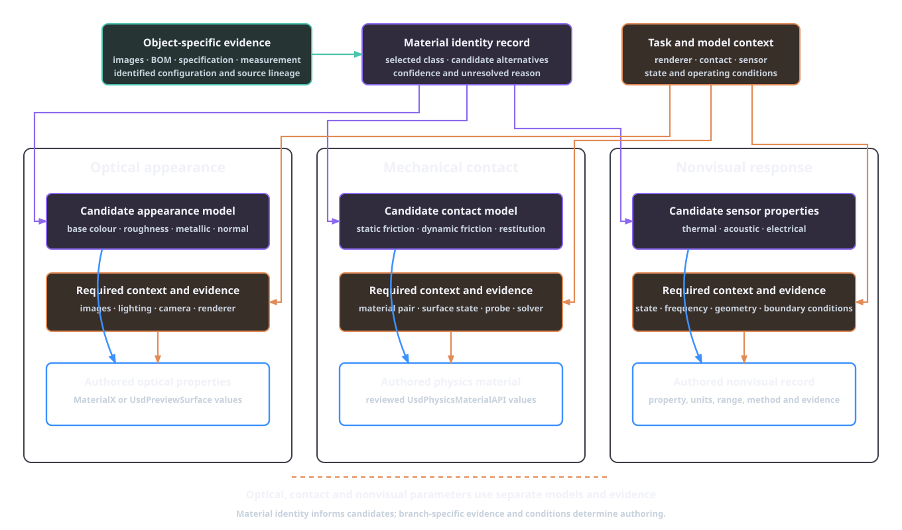
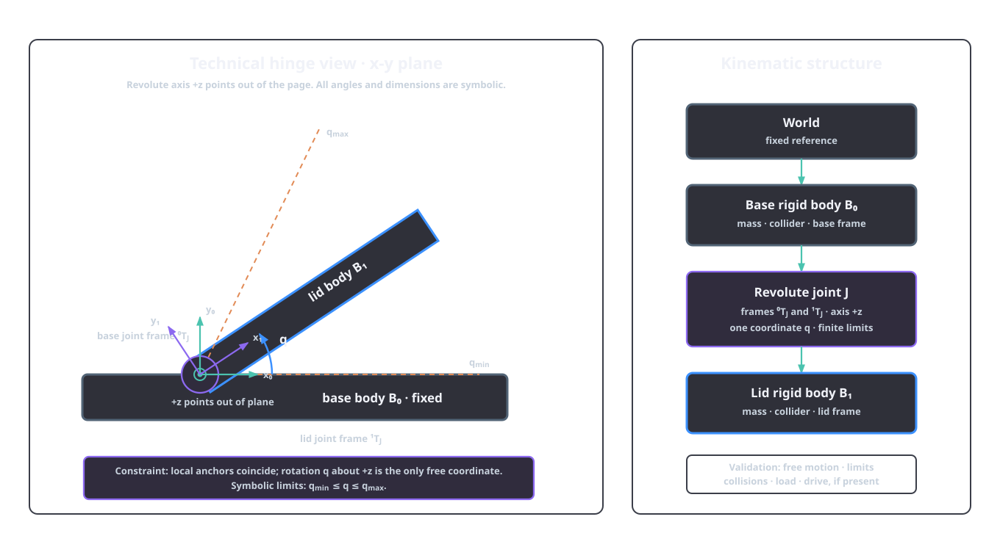

# Geometry, materials and physical interaction

Rendered appearance, spatial extent, mass, collision, articulation and sensor response are separate representations with separate evidence. Their adequacy depends on the computation: rendering, volume integration and grasp contact impose different geometric requirements.

Geometry, density, mass, centre of mass and inertia are related quantities, not interchangeable asset properties. Visible and collision surfaces also serve different computations, while articulation and material records make task-bound physical claims. OpenUSD supplies schemas for expressing those claims. The [physics and articulation](../pipeline/05-physics-articulation.md) stage defines AFB's evidence methods, authoring fields and validation scenarios.

## Geometry depends on the computation

A polygon mesh is a data structure before it is a physical object. Its vertices, faces, orientation, connectivity and embedding can support several computations, each with different validity requirements. Rasterisation needs visible surface samples and normals. Volume and inertia integration need a closed, consistently oriented boundary for the intended solid. Collision detection needs a supported shape representation with usable contact geometry. Articulation needs separate body geometry and coherent local frames.

The principal geometric conditions are distinct:

| Condition | Meaning | Computation affected |
|---|---|---|
| Manifoldness | the local neighbourhood has the expected disc or half-disc structure | adjacency, traversal, repair and solid interpretation |
| Watertightness | the surface has no boundary loops through which the intended volume is open | volume, density-derived mass and inside–outside classification |
| Consistent orientation | adjacent faces and closed components agree on outward direction | signed volume, normals and contact direction |
| Connectedness | components are linked through the selected adjacency relation | body partition, floating-fragment detection and aggregate properties |
| No self-intersection | non-adjacent surface elements do not cross improperly | unambiguous interior, collision and remeshing |
| Non-degeneracy | faces and edges retain usable area and length | stable normals, integration and numerical processing |

The operation declared for each representation determines its geometric requirements. Open cloth surfaces, one-sided cards and appearance-only scans support rendering without enclosing a solid. Scene assemblies can contain many disconnected components. Solid-volume operations require a closed boundary for the intended interior.

AFB expresses this distinction through mesh-verification profiles. The `simulation_closed_surface` profile requires watertight, consistently wound geometry and defined closed-surface diagnostics. The `appearance_mesh` profile retains exact measurements while permitting open or multi-component geometry within declared thresholds. The full checks and failure semantics are defined in [mandatory mesh verification](../pipeline/01a-mesh-verification.md#failure-semantics). Profile conformance and contact-task fitness retain separate results.

Repairs also have semantics. Reorienting a demonstrably inverted component can preserve intended shape. Filling a hole adds a surface and chooses an interior. Removing a disconnected component can delete a real fastener as easily as a reconstruction fragment. Established mesh-repair methods address classes of polygonal defects, but the selected operation still requires a source- and task-aware review [@attene_mesh_repair_2010]. AFB therefore reruns deterministic and visual checks after every local repair and binds promotion to the resulting checksum.

Three geometric representations should be considered independently:

1. the visual surface, which determines rendered shape and appearance support;
2. the collision geometry, which determines where the physics runtime detects contact;
3. the volumetric or component model used to assign mass distribution.

They can share source geometry without being identical. A high-resolution visual mesh can use a simpler collision representation. A hollow shell can use an internal mass model that is not rendered. The relationship among them must be recorded because an edit to scale, topology or component boundaries can change all three computations.

*Figure 3.1. Three computation-specific representations derived from the supplied A23D wooden crate. Four 2K maps provide the visual surface; a triangulated proxy defines collision queries; and the source geometry supports the uniform-density mass model. The orange bracket marks the support-contact query region.*

### Units and frames

Geometry becomes physical only after its coordinates have units and a frame. Let \(\mathbf x_A\) be a point in the asset's local coordinates, let \(S_u\) convert its stored length unit to the stage unit and let \({}^WT_A\) place the asset frame in the world. The world point is

\[
\begin{bmatrix}\mathbf x_W\\1\end{bmatrix}
= {}^WT_A
\begin{bmatrix}S_u\mathbf x_A\\1\end{bmatrix}.
\]

The order and ownership of these transformations matter. Baking a scale into vertices and also retaining it on a parent transform applies it twice. Changing the up axis without rotating joint, gravity or affordance frames creates a scene that can remain visually recognisable while being physically inconsistent. A unit policy must therefore name the stored unit, conversion, axis convention and frame in which every derived value was computed.

Non-uniform scale needs separate treatment. It changes angles, surface normals and the relative dimensions of the body. A sphere becomes an ellipsoid, a circular hinge clearance changes and a previously fitted collision primitive represents a different shape. Mass and inertia must be recomputed from the transformed distribution. The uniform scaling derivation below applies to one scalar scale factor.

Frame changes can preserve a physical quantity while changing its coordinates. Total mass is invariant. Centre of mass transforms as a point, and the inertia tensor rotates as \(\mathbf I'=\mathbf R\mathbf I\mathbf R^{\mathsf T}\) about the same physical centre. Principal moments remain the same under rigid rotation, while principal axes change with the frame. Evidence and authored values must state their reference frame so a correct tensor is not applied in the wrong orientation.

## From geometry to mass properties

For a body occupying a region \(V\) with density field \(\rho(\mathbf x)\), the total mass is

\[
m=\int_V \rho(\mathbf x)\,\mathrm dV.
\]

Its centre of mass is

\[
\mathbf r_c=\frac{1}{m}\int_V \mathbf x\rho(\mathbf x)\,\mathrm dV,
\]

and its inertia tensor about the centre of mass is

\[
\mathbf I_c=
\int_V \rho(\mathbf x)
\left(
\lVert\mathbf x-\mathbf r_c\rVert^2\mathbf I_3
-(\mathbf x-\mathbf r_c)(\mathbf x-\mathbf r_c)^{\mathsf T}
\right)\,\mathrm dV.
\]

Geometry determines these quantities after a density distribution is chosen. Under uniform density, a closed polyhedral boundary supports direct evaluation of the required volume integrals. Mirtich's algorithm reduces the volume integrals for polyhedral mass properties to lower-dimensional integrals and evaluates the required terms in one traversal of the boundary [@mirtich_mass_1996]. The result is exact for the represented uniform-density polyhedron up to numerical error. Physical interior and homogeneity come from object-specific evidence.

Composite bodies require component evidence. If component \(i\) has mass \(m_i\), centre \(\mathbf r_i\) and inertia \(\mathbf I_i\) about its own centre, then

\[
m=\sum_i m_i,
\qquad
\mathbf r_c=\frac{1}{m}\sum_i m_i\mathbf r_i.
\]

The total inertia follows by rotating each component tensor into a common frame and applying the parallel-axis term

\[
\mathbf I_c=
\sum_i\left[
\mathbf R_i\mathbf I_i\mathbf R_i^{\mathsf T}
+m_i\left(
\lVert\mathbf d_i\rVert^2\mathbf I_3-
\mathbf d_i\mathbf d_i^{\mathsf T}
\right)
\right],
\]

where \(\mathbf d_i=\mathbf r_i-\mathbf r_c\). A measured total mass supplies the first equation. Component masses, centres and inertias supply the second and third.

### Scaling derivation

Let every position in a body be scaled by \(s>0\), so \(\mathbf x'=s\mathbf x\). If density is held fixed, \(\mathrm dV'=s^3\mathrm dV\), and therefore

\[
m'=s^3m,
\qquad
\mathbf r'_c=s\mathbf r_c,
\qquad
\mathbf I'_c=s^5\mathbf I_c.
\]

The fifth power follows from three powers of length in volume and two in squared distance. If total mass is instead held fixed for the corresponding scaled distribution, density must change as \(\rho'=\rho/s^3\). The inertia then scales as

\[
\mathbf I'_c=s^2\mathbf I_c.
\]

These are different authoring assumptions. Rescaling geometry while retaining density describes more or less material. Rescaling geometry while retaining measured mass describes a changed effective density. An authoring tool must choose between them explicitly. A unit error is especially consequential: it changes contact dimensions linearly, density-derived mass cubically and density-derived inertia to the fifth power.

OpenUSD's `UsdPhysicsMassAPI` can represent mass, density, centre of mass, diagonalised inertia and principal axes. The schema also defines precedence when mass can be derived from collider volume and density or is supplied explicitly [@aousd_usdphysics_2026]. AFB activates its `phy.usda` rigid-body opinions after a project-local, checksum-bound record supplies accepted mass properties, SI units, uncertainty, review and attestation. The accepted methods and constraints are specified in [physics authoring](../pipeline/05-physics-articulation.md#physics-authoring).

Internal contents require explicit configuration. An empty container, a partly filled container and the same container carrying a fixed insert can share an exterior mesh while having different centres of mass and inertias. Moving liquid or loose contents also violate a single fixed rigid-body mass distribution. The asset scope must either model that state, bind a fixed configuration or exclude the associated interaction claim.

## Contact geometry and collision approximation

The visual surface answers where the renderer draws the object. Collision geometry answers where a selected physics runtime creates candidate contacts. Using separate representations is normal because detailed triangle meshes can be expensive, noisy or unsupported for a given dynamic-body operation. The simplification is acceptable only when it preserves the contacts and free space required by the task.

Primitive fitting and convex decomposition are common collision strategies. Approximate convex decomposition partitions a shape and uses convex hulls of the parts as collision shapes. Earlier hierarchical methods and later collision-aware methods make different trade-offs between concavity, component count and retained detail [@mamou_hacd_2009; @wei_coacd_2022]. CoACD evaluates approximation from both boundary and interior collision conditions; its reported examples include openings that a coarser decomposition fills. Selecting decomposition settings therefore requires task-specific contact and clearance checks.

Global surface agreement can conceal a local functional error. A collision hull that spans a handle opening changes few surface samples relative to the whole container, yet it removes the free-space path for the fingers. A thin lip omitted from a collider can change the first contact during insertion. A small angular error on a support face can change a resting pose. The relevant error measure must weight the region and geometric quantity used by the interaction.

For a task \(\tau\), define the mean-square contact-region surface error

\[
E_\tau^{(2)}(S_v,S_c)=
\frac{
\int_{S_v}w_\tau(\mathbf x)
\operatorname{dist}\!\left(\mathbf x,S_c\right)^2\,\mathrm dA
}{
\int_{S_v}w_\tau(\mathbf x)\,\mathrm dA
},
\]

where \(S_v\) is the reference surface, \(S_c\) is the collision surface and \(w_\tau\) identifies task-relevant regions. The quantity has units of length squared; \(\sqrt{E_\tau^{(2)}}\) is the corresponding root-mean-square distance. The protocol records how the regions were obtained and which distance is used. Clearance tests, normal error and swept-volume intersections remain separate measures when the task depends on them.

The robot belongs in the evaluation. A gap can be open for one gripper and closed for another. An affordance frame can be reachable in free space but blocked by the gripper's fingers, wrist or approach path. Contact geometry should therefore be tested using the declared embodiment, approach set and safety margin. The [RL environment contract](../extensions/rl-environment.md#affordance-weighted-collision-fidelity) carries task-specific collision checks around recorded affordances rather than treating the complete object surface uniformly.

Collision geometry also influences derived mass when a runtime computes volume from colliders. OpenUSD permits collider volume and effective density to contribute implicit mass [@aousd_usdphysics_2026]. A decimated, convexified or otherwise expanded collider can therefore change both contacts and mass properties when those values are implicit. AFB authors evidence-bound explicit mass properties.

Contact validation must bind the runtime context \(c\). Timestep, solver, collision margins, material-combination rules and initial conditions affect the simulated interaction. A static placement test, a quasi-static push, an impact and a grasp closure support different claims. The physics-articulation manifest records collision approximations and validation scenarios so a passing test retains the conditions under which it passed.

## Physical admissibility and numerical execution

Authored parameters must first describe a possible rigid body. Mass and density are positive. The inertia tensor is symmetric and positive definite for a three-dimensional body with non-zero extent. Its principal moments \(I_1,I_2,I_3\) also satisfy the rigid-body triangle inequalities

\[
I_1+I_2\geq I_3,
\qquad
I_2+I_3\geq I_1,
\qquad
I_3+I_1\geq I_2.
\]

These conditions follow from the integral definition. In principal coordinates, for example,

\[
I_1+I_2-I_3=2\int_V \rho(\mathbf x)z^2\,\mathrm dV\geq0,
\]

with the other inequalities obtained by permutation. They catch impossible or mistyped inertia records. Source correspondence comes from accepted mass evidence. AFB checks finite positive principal moments, the triangle inequalities and a unit principal-axis quaternion before authoring those values.

Geometric admissibility and numerical execution are also separate. A closed, non-self-intersecting collider can begin a scenario in penetration. A valid pair of joint frames can be inconsistent with the initial body transforms. A permitted coefficient can interact poorly with a chosen timestep, contact margin or drive. The simulator resolves a discretised model. Runtime identity and settings therefore remain part of the evidence for every behaviour claim.

Numerical tuning changes the model being assessed. Increasing damping, changing collision margins or reducing a drive target creates a new authored hypothesis and retains its reason, affected records and validation result. Measured mass and geometry remain bound to their accepted evidence.

Validation scenarios should isolate the proposition under review. A free-fall or pendulum-style probe can expose mass or inertia only under a model that relates the observation to those quantities. A resting test exercises gravity, support geometry and contact together. A joint sweep checks reachable motion and limits, while a loaded joint test adds mass, drive and contact. A complete manipulation episode integrates more of the model but makes a failure harder to attribute. The evidence set should therefore include both local checks and the declared task test when both are required.

A successful run establishes repeatable behaviour for its exact asset, initial state and runtime context. A passing comparison of a registered physical observation under the declared discrepancy measure establishes physical correspondence.

## Optical and mechanical material properties

A material identity can connect several records. Optical parameters control the rendered response to light. Mechanical contact parameters control the selected contact model. Density contributes to mass under a stated geometry model. Thermal, acoustic and electrical quantities enter separate sensor or field models.

| Property group | Representative quantities | Required context |
|---|---|---|
| Optical appearance | base colour, roughness, metallic response, normal and opacity | renderer, illumination, texture space and wavelength response |
| Rigid contact | static friction, dynamic friction and restitution | contact model, material pairing and operating conditions |
| Mass distribution | density, total mass, centre of mass and inertia | body geometry, contents and configuration |
| Nonvisual response | conductivity, heat capacity, absorption and permittivity | sensor or field model, state, frequency and boundary conditions |

*Figure 3.2. Material-record dependencies. Identity and source records inform candidates in three separate branches. Branch-specific operating conditions and evidence support the authored values.*

`UsdPreviewSurface` and MaterialX Standard Surface encode appearance models for rendering [@aousd_preview_surface_2026; @materialx_specification_2025]. `UsdPhysicsMaterialAPI` separately represents static friction, dynamic friction, restitution and density for physics interchange [@aousd_usdphysics_2026]. Mechanical-contact evidence supplies the coefficients in the physics representation.

Mechanical values also belong to a contact pair and model. Friction depends on the two contacting surfaces and their condition. Restitution summarises energy return for a selected impact model and range of conditions. A library material identity can supply a prior or a candidate range; promotion requires the evidence and review appropriate to the task. AFB enforces this boundary by keeping numeric physical values as proposals after [material and physical inference](../pipeline/03-material-inference.md#physical-property-proposals), then consuming only validated or review-approved values in physics authoring.

Uncertainty should remain attached to the physical quantity and method. A range for friction is not an uncertainty interval for optical roughness. A density range combined with fixed external geometry can generate a mass range only under the assumed interior and material partition. Correlated and derived quantities must be varied consistently when they later become environment parameters.

## Articulation, constraints and affordances

Articulation begins with a rigid-body partition. Points on one rigid body retain fixed relative positions; motion occurs between bodies through constraints. A semantic part hierarchy or generated mesh partition can propose this structure, but relative motion evidence is what establishes a joint. Ditto demonstrates the added information in interaction by reconstructing part-level geometry and estimating an articulation model from observations before and after an action [@jiang_ditto_2022].

A joint connects two body frames. Let \({}^WT_0\) and \({}^WT_1\) be the body poses in the world, and let \({}^0T_J\) and \({}^1T_J\) be the joint frames expressed locally in the two bodies. The constraint is defined by the permitted relative transform between those frames. For an ideal revolute joint with unit axis \(\mathbf a\), the relative motion has one coordinate \(q\):

\[
{}^{J_0}T_{J_1}(q)=
\begin{bmatrix}
\operatorname{Rot}(\mathbf a,q)&\mathbf 0\\
\mathbf 0^{\mathsf T}&1
\end{bmatrix},
\qquad q_{\min}\leq q\leq q_{\max}.
\]

The remaining relative translations and rotations are constrained. A prismatic joint instead permits translation along its axis. A fixed joint removes all relative degrees of freedom. OpenUSD represents joints with two local frames and supplies typed fixed, revolute and prismatic schemas, limits, collision filtering and drive APIs [@aousd_usdphysics_2026]. The typed joint and its local frames create the mechanism.

*Figure 3.3. Analytical hinge frames and constrained motion. The drawing uses an x–y section with the revolute axis along +z. The base and lid each supply a local joint frame; only the coordinate \(q\) remains free within symbolic limits. The kinematic tree names the body, joint and validation dependencies.*

Joint frames require the same care as geometry units. The axis must be expressed in the documented frame, the two anchors must coincide as intended in the reference configuration and limits must use the schema's units. Changing a body's origin, scale or geometry without updating the local frames can move the effective hinge even when the joint file itself is unchanged.

Drives add dynamics rather than correcting kinematics. The USD Physics drive model expresses its output as

\[
u=k_p(q^*-q)+k_d(\dot q^*-\dot q),
\]

subject to the authored drive settings [@aousd_usdphysics_2026]. For a force-mode revolute drive, \(u\) is torque, \(k_p\) has units of torque per radian and \(k_d\) has units of torque per radian per second. A prismatic drive uses the corresponding force-per-length units. Acceleration mode replaces force or torque with the matching acceleration units. Target values, output limit, body masses, contact and solver settings determine the resulting motion. Mechanism validation checks the joint frames, axis, limits and swept volume independently of the drive response.

### Revolute-joint claim

A physical articulation claim for two bodies connected by a revolute joint requires:

- the local anchor in each body;
- a common axis with a documented sign convention;
- lower and upper limits;
- the collision policy between lid and base;
- mass properties for the moving lid;
- drive or passive-joint parameters when applicable;
- a validation sequence covering free motion, limits and unintended contacts.

If the axis is displaced by \(\Delta\), the moving body follows a different swept volume even when its final rendered pose looks similar. The resulting path can penetrate the fixed body, expose a gap or block a robot approach. A latch requires another state or constraint unless the declared scope excludes it.

AFB records these elements in `constraints.articulation.joints` and the physics-articulation manifest. Each non-fixed joint requires distinct bodies, local positions and rotations, an axis, finite ordered limits and source evidence. Verification reopens the composed stage and inspects the typed joint and body targets. The exact contract is defined in [articulation](../pipeline/05-physics-articulation.md#articulation).

An affordance is also relational. A grasp candidate binds the handle to gripper geometry, approach direction, required width, nearby collisions and task objective. Where2Act operationalises this dependence by predicting actionable pixels and interaction trajectories for specified manipulation primitives such as pushing and pulling [@mo_where2act_2021]. AFB records grasp frames, approach vectors, gripper width, confidence, evidence and validation state. Passing results under the declared embodiment and validation scenario support the governance decision.

## Nonvisual sensing and material state

Nonvisual simulation requires the state and boundary conditions used by the sensor model, not only a material label. For heat conduction, a common continuum model is

\[
\rho c_p\frac{\partial T}{\partial t}
=\nabla\cdot(\lambda\nabla T)+q_V,
\]

which requires density \(\rho\), specific heat capacity \(c_p\), thermal conductivity \(\lambda\), temperature state \(T\), volumetric heat-source density \(q_V\) in W m\(^{-3}\), geometry and boundary conditions. Together, these quantities determine the thermal-camera observation under the selected sensor model.

Acoustic absorption must be attached to the frequency and incidence assumptions of the selected acoustic model. Electrical conductivity and permittivity require the geometry, excitation and frequency regime used by the sensor model. Surface coatings, moisture, temperature and internal structure can place the as-used object outside a generic material-library value.

The optional [nonvisual-materials stage](../pipeline/06-nonvisual-materials.md) therefore records properties with units, ranges, distributions, methods, confidence, evidence and review state. Thermal conductivity and heat capacity, acoustic absorption, electrical conductivity and permittivity are separate property claims. Weak evidence can support a proposal, while a task-critical nonvisual sensor model requires the corresponding promoted evidence.

## Physical claims follow dependencies

Physical authoring follows six dependencies:

1. select the geometry profile from its intended computation;
2. keep visual surfaces, collision geometry and mass distribution distinct and bind their relationship to the asset version;
3. derive mass properties only under stated geometry and density assumptions, or author accepted measured values explicitly;
4. validate collision approximations at task-critical contacts and clearances with the declared robot;
5. treat optical appearance, contact parameters and nonvisual properties as separate evidence claims;
6. define articulation through rigid bodies, joint frames, axes, limits, drives and validation scenarios rather than visible motion alone.

These dependencies explain AFB's layer ownership: `geo.usda` carries approved geometry, `phy.usda` carries rigid bodies, colliders, mass and physics materials, `art.usda` carries joints and drives, and `sem.usda` surfaces reviewed affordance metadata. The ownership contract is defined in [layer ownership and variants](../platform/layer-ownership-and-variants.md).

A geometry change can invalidate physical evidence even when `phy.usda` and `art.usda` have not changed. Scale affects mass and inertia assumptions; topology affects volume; component boundaries affect body assignment; collider edits affect contacts; origin changes affect joint and affordance frames. Promotion must therefore follow the dependency, rerun the applicable checks and bind the physical records to the effective geometry checksum.

## References

\bibliography
