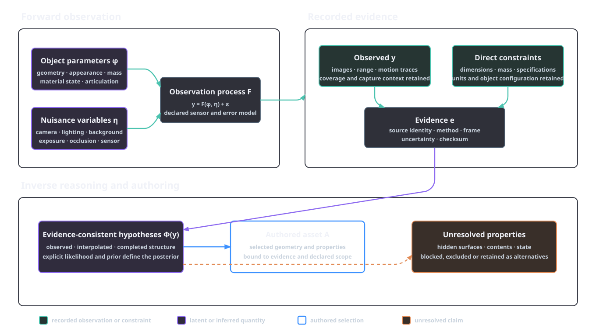
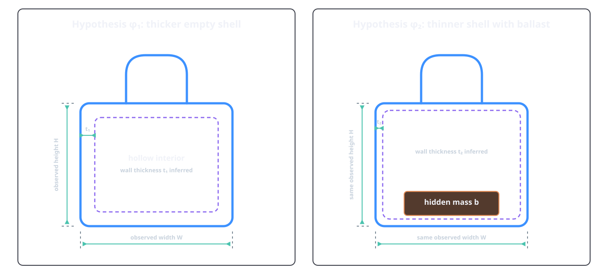
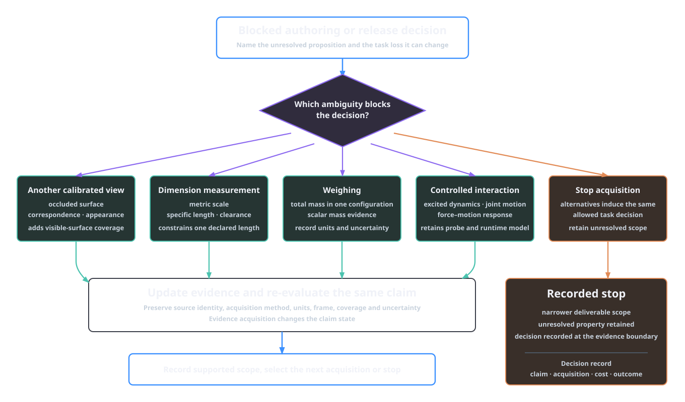

# Reconstruction and evidence

Reconstruction estimates an object from incomplete observations. The observations constrain geometry, appearance and, in some cases, motion, but they seldom identify every property required by a simulation asset. Hidden surfaces, metric scale, wall thickness, internal contents, material state and articulation can remain unresolved after a plausible mesh has been produced.

Reconstruction requires a clear boundary among source evidence, inference and authoring choice. Learned reconstruction and generation propose object parameters. Calibrated observations, dimensions, weighings and interaction records supply measurements, selected according to the decision they can change. The operational routes, records and promotion gates remain in [intake and source ingestion](../pipeline/00-intake-and-sources.md), [reconstruction](../pipeline/01-reconstruction.md) and [mandatory mesh verification](../pipeline/01a-mesh-verification.md).

## The inverse problem

Let \(e\) denote the available evidence and let \(\phi\) collect the object parameters relevant to the requested asset. Depending on scope, \(\phi\) can include surface geometry, metric dimensions, material assignments, spatially varying appearance, mass properties, rigid-body partitions and joint parameters. For one observation \(y\), write

\[
y = F(\phi,\eta) + \epsilon,
\]

where \(F\) is the observation process, \(\eta\) contains nuisance quantities and \(\epsilon\) represents measurement error and model discrepancy. Camera intrinsics and pose, illumination, exposure, background, occlusion and sensor response belong in \(\eta\) when they are not controlled object properties.

The equation separates three questions. The forward question asks what observation a specified object and context would produce. The inverse question asks which values of \(\phi\) remain compatible with the observation. The asset-authoring question selects one explicit package \(A\) from those compatible values, together with recorded assumptions. A reconstruction backend addresses part of the inverse question; the authoring decision selects the executable package.

Non-uniqueness is structural. Parameter settings that produce the same observable data within the accepted error model remain equivalent under that evidence. Define the evidence-consistent set

\[
\Phi(y)=\left\{(\phi,\eta):d\bigl(F(\phi,\eta),y\bigr)\leq \delta_y\right\},
\]

for a declared discrepancy \(d\) and observation tolerance \(\delta_y\). A sharper image can reduce this set while leaving an entire ambiguity unchanged. Wall thickness and internal mass distribution require observations that bear on those properties. A visually convincing completion remains one member of \(\Phi(y)\); object-specific evidence selects among the compatible completions.

When a likelihood and prior are specified, uncertainty can be expressed as

\[
p(\phi,\eta\mid y)
\propto p(y\mid\phi,\eta)\,p(\phi,\eta).
\]

This expression has operational content when the variables, likelihood, prior, conditioning data and approximation method are defined. Backend confidence, reviewer scores and normalised material suggestions rank proposals under their documented rubrics. Their scale and calibration belong to those rubrics.

Evidence is also modality-specific. A photograph records radiometric observations from a viewpoint. A depth map or scan records sampled surface range under its sensor model. A dimension record supplies a metric constraint. A weighing constrains total mass. A force–motion trace constrains the physical parameters excited and observed during that interaction. Combining these sources requires their coordinate frames, units, coverage and uncertainty.

*Figure 2.1. Observation and inference model. Teal nodes are recorded observations or direct constraints; violet nodes are latent or inferred quantities. The authored asset selects an executable model from the evidence-consistent hypotheses while unsupported properties remain explicit. A posterior exists only when an explicit probabilistic model supports it.*

## Geometric reconstruction

Image reconstruction depends on viewpoint diversity, visible texture or learned correspondences, camera modelling and surface visibility. DUSt3R predicts pairwise point maps in a common coordinate frame and aligns them globally for larger image collections; it also recovers camera and depth quantities from that representation [@wang_dust3r_2024]. This is a learned route from images to geometric structure. Project unit policy defines the target units, and metric-scale evidence connects the reconstruction to that policy.

The metric-scale issue can be stated directly. In a pinhole model, image coordinates are unchanged when reconstructed scene coordinates and camera translations are both multiplied by the same positive scale. Image reprojection can therefore agree while the object remains in arbitrary units. A known camera baseline, calibrated metric depth, a measured object dimension or another independent scale reference removes this particular degree of freedom. Scale evidence must be recorded separately from visual agreement because scale also changes collision clearance, mass calculations and joint-frame locations.

Surface coverage is a different constraint. Multiple photographs add information where their rays expose new surfaces or improve geometric conditioning. Rear-face evidence requires views that expose the rear face. A range scan supplies direct surface samples over its coverage. A polygonal mesh produced from either source retains the distinction between observed surface, interpolated surface and completed surface when that distinction affects the requested use.

Inverse rendering broadens the parameter set. A rendered image can be written schematically as

\[
I = R(G,M,L,C_{\mathrm{cam}})+\epsilon,
\]

with geometry \(G\), material appearance \(M\), lighting \(L\) and camera parameters \(C_{\mathrm{cam}}\). Changes in these quantities can compensate for one another. A dark image region can result from reflectance, illumination, orientation or occlusion. Munkberg et al. jointly optimise mesh topology, spatially varying materials and environment lighting from multi-view images and produce an explicit triangular model for conventional renderers [@munkberg_nvdiffrec_2022]. Chemical composition and contact coefficients follow separate evidence paths from the recovered optical parameters.

Authored sources have a separate evidential role. A supplied USD or supported mesh can carry dimensions, hierarchy and part names more directly than image reconstruction, provided its provenance and units are trustworthy. Original CAD records the design intent and nominal dimensions present in that source. As-used observations record captured wear, contents and configuration. AFB retains native CAD as governance evidence and consumes a supported USD or mesh export for authoring. The route is defined in [reconstruction](../pipeline/01-reconstruction.md#choose-a-reconstruction-route).

Whatever route produced it, reconstruction output is a candidate. [Mandatory mesh verification](../pipeline/01a-mesh-verification.md) checks loading, topology, integrity, fixed-view renders, source agreement and identity under a selected profile. Checksum-bound approval establishes that the specific candidate passed those checks. Hidden cavities and physical properties use their own evidence and approval records.

## Learned priors and completion

Learned systems are useful because training data encode regularities that are absent from a single input. Those regularities act as priors over plausible shape, appearance and structure. They allow a system to propose the back of an object, regularise noisy geometry or divide a visible object into candidate parts. Each completion records the learned prior and conditioning input as its evidential source.

TRELLIS.2 represents geometry and appearance in a structured sparse voxel representation and trains generative models over its compact latent space [@xiang_trellis2_2025]. PartCrafter conditions on one RGB image and jointly generates multiple semantically meaningful mesh parts, including parts not directly visible in the input [@lin_partcrafter_2025]. These capabilities expand the set of authorable hypotheses. Their structured outputs remain hypotheses about this object until object-specific evidence supports the relevant boundaries and surfaces.

*Figure 2.2. Analytical alternatives compatible with the same exterior. Blue lines mark the shared observed boundary; dashed violet lines and orange ballast mark unobserved structure. Exterior dimensions constrain scale, while weighing constrains total mass without selecting either internal distribution.*

Appearance regions, semantic parts, material domains and rigid bodies answer different questions:

| Decomposition | Criterion | Valid use | Unsupported inference |
|---|---|---|---|
| Appearance regions | similar visible colour, texture or image features | masks, texture authoring and render review | material identity |
| Semantic parts | labels assigned to meaningful regions | naming, selection and task metadata | independent motion |
| Material domains | a shared optical or physical material model | material binding and property evidence | rigid-body membership |
| Rigid bodies | points that remain fixed relative to one another during motion | collision, mass and articulation | semantic or material uniformity |

A painted stripe can be an appearance region without being a separate material. One polymer component can contain several semantic regions. A hinge pin and lid can share a material while belonging to different rigid bodies. Conversely, a generated part boundary can be convenient for editing without corresponding to a physical seam or joint. Interactive observations can add the missing motion evidence: Ditto, for example, estimates part-level geometry and an articulation model from observations before and after an interaction [@jiang_ditto_2022]. Joint approval then applies the declared articulation checks to the evidence-conditioned result.

A probabilistic model can use a learned prior. The posterior then depends on the stated likelihood and the data used to train or condition the prior. Presenting several completions outside that construction expresses candidate diversity. Sample frequency reflects the generator's sampling distribution, conditioning and training population.

## Combining heterogeneous observations

Evidence combination requires a common account of identity and transformation. Two photographs support one multi-view reconstruction when they concern the same object configuration and their camera relationship is estimated or supplied. A scan and a dimension record can be fused after their units, axes and registration are reconciled. A catalogue specification applies after the model, revision and configuration have been matched to the captured object. Durable identity and transformation records establish these relations.

Registration introduces its own parameters. If a scan-to-image transform is estimated jointly with shape, errors in the transform can appear as surface error. If an object's pose changes between captures, rigid registration can force a non-rigid or articulated change into one static geometry. The evidence record should retain the original observations, the estimated transform and the method that produced it so later review can distinguish source disagreement from alignment error.

Source data used to optimise a model and data used to test it have different roles. A low render residual on the fitting views shows that the selected model can reproduce those observations under the fitted nuisance variables. A view withheld from optimisation provides an additional source-consistency check for its observable surface. The claim names the held-out viewpoint, capture dependency and observable quantity.

Derived artefacts retain the dependency structure of their underlying evidence. A depth map predicted from a photograph, a point cloud converted from that depth map and a mesh reconstructed from the point cloud form one derivation chain. Agreement among the three tests internal consistency within that chain. Likewise, a reviewer response and the contact sheet it reviewed share the same source pixels. Checksums and provider traces keep those dependencies visible.

When evidence sources conflict, fusion should preserve alternatives until the conflict is explained. A single best-fit mesh can hide a multimodal result: one group of observations can support a flat rear surface while another supports a recessed one. Averaging the two can produce a surface supported by neither. A probabilistic model can retain separate modes; a non-probabilistic workflow can retain named candidate hypotheses and the evidence for each. Selection then follows the task requirement and review authority.

The authored asset \(A\) is necessarily more explicit than much of the evidence. A renderer requires one surface at each authored point, and a physics solver requires concrete values for enabled properties. Unknowns remain explicit: leave the property unauthored, block the physical lane, select an approved candidate for one use or expose reviewed alternatives as variants. The evidence record remains the basis for revisiting that choice when a new observation arrives.

## Evidence strength and conflict

Evidence strength is relative to a proposition. A calibrated dimension measurement is strong evidence for one distance and weak evidence for surface roughness. A manufacturer's mass specification can be strong for an identified empty product configuration and irrelevant to the same container after it has been filled. A close photograph can establish the presence of a fastener while leaving its material and thread depth unresolved.

Every consequential claim should therefore be reviewed with six questions:

| Question | Purpose |
|---|---|
| What exact proposition is supported? | prevents evidence for one property being transferred to another |
| Which object instance and configuration does it concern? | separates nominal type data from the captured instance |
| Which region, view or operating range was observed? | records coverage |
| What method, frame and units apply? | makes the result interpretable |
| What uncertainty or tolerance applies? | defines compatible alternatives |
| Which durable source record carries it? | preserves identity and lineage |

AFB's [manifest contracts](../manifest-contracts.md) supply durable evidence IDs, checksums, units and distinct proposal, review and validation states. Each confidence field retains the statistical or rubric interpretation defined by its source.

Conflicts should be resolved at the claim level. If a nominal drawing and a scale-calibrated scan disagree on handle width, the first step is to check identity, revision, coordinate frame, configuration and measurement uncertainty. If both remain applicable, the conflict stays explicit. Selecting the source with the larger confidence number is valid only when the numbers were calibrated for the same proposition and method.

The same rule applies to model–source disagreement. A candidate can agree with most image pixels while violating a measured dimension. A repair can improve watertightness while changing a task-critical opening. A material proposal can match visible colour while conflicting with a bill of materials. Deterministic geometry checks, visual review and physical evidence retain separate authority because each tests a different proposition.

Unresolved properties need an explicit disposition. They can remain outside the deliverable, block a required stage, be represented as bounded alternatives or motivate a new observation. Replacing *unknown* with a point estimate merely makes the uncertainty harder to inspect. AFB's reconstruction stage therefore records a proposal and its provider trace, while downstream physical values require their own evidence and review.

## Choosing the next observation

Additional evidence should be selected for the decision it can change. Let \(u\) be the next authoring or release action, let \(L(u,\phi)\) be its task-relative loss and let \(a\) be an evidence-acquisition action with possible result \(z\). An analytical value for that action is

\[
V(a\mid e)=
\min_u \mathbb E[L(u,\phi)\mid e]
-
\mathbb E_{z\mid e,a}
\left[\min_u \mathbb E[L(u,\phi)\mid e,z,a]\right]
-C(a),
\]

where \(C(a)\) converts acquisition expense, delay and risk into the same decision-loss units as \(L\). The criterion distinguishes another generation attempt from another observation: regeneration searches the current hypothesis space, whereas a measurement can exclude hypotheses.

| Acquisition | Ambiguity it can address | Ambiguity it leaves |
|---|---|---|
| additional calibrated view | occluded surface shape, image correspondence and appearance coverage | opaque interior and most physical properties |
| dimension measurement | metric scale or a specific clearance | mass distribution and hidden topology elsewhere |
| weighing in a defined configuration | total mass | centre of mass, inertia and local material identity |
| controlled force–motion record | parameters that affect the excited, observed dynamics | unexcited parameters and confounded effects |
| manufacturer specification | nominal properties for an identified revision and configuration | as-used deviation unless specified |

*Figure 2.3. Analytical evidence-acquisition decision structure. Each acquisition addresses a different ambiguity and returns to the same blocked claim with updated evidence. Stopping retains the unresolved property and narrows the authorised scope.*

Interaction data supply physical information through observed responses. BayesSim performs likelihood-free inference over simulator parameters by comparing trajectories generated under sampled parameters with trajectories from the physical system [@ramos_bayessim_2019]. The inferred posterior is tied to its simulator, summary representation, prior and observed interactions. Parameters that produce indistinguishable traces under the chosen probe remain unresolved.

Stopping is also a decision. Acquisition should stop when the remaining alternatives induce the same allowed authoring decision for the declared task, or when no available observation has sufficient decision value. The resulting scope states what remains unresolved. Dynamic-manipulation readiness includes the inertia evidence required by its protocol.

## Unknown properties stay explicit

The evidence boundary produces five operational requirements:

1. [Source ingestion](../pipeline/00-intake-and-sources.md) preserves exact inputs, checksums, rights state and unit policy before authoring.
2. [Reconstruction](../pipeline/01-reconstruction.md) records backend output as `candidate-geometry`; learned or generated completion remains a proposal.
3. [Mandatory mesh verification](../pipeline/01a-mesh-verification.md) promotes only a checksum-matched candidate and states the selected geometry profile. Hidden properties retain their own evidence state.
4. [Material and physical inference](../pipeline/03-material-inference.md) keeps visual material candidates and numeric physical properties in distinct evidence paths. Numeric physical values require accepted physical evidence.
5. [Physics and articulation](../pipeline/05-physics-articulation.md) consumes accepted physical evidence and leaves the corresponding opinions disabled or blocked when that evidence is absent.

These boundaries allow useful assets and explicit unknowns to coexist. They also identify the remedy for a blocked claim: acquire evidence that bears on the claim, revise the declared scope or retain explicit alternatives.

## References

\bibliography
