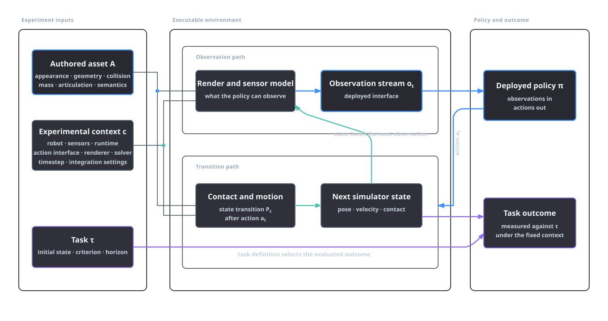
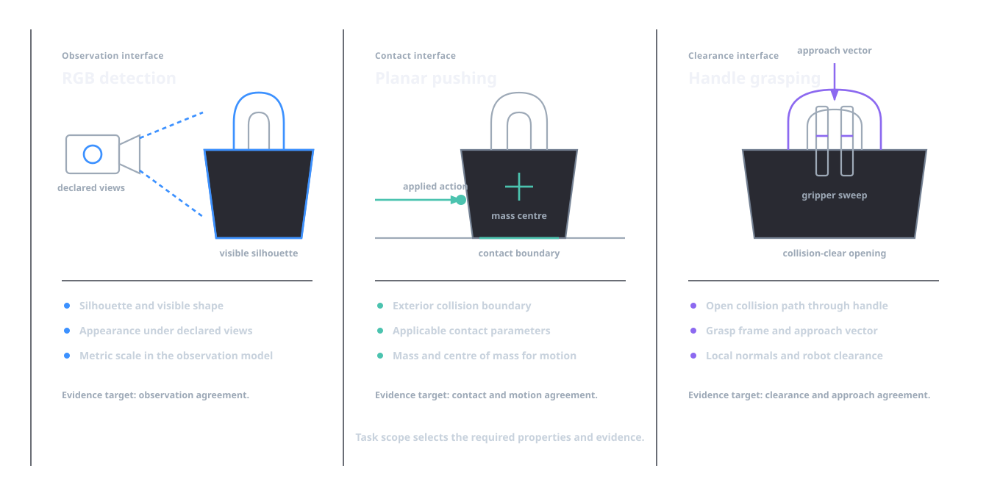
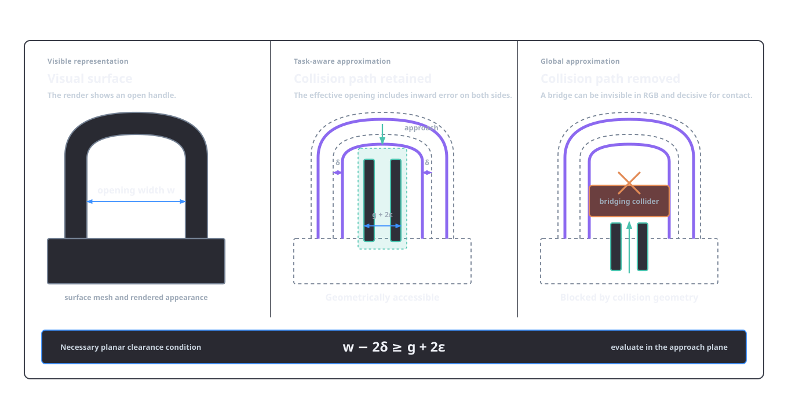

# Task-dependent fidelity

A simulation asset is adequate only in relation to a stated use. The same object model can support image-based detection while being unsuitable for pushing, grasping or articulated manipulation. The difference is not a matter of general visual quality. Each use depends on a particular observation process, set of actions, physical interaction and criterion for success.

Fidelity belongs to a complete robot–sensor–simulator experiment. The analysis separates visual, geometric, physical and task-level claims, then relates them to the evidence and verification stages in Asset Factory Blueprint (AFB). A task-relative discrepancy formalises the engineering question.

## The asset within an experiment

Let \(A\) denote an authored asset package and let \(c\) denote the experimental context. The context includes the robot embodiment, sensor models, renderer, physics solver, timestep, integration settings and any other runtime choice that affects observations or transitions. A task \(\tau\) supplies an initial-state distribution, objective, success criterion, termination rule and evaluation horizon. A policy \(\pi\) receives the deployed observation stream and selects actions.

The asset affects two distinct interfaces. Its visual and geometric state contributes to rendered sensor observations. Its collision representation, mass properties, contact parameters and articulation contribute to the state transition produced after an action. Some properties enter both interfaces: scale changes apparent size, collision clearance and inertia; articulation changes visible configuration and reachable state. Keeping the interfaces separate makes the associated claim testable.

*Figure 1.1. Schematic experiment boundary. The asset influences rendered observations and contact or motion transitions. Robot, sensors and runtime affect both paths, while the task defines the evaluated outcome.*

An asset therefore has no context-free operational meaning. A triangular surface, a texture set and a USD physics layer become an executable model only after composition and runtime interpretation. Even a byte-identical package can produce different observations or trajectories under different renderers, solver versions, timesteps or robot geometries. A fidelity statement must bind the asset to the relevant parts of \(c\).

AFB records this separation in its authoring structure. Geometry, appearance, physics, articulation and semantics have distinct [layer ownership](../platform/layer-ownership-and-variants.md). The [reference-run capsule](../reference-run-capsule.md) binds promoted artefacts to source, validation and runtime records. These mechanisms identify the model evaluated in an experiment. Each task-fitness result binds its adequacy claim to the declared task and protocol.

## Observation, transition and objective

For a fixed context, write the simulator's observation model as

\[
o_t \sim O_c(\,\cdot\mid x_t, A),
\]

and its transition model as

\[
x_{t+1} \sim P_c(\,\cdot\mid x_t, a_t, A).
\]

Here \(x_t\) is simulator state, \(o_t\) is the observation exposed to the policy and \(a_t\) is its action. The notation permits deterministic renderers and dynamics as degenerate distributions. It also prevents privileged simulator state from being confused with the policy's deployed input.

An observation claim names the sensing operation. RGB, depth, surface-normal, thermal and contact observations each carry their own agreement criteria. For RGB, relevant properties can include visible shape, reflectance, texture, illumination and camera response. For depth, metric scale, occlusion boundaries, missing-data behaviour and range noise may dominate. For a tactile or force signal, contact geometry and the selected contact model become part of the observation process.

A transition claim names the interactions it covers. Static resting stability, quasi-static pushing, impact, grasp closure and constrained joint motion exercise different parts of \(P_c\), so each requires its own probe. A rigid body's measured mass constrains total mass; centre of mass, inertia tensor, frictional behaviour and collision geometry require their own evidence. Joint validation covers axis, limit, damping and drive response as well as visible range.

The task objective determines which errors matter. Let \(J_{\tau,c}(\pi;A)\) be the expected return, success measure or other declared performance functional for policy \(\pi\) in task \(\tau\), context \(c\) and asset \(A\). Comparisons require compatible observation and action interfaces. Returns also require a common definition and scale; arbitrary reward totals from unrelated tasks are not comparable.

Binding fidelity to a task separates image agreement from action consequences. It also allows a dynamics error to be immaterial for one task and decisive for another. An inaccurate internal mass distribution may be irrelevant to fixed-camera detection but critical during rapid rotation. The adequacy claim therefore names the affected task, interface and tolerance.

## Four fidelity claims

The term *fidelity* is useful when it names the preserved relation. Four claim types cover most asset decisions.

| Claim | Preserved relation | Typical evidence | Evidence scope |
|---|---|---|---|
| Visual fidelity | Sensor observations under declared views and conditions | source-aligned renders, calibrated image or depth comparisons | rendered observation |
| Geometric fidelity | dimensions, topology, clearances, frames and surfaces relevant to the use | measurements, registered scans, mesh diagnostics, local distance checks | represented geometry |
| Physical fidelity | transitions under declared contacts, loads and runtime settings | mass-property records, contact probes, settling tests, joint trajectories | tested conditions and physical model |
| Task-level fidelity | outcomes for a declared task and policy class | task-fitness protocol and held-out execution evidence | integrated task outcome |

These claims overlap without forming a fixed hierarchy. Geometric fidelity can be evaluated globally or in task-critical regions. Visual fidelity can depend on geometry and material appearance. Task-level evidence integrates the effects of many components but is less diagnostic when a result changes. The purpose of the distinction is to retain what each test supports.

The required spatial resolution also depends on the operation. A small bevel may be irrelevant to object detection, affect a depth edge used for pose estimation and change the contact normal during insertion. A thin wall can be visually important but absent from a collision approximation by design. A hidden cavity can be irrelevant to surface sensing while determining mass distribution. “High fidelity” without the affected interface and tolerance leaves these cases unresolved.

Resource allocation follows the same logic. Additional polygons are justified when they preserve a relevant silhouette, clearance, surface normal or collision region. Higher-resolution textures are justified when the sensor and task can observe the added spatial frequency. A smaller timestep is a runtime decision justified by the dynamics being resolved. None is an independent measure of asset quality.

Dex-Net 2.0 is a concrete example of a task-bound modelling chain. It connects object meshes, a depth-sensing model, analytic grasp metrics, a specified parallel-jaw grasp representation and physical robot trials. Its conclusions belong to those sensing, grasp and evaluation conditions [@mahler_dexnet_2017]. Visual and dynamics randomisation make the same dependence explicit from another direction: the training conditions are varied to support a defined transfer problem [@tobin_domain_2017; @peng_dynamics_2018].

## Task-relative discrepancy

Let \(A^\star\) be a reference world model or an idealised target defined on compatible interfaces. For a task set \(\mathcal T\), policy set \(\Pi\) and context \(c\), define the task-relative discrepancy

\[
\Delta_{\mathcal T,\Pi}(A,A^\star\mid c)
=\sup_{\tau\in\mathcal T,\,\pi\in\Pi}
\left|J_{\tau,c}(\pi;A)-J_{\tau,c}(\pi;A^\star)\right|.
\]

The supremum states which uses the claim must cover. Enlarging \(\mathcal T\) or \(\Pi\) can expose differences hidden by a narrower evaluation. Restricting them can make a simpler model adequate. Practical validation evaluates the discrepancy through claim-specific proxies.

If \(J\) is a bounded success probability, the difference has a direct scale. If \(J\) is a return, tasks must use the same reward definition, horizon and normalisation before their discrepancies are combined. Otherwise, the results should be reported per task. A single aggregate number would conceal both the task weighting and the reason for failure.

Practical validation therefore uses proxies. A dimension check supports a claim about scale or clearance. A source-aligned render supports observable agreement from its recorded cameras. A settling test supports stability under its initial conditions, solver and timestep. A joint sweep supports axes, limits and collision behaviour along the tested path. A task-fitness run supports the declared outcome under the recorded policy and protocol. Each proxy should identify the part of the task-relative claim it tests.

Simulation verification establishes that an implementation matches its specified model; validation asks whether the model is sufficiently accurate for its intended use [@sargent_validation_2013]. AFB's schema and package checks perform verification, while task-fitness evidence performs validation.

## Model abstraction and value equivalence

Model abstraction formalises which differences a decision process must preserve. Bisimulation-based work for Markov decision processes relates state similarity to rewards and transition behaviour and provides bounds connecting an abstraction metric to value functions under its assumptions [@ferns_metrics_2004]. Asset adequacy therefore depends on which distinctions alter the quantities used by the decision process.

The value-equivalence principle sharpens this relation for model-based reinforcement learning. Grimm et al. define two models as value equivalent with respect to selected functions and policies when they produce the same Bellman updates on those functions under those policies. As the relevant sets expand, the class of equivalent models becomes more restrictive [@grimm_value_2020]. Approximate value equivalence studies planning performance when exact conditions are not met [@grimm_approximate_2022].

AFB applies the value-equivalence principle at the asset-engineering level through declared outputs, task-fitness protocols and separate evidence for observations and dynamics. Formal value-equivalence analysis operates on the complete state, reward and transition model, with specified functions and policies. Both frameworks use the future use of a model to determine which distinctions must be retained.

## Clearance conditions for handle grasping

For a handled rigid body, let the smallest usable opening width be \(w\), the gripper's required swept width be \(g\), the maximum inward collision error on each side be \(\delta\), and the declared clearance margin be \(\epsilon\). A necessary planar clearance condition is

\[
w-2\delta \geq g+2\epsilon.
\]

The inequality expresses planar clearance. The complete grasp condition also includes the approach path, finger thickness, orientation tolerance, handle depth, robot kinematics and contacts elsewhere on the object.

The same geometry imposes different requirements across three asset uses:

| Use | Handle requirement | Properties that may remain unresolved |
|---|---|---|
| RGB detection | visible silhouette and appearance at the declared views | collision clearance, inertia and internal contents |
| Planar pushing | exterior collision boundary and applicable contact parameters | opening clearance if the handle is never contacted |
| Handle grasping | open collision path, local surface normals, grasp frame and robot clearance | hidden appearance outside the sensor and task path |

*Figure 1.2. Requirements comparison for one handled container. Detection depends on the declared observation interface, pushing on the exterior contact model, and handle grasping on a collision-clear opening and approach.*

A collision approximation that spans the opening can leave the RGB render unchanged while making the grasp transition impossible. A global surface-distance statistic may assign little weight to the thin region that blocks the fingers. For this task, the inspection must localise error around the opening and evaluate it with the intended gripper and approach. The [physics and articulation stage](../pipeline/05-physics-articulation.md) records grasp candidates and colliders; the [RL environment lane](../extensions/rl-environment.md#affordance-weighted-collision-fidelity) evaluates collision fidelity around recorded affordances. These checks address collision geometry, while fixed-view renders address the observation interface.

*Figure 1.3. Analytical clearance diagram. A task-aware collider retains an effective opening of \(w-2\delta\), which must accommodate the gripper width and margins, \(g+2\epsilon\). A bridged collider removes that path while leaving the visual surface unchanged.*

The clearance condition covers the handle approach. Mass, centre of mass and friction have separate requirements. This separation shows why the collision representation forms part of the model presented to the policy.

## Evidence stays claim-specific

AFB separates checks because they answer different questions:

| Blueprint evidence | Supported proposition |
|---|---|
| [Mandatory mesh verification](../pipeline/01a-mesh-verification.md) | the candidate satisfies declared topology, integrity and source-review gates |
| [Physics and articulation evidence](../pipeline/05-physics-articulation.md) | physical and kinematic opinions have stated sources, assumptions and checks |
| [SimReady verification](../pipeline/07-simready-verification.md) | the composed package conforms to the named profile and recorded load checks |
| [Task-fitness evidence](../pipeline/07-simready-verification.md#fitness-for-use) | the package passed the declared use-specific protocol |
| [Reference-run capsule](../reference-run-capsule.md) | the evaluated source, asset, protocol and runtime records can be inspected together |

These records remain separate through review and release. A task requirement selects the relevant evidence. An unresolved property leads to additional evidence, a bounded authoring change or a narrower declared scope.

## References

\bibliography
