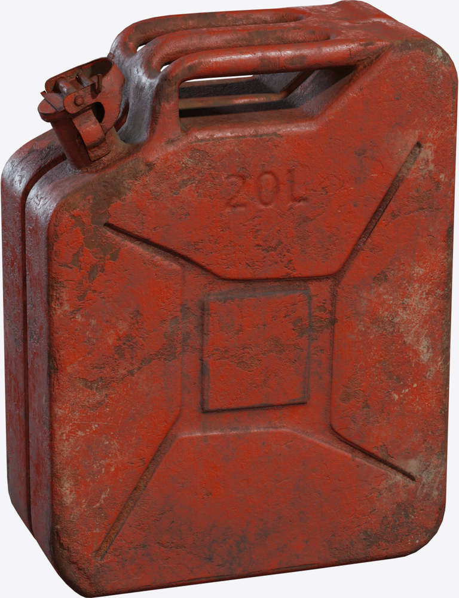
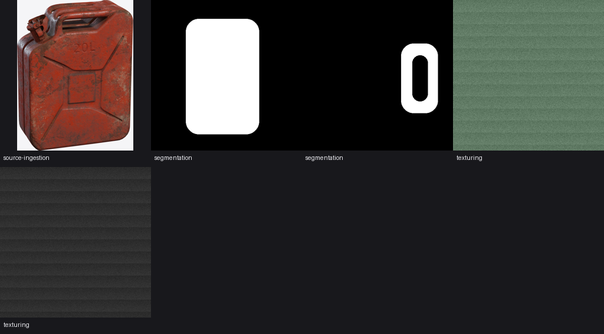

# Walkthrough: one photo to a governed workspace

A worn 20 litre metal jerrycan provides the example, with runnable commands and abridged captured output. The bundled sample photo is a CC0 render of the Poly Haven `metal_jerrycan` model. The source and dry planning path ship with the repository. Live model output is illustrative and must be cited with its recorded run rather than treated as invariant across checkouts.

The captured output covers a dry workflow pass followed by a live agent loop with the VLM reviewer on the NVIDIA NIM lane (`nvidia/llama-3.1-nemotron-nano-vl-8b-v1`). For fresh-machine timings and blockers, see the [observed runthrough](runthrough.md).

## Sample input

<p align="center">
  
</p>

The run request at `examples/run-requests/jerrycan_from_photo.json`:

```json
{
  "id": "metal_jerrycan",
  "version": "1.0",
  "objective": "Create a SimReady candidate for a worn 20 litre metal jerrycan from a single photo, with material, texture, physics and grasp evidence.",
  "sources": ["examples/sources/photos/metal_jerrycan.png"],
  "requested_outputs": ["simready", "texture"],
  "constraints": { "review_required": true, "target_simulator": "isaac_sim" },
  "source_note": "sample photo is a CC0 render of the Poly Haven metal_jerrycan model"
}
```

## Plan the route

```bash
afb run-plan --request examples/run-requests/jerrycan_from_photo.json --output artifacts/jerrycan-plan.json
```

The `.png` source routes through reconstruction; the requested outputs pull in texturing and simready verification:

```text
stages: orchestrate, intake, source-ingestion, reconstruction, mesh-verification, segmentation,
        material-inference, texturing, physics-articulation,
        simready-verification, evaluation, infrastructure, governance
gates:  governance-review, isaac-load, mesh-verification, schema-valid,
        segmentation-segments, source-lineage, vlm-signoff
```

## Run the agent loop

```bash
set NVIDIA_API_KEY=<your key>
set AFB_VISION_MODEL=nvidia/llama-3.1-nemotron-nano-vl-8b-v1
afb agent run --request examples/run-requests/jerrycan_from_photo.json --project-root projects --live
```

Without `--live` the same command is a dry run: the workspace and every record are written, provider calls are skipped and every review is recorded as `skipped` pending an operator. The live summary from the captured run:

```json
{
  "project_id": "metal_jerrycan",
  "workflow_status": "blocked",
  "reviewed_stages": 5,
  "approved_stages": ["segmentation", "material-inference"],
  "pending_stages": ["reconstruction", "texturing", "simready-verification"],
  "status": "review_required"
}
```

`blocked` identifies the missing inputs and makes no completeness claim.

## What the reviewer recorded

The segmentation review compared the generated masks with the source photo and approved the stage. It also recorded a note-severity finding after reading the embossed lettering on the can:

```json
{
  "stage_id": "segmentation",
  "verdict": "approve",
  "confidence": 1.0,
  "reviewer": { "provider": "nvidia_nim", "model": "nvidia/llama-3.1-nemotron-nano-vl-8b-v1" },
  "findings": [
    {
      "defect_tag": "wrong_semantic_label",
      "severity": "note",
      "description": "The label on the gas can is incorrect. It should be 'GAS' instead of '20L'."
    }
  ]
}
```

Note-severity findings do not block promotion; this stage was approved.

The dry workspace carries neutral smoke maps that do not match the worn red paint in the photo. The review returned:

```json
{
  "stage_id": "texturing",
  "verdict": "approve",
  "findings": [
    {
      "defect_tag": "wrong_material_appearance",
      "severity": "blocker",
      "description": "The material appearance of the map set does not read as the declared material at the declared wear level."
    }
  ]
}
```

A blocker finding overrides the approve verdict, so the loop keeps the stage review required. Sign-off is never granted against the review record's own evidence.

The reconstruction review recorded `skipped` because no stage output existed:

```text
verdict: skipped
reason:  no stage-output images exist yet; reviewing source photos alone
         would judge nothing this stage produced
```

## Generated workspace

Every stage wrote its records under `projects/metal_jerrycan/`. The segmentation manifest carries the two segments encoded by the masks (`body` and `cap`), and the material manifest carries the review-gated physical proposals beside the material candidates:

```json
{
  "component_materials": [
    { "component_label": "body", "selected_material": "painted_metal", "confidence": 0.92, "requires_human_review": true },
    { "component_label": "cap", "selected_material": "metal", "confidence": 0.48945007507507504, "requires_human_review": true }
  ],
  "physical_property_proposals": [
    {
      "property_name": "mass",
      "value": 1.0,
      "unit": "kg",
      "range_low": 0.1,
      "range_high": 10.0,
      "validation_status": "review_required",
      "notes": "numeric value is proposal-only until measured, specified or reviewed"
    }
  ]
}
```

The operator contact sheet generated for this run (`reports/contact-sheet.png`):

<p align="center">
  
</p>

`progress.json` rolls the run up for machines; its `next_actions` from this run began with:

```text
run or record an operator review for reconstruction
reconstruction: external reconstruction validation required before release
```

## Next steps

1. Generate the mesh. `afb capabilities` names the ready backend, then:

    ```bash
    afb reconstruction create-backend --backend hunyuan3d --input-manifest projects/metal_jerrycan/manifests/source-asset-manifest.json --asset-id metal_jerrycan --project-id metal_jerrycan --output artifacts/jerrycan-run.json
    afb external-models run --manifest artifacts/jerrycan-run.json
    ```

    The run reads its inputs from the project's source manifest and writes the mesh, preview renders and run manifest into the workspace. This unblocks reconstruction review on the next `afb agent run` and records the run lineage for release.

2. Generate textures. With an image-generation lane configured, the texturing stage replaces the smoke maps and the blocker finding is re-reviewed against generated PBR maps.

3. Run the Isaac load gate once the package composes:

    ```bash
    afb isaac-load apply --project projects/metal_jerrycan --report projects/metal_jerrycan/reports/isaac-load-check.json
    ```

4. Generate and apply task-fitness evidence, run `afb project validate`, then preview and write the release decision with `afb governance decide`. Release stays blocked until the current run, asset fingerprint, exact Profile, rights, runtime and declared use all match; the [governance page](platform/governance.md) shows the worked example.

Rerun `afb progress --project projects/metal_jerrycan` after each step; the contact sheet and `progress.json` always reflect the latest state.
